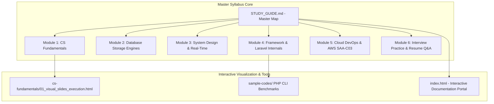
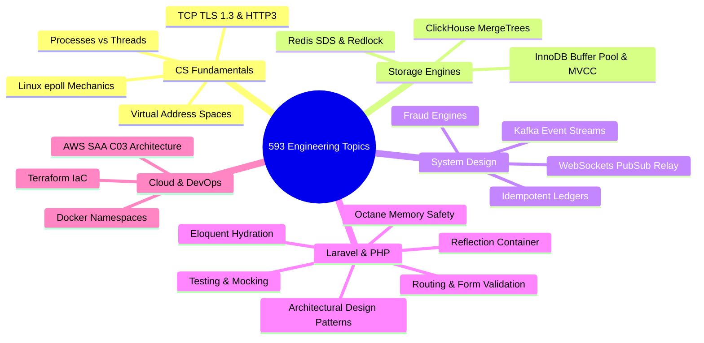

# 📚 Unified Engineering Mastery Guide & Staff Architect Blueprint

> **Owner:** Md. Fazley Rabbi (Backend Developer)
> **Repository:** `/Users/rabbi/Desktop/Learning`  
> **Target:** Staff Backend Architect & AWS Certified Solutions Architect (SAA-C03) Mastery Path.

---

## 🏛️ Executive Summary & Study Architecture

This master guide consolidates **593 computer science & backend engineering topics**, **30 senior architectural interview scenarios**, **27 production-grade deep-dive lesson guides**, and **interactive benchmark tools**.

---

## 🤖 AI Agent & LLM Tutor Directives

When acting as an AI Tutor or pair programmer within this workspace, enforce the following instructional protocol:

1. **Staff Architect & CS Professor Persona:**  
   Explain topics from absolute first principles. Cover low-level kernel mechanics, memory layout, CPU cycles, disk I/O, network protocols, and real-world failure modes.

2. **Standard 4-Phase Lesson Blueprint:**
   - 💡 **Conceptual Blueprint & First Principles:** High-level architectural context, trade-offs, and design motivations.
   - 🔬 **Under-the-Hood Mechanics:** Low-level execution details, sequence diagrams, and memory maps.
   - 💻 **Production Code & Benchmarks:** Concrete PHP, Laravel, SQL, Docker, or Terraform code examples.
   - ⚔️ **Staff / Senior Interview Scenarios:** Top interview questions, edge cases, and trade-off discussions.

3. **Workspace Integrity:** Maintain [`STUDY_GUIDE.md`](STUDY_GUIDE.md) as the authoritative index. Update module progress checkboxes as study advances.

---

## 🎯 Master Learning Modules Index

| Module | Core Domain | Focus Topics | Progress Status |
| :--- | :--- | :--- | :---: |
| **01** | [**CS Fundamentals**](cs-fundamentals/) | CPU, Memory, Linux I/O, `epoll`, TCP/TLS 1.3, Big-O, Dynamic Programming, OWASP | `8 / 8 Complete` |
| **02** | [**Database Deep Dives**](database-deep-dives/) | MySQL InnoDB Buffer Pool, ClickHouse Columnar MergeTree, Redis SDS & Redlock, SQL Mastery, Normalization | `6 / 6 Complete` |
| **03** | [**System Design & Real-Time**](system-design/) | WebSockets, Idempotency, Kafka, Sharding, Saga, Fraud Engine, Matching Engine, Reservations | `19 / 19 Complete` |
| **04** | [**Laravel Internals**](laravel-internals/) | Reflection Container, Request Lifecycle, Eloquent Hydration, Octane Safety | `6 / 6 Complete` |
| **05** | [**Laravel Mastery**](laravel-mastery/) | Routing, Eloquent, Auth, Testing, APIs, Job Queues & Design Patterns | `0 / 6 Complete` |
| **06** | [**Cloud & DevOps**](cloud-devops/) | Docker Kernel Namespaces, CI/CD, AWS Architecture, Terraform, SAA-C03 Guide | `5 / 5 Complete` |
| **07** | [**Interview Practice**](interview-practice/) | 35 Architectural Questions, Domain Deep Dives & Financial Testing | `3 / 3 Complete` |

---

### 🔬 Module 1: Computer Science & Low-Level Fundamentals
- [x] 🎨 🖥️ [**`01_visual_slides_execution.html`**](cs-fundamentals/01_visual_slides_execution.html) — **Interactive Slide Deck** (CPU Registers, Stack vs Heap Memory, Zend Opcodes & Linux `epoll`).
- [x] 📄 [**`01_cpu_memory_os_execution.md`**](cs-fundamentals/01_cpu_memory_os_execution.md) — CPU Fetch-Decode-Execute Cycle, Virtual Memory Layout, Cache Lines & Opcodes.
- [x] 📄 [**`02_processes_threads_concurrency.md`**](cs-fundamentals/02_processes_threads_concurrency.md) — Process vs Thread (`task_struct`), Concurrency vs Parallelism, Hardware Mutex Locks & Shared-Nothing vs Octane.
- [x] 📄 [**`03_linux_io_models_epoll.md`**](cs-fundamentals/03_linux_io_models_epoll.md) — Linux I/O Models (Blocking vs Non-Blocking), `epoll` Event Loops & Reactive Reactor Pattern.
- [x] 📄 [**`04_networking_tcp_tls_http.md`**](cs-fundamentals/04_networking_tcp_tls_http.md) — TCP 3-Way Handshake, TLS 1.3 Key Exchange, HTTP/1.1 vs HTTP/2 vs HTTP/3 (QUIC over UDP).
- [x] 📄 [**`05_data_structures_big_o.md`**](cs-fundamentals/05_data_structures_big_o.md) — Big-O Asymptotic Analysis, Hash Map Collision Resolution, B+ Trees vs Binary Search Trees.
- [x] 📄 [**`06_algorithms_graphs_dynamic_programming.md`**](cs-fundamentals/06_algorithms_graphs_dynamic_programming.md) — Two Pointers, Sliding Window, Graph BFS/DFS & Memoized Dynamic Programming.
- [x] 📄 [**`07_oop_solid_design_patterns.md`**](cs-fundamentals/07_oop_solid_design_patterns.md) — 4 OOP Pillars, SOLID Principles, Factory, Strategy & Observer Design Patterns.
- [x] 📄 [**`08_security_owasp_oauth2.md`**](cs-fundamentals/08_security_owasp_oauth2.md) — OWASP Top 10 (SQLi, XSS, CSRF, SSRF), Argon2id Hashing, AES-256 Encryption & OAuth 2.0 PKCE.

---

### ⚡ Module 2: Data Storage Engine Deep Dives
- [x] 📄 [**`01_mysql_innodb_internals.md`**](database-deep-dives/01_mysql_innodb_internals.md) — InnoDB Storage Architecture, Buffer Pool Midpoint LRU, Clustered B+Trees & MVCC Read Views.
- [x] 📄 [**`02_clickhouse_columnar_mergetree.md`**](database-deep-dives/02_clickhouse_columnar_mergetree.md) — Columnar OLAP Storage Engine, Sparse Indexing & MergeTree Part Compression.
- [x] 📄 [**`03_redis_structures_locks.md`**](database-deep-dives/03_redis_structures_locks.md) — Redis SDS, SkipLists, Redlock Distributed Lock Algorithm & Atomic Lua Scripts.
- [x] 📄 [**`04_postgresql_internals_wal_vacuum.md`**](database-deep-dives/04_postgresql_internals_wal_vacuum.md) — PostgreSQL MVCC (Tuple Versioning), Write-Ahead Logging (WAL), Auto-VACUUM & GIN/JSONB Indexing.
- [x] 📄 [**`05_sql_mastery_joins_ctes_windows.md`**](database-deep-dives/05_sql_mastery_joins_ctes_windows.md) — JOINs Deep Dive, GROUP BY & Aggregations, CTEs, Window Functions (ROW_NUMBER, RANK, SUM OVER), Cursor Pagination.
- [x] 📄 [**`06_database_normalization_denormalization.md`**](database-deep-dives/06_database_normalization_denormalization.md) — 1NF→3NF+BCNF with a payments example, functional dependencies, strategic denormalization for OLAP/fraud & JSON vs relations.

---

### 🌐 Module 3: System Design & Real-Time Architecture
- [x] 📄 [**`01_websockets_scaling_pubsub.md`**](system-design/01_websockets_scaling_pubsub.md) — HTTP 101 Upgrade, Stateful TCP Sockets, Redis Pub/Sub Relay & Linux Sysctl Socket Tuning for 100k Sockets.
- [x] 📄 [**`02_idempotency_financial_systems.md`**](system-design/02_idempotency_financial_systems.md) — Idempotency Key Pipeline, Double-Entry Financial Ledgers & Integer Minor Units.
- [x] 📄 [**`03_distributed_systems_cap_kafka.md`**](system-design/03_distributed_systems_cap_kafka.md) — CAP Theorem, PACELC, Apache Kafka Event Log Streams vs RabbitMQ AMQP Queues.
- [x] 📄 [**`04_load_balancing_caching_patterns.md`**](system-design/04_load_balancing_caching_patterns.md) — Horizontal Scaling, Cache-Aside Pattern, Cache Stampede & Cache Penetration Safeguards.
- [x] 📄 [**`05_database_replication_sharding.md`**](system-design/05_database_replication_sharding.md) — Primary-Replica Read Scaling, Shard Keys, Partitioning & Consistent Hashing.
- [x] 📄 [**`06_microservices_saga_observability.md`**](system-design/06_microservices_saga_observability.md) — Monolith vs Microservices, Saga Pattern (Compensating Transactions) & 3 Pillars of Observability.
- [x] 📄 [**`07_staff_architecture_adrs_postmortems.md`**](system-design/07_staff_architecture_adrs_postmortems.md) — Staff Architectural Leadership, Architectural Decision Records (ADR) & Blameless RCAs.
- [x] 📄 [**`08_real_world_fraud_engine_architecture.md`**](system-design/08_real_world_fraud_engine_architecture.md) — Production Fraud Engine Architecture (IP Risk, BIN/ASN Proxy, Device Fingerprints, Redis ZSET Velocity).
- [x] 📄 [**`09_payment_gateway_outbox_webhooks.md`**](system-design/09_payment_gateway_outbox_webhooks.md) — Multi-Gateway Strategy Pattern, Timeout Handling, Out-of-Order Webhooks & Transactional Outbox Pattern.
- [x] 📄 [**`10_grpc_graphql_opentelemetry.md`**](system-design/10_grpc_graphql_opentelemetry.md) — gRPC over HTTP/2, Protobuf Serialization, GraphQL vs REST, OpenTelemetry & Jaeger Tracing.
- [x] 📄 [**`11_elasticsearch_opensearch_inverted_index.md`**](system-design/11_elasticsearch_opensearch_inverted_index.md) — Inverted Indexes, BM25 / TF-IDF Relevance Scoring, Lucene Segment Merges & Cluster Sharding.
- [x] 📄 [**`12_ai_vector_databases_pgvector_sse.md`**](system-design/12_ai_vector_databases_pgvector_sse.md) — Vector Embeddings, HNSW Graph Indexing vs IVFFlat, pgvector & Streaming LLM responses via SSE.
- [x] 📄 [**`13_reconciliation_matching_systems.md`**](system-design/13_reconciliation_matching_systems.md) — Transaction Reconciliation, Matching Algorithms, Discrepancy Detection, Settlement File Parsing & Resolution Workflows.
- [x] 📄 [**`14_case_studies_interview.md`**](system-design/14_case_studies_interview.md) — System Design Case Studies: Interview Attack Framework (Rate Limiter, URL Shortener, Notifications, and Food Delivery App).
- [x] 📄 [**`15_troubleshooting_scenarios.md`**](system-design/15_troubleshooting_scenarios.md) — Troubleshooting & Debugging Scenarios: Production War Stories (Latency Spikes, DB CPU 100%, Memory Leaks, and Queue Backlogs).
- [x] 📄 [**`16_observability_pillars.md`**](system-design/16_observability_pillars.md) — Observability: Metrics, Logs, Traces & SLOs (from a Real Homelab), Prometheus, Loki, Grafana, OpenTelemetry.
- [x] 📄 [**`17_ddd_bounded_context_outbox.md`**](system-design/17_ddd_bounded_context_outbox.md) — Domain-Driven Design: Bounded Contexts, Aggregates & the Outbox Pattern.
- [x] 📄 [**`18_hotel_reservation_concurrency.md`**](system-design/18_hotel_reservation_concurrency.md) — Hotel Reservation Systems: Locking patterns (pessimistic, optimistic), DB constraints & Redis inventory caching.
- [x] 📄 [**`19_stock_exchange_matching_engine.md`**](system-design/19_stock_exchange_matching_engine.md) — Stock Exchange Architecture: L3 Order Books, FIFO matching algorithm loops, sequencers & low-latency execution paths.

---

### 🚀 Module 4: Framework Internals & Advanced PHP/Laravel
- [x] 📄 [**`01_container_reflection_octane.md`**](laravel-internals/01_container_reflection_octane.md) — Reflection Container Auto-Wiring, Container Scopes & Octane Persistent Memory Safety.
- [x] 📄 [**`02_request_lifecycle_middleware.md`**](laravel-internals/02_request_lifecycle_middleware.md) — End-to-End Request Lifecycle, Service Provider Booting & Middleware Pipeline.
- [x] 📄 [**`03_eloquent_hydration_n_plus_one.md`**](laravel-internals/03_eloquent_hydration_n_plus_one.md) — Active Record Hydration Overhead, Model Memory Footprint & N+1 Eager Loading.
- [x] 📄 [**`04_queue_architecture_worker_lifecycle.md`**](laravel-internals/04_queue_architecture_worker_lifecycle.md) — Queue Payload Serialization, Redis Workers, Job Retries & Memory Limit Recycling.
- [x] 📄 [**`05_events_listeners_broadcasting.md`**](laravel-internals/05_events_listeners_broadcasting.md) — Events, Synchronous vs Queued Listeners & Real-Time Broadcasting.
- [x] 📄 [**`06_facades_macros_metaprogramming.md`**](laravel-internals/06_facades_macros_metaprogramming.md) — Facade `__callStatic()` Magic, `Macroable` Metaprogramming & Contracts vs Facades.

---

### 🛠️ Module 5: Laravel Mastery & Practical Software Engineering
- [ ] 📄 [**`01_routing_controllers_requests.md`**](laravel-mastery/01_routing_controllers_requests.md) — Routing, Controllers, Route Model Binding, Form Requests & Input Validation.
- [ ] 📄 [**`02_eloquent_relationships_transactions.md`**](laravel-mastery/02_eloquent_relationships_transactions.md) — Eloquent Relationships (One-to-Many, Many-to-Many, Polymorphic), Database Migrations & Database Transactions.
- [ ] 📄 [**`03_authentication_authorization_apis.md`**](laravel-mastery/03_authentication_authorization_apis.md) — Authentication (Sanctum/Passport), Access Policies, API Resources & JSON Payloads.
- [ ] 📄 [**`04_advanced_features_scheduling.md`**](laravel-mastery/04_advanced_features_scheduling.md) — Custom Artisan commands, Task Scheduling, Filesystems & Async Mail/Notifications.
- [ ] 📄 [**`05_testing_debugging_ci.md`**](laravel-mastery/05_testing_debugging_ci.md) — Feature & Unit Testing (Pest/PHPUnit), Mocking services, HTTP & DB state assertions.
- [ ] 📄 [**`06_laravel_design_patterns.md`**](laravel-mastery/06_laravel_design_patterns.md) — Architectural patterns: Service-Repositories, DTOs, Action classes, and the Pipeline processing pattern.

---

### ☁️ Module 6: Cloud Infrastructure, DevOps & Homelab
- [x] 📄 [**`01_docker_kernel_namespaces_nginx.md`**](cloud-devops/01_docker_kernel_namespaces_nginx.md) — Linux Kernel Namespaces, Cgroups v2, Nginx Reverse Proxies & SSL Termination.
- [x] 📄 [**`02_cicd_zero_downtime_deployments.md`**](cloud-devops/02_cicd_zero_downtime_deployments.md) — CI/CD Pipelines, Blue-Green & Canary Deployments, Zero-Downtime Database Migrations.
- [x] 📄 [**`03_aws_cloud_architecture_kubernetes.md`**](cloud-devops/03_aws_cloud_architecture_kubernetes.md) — AWS VPC Architecture (Subnets, Security Groups, ECS/Fargate, RDS) & Kubernetes Fundamentals.
- [x] 📄 [**`04_terraform_iac_tunnels_mesh_networks.md`**](cloud-devops/04_terraform_iac_tunnels_mesh_networks.md) — Terraform Infrastructure as Code (IaC), Cloudflare Tunnels (`cloudflared`) & Tailscale Mesh Networks.
- [x] 📄 [**`05_aws_saa_c03_certification_guide.md`**](cloud-devops/05_aws_saa_c03_certification_guide.md) — **AWS Certified Solutions Architect - Associate (SAA-C03)** Complete Guide (4 Domains, Storage Classes, VPC Peering, RTO/RPO).

---

### 🎯 Module 7: Technical Interview Preparation & Resume Deep-Dives
- [x] 📄 [**`01_master_30_interview_questions.md`**](interview-practice/01_master_30_interview_questions.md) — Complete Answer Strategies & Architectural Breakdowns for the **35 Core Senior Interview Questions** (incl. Auth vs Capture, Webhook HMAC, Isolation Levels, Reconciliation, Testing).
- [x] 📄 [**`02_php_laravel_domain_deep_dives.md`**](interview-practice/02_php_laravel_domain_deep_dives.md) — Tailored Interview Q&A for **Payment Gateways, Fraud Engines, Out-of-Order Webhooks, ClickHouse OLAP vs MySQL, and FrankenPHP**.
- [x] 📄 [**`03_testing_financial_systems.md`**](interview-practice/03_testing_financial_systems.md) — Testing Financial Systems: Unit/Integration/Feature Tests, Mocking Payment APIs, Race Conditions, Currency Rounding & Edge Cases.

---

## 🔴 Section I: The 30 Priority Senior Architectural Scenarios

| # | Question / Scenario | Key Focus Area | Deep Dive Resource |
| :-: | :--- | :--- | :--- |
| **01** | OOP Application Principles | Encapsulation, Polymorphism & Abstraction in Laravel | [`cs-fundamentals/07`](cs-fundamentals/07_oop_solid_design_patterns.md) |
| **02** | SOLID Violations in Real Code | Single Responsibility & Interface Segregation traps | [`cs-fundamentals/07`](cs-fundamentals/07_oop_solid_design_patterns.md) |
| **03** | Dependency Injection Benefits | Inversion of Control & Loose Coupling | [`laravel-internals/01`](laravel-internals/01_container_reflection_octane.md) |
| **04** | Laravel Request Lifecycle | Kernel, Service Providers & Middleware Onion | [`laravel-internals/02`](laravel-internals/02_request_lifecycle_middleware.md) |
| **05** | Browser URL Execution Journey | DNS, TCP Handshake, TLS 1.3 & Server Parsing | [`cs-fundamentals/04`](cs-fundamentals/04_networking_tcp_tls_http.md) |
| **06** | Network Protocol Stack | HTTP/1.1 vs HTTP/2 vs HTTP/3 (QUIC) | [`cs-fundamentals/04`](cs-fundamentals/04_networking_tcp_tls_http.md) |
| **07** | E-Commerce Database Schema Design | Foreign Keys, Indexing & Normalization | [`database-deep-dives/01`](database-deep-dives/01_mysql_innodb_internals.md) |
| **08** | B+Tree Indexing Mechanics | Clustered vs Secondary Bookmark Lookups | [`database-deep-dives/01`](database-deep-dives/01_mysql_innodb_internals.md) |
| **09** | Slow Query Debugging Workflow | Slow Log, EXPLAIN ANALYZE & Index Selection | [`database-deep-dives/01`](database-deep-dives/01_mysql_innodb_internals.md) |
| **10** | EXPLAIN Key Fields Analysis | `type: ref`, `key_len`, `Using index` | [`database-deep-dives/01`](database-deep-dives/01_mysql_innodb_internals.md) |
| **11** | ACID Properties Breakdown | Atomicity, Consistency, Isolation, Durability | [`database-deep-dives/01`](database-deep-dives/01_mysql_innodb_internals.md) |
| **12** | Database Isolation Levels & MVCC | Read Committed vs Repeatable Read & Undo Logs | [`database-deep-dives/01`](database-deep-dives/01_mysql_innodb_internals.md) |
| **13** | Real-World Race Conditions | Concurrency hazards in web applications | [`cs-fundamentals/02`](cs-fundamentals/02_processes_threads_concurrency.md) |
| **14** | Preventing Product Overselling | Mutexes, Redis ZSETs & Pessimistic Locks | [`system-design/02`](system-design/02_idempotency_financial_systems.md) |
| **15** | Database Deadlocks Resolution | Lock order consistency & deadlock detection | [`database-deep-dives/01`](database-deep-dives/01_mysql_innodb_internals.md) |
| **16** | Optimistic vs Pessimistic Locking | Version column vs `SELECT FOR UPDATE` | [`system-design/02`](system-design/02_idempotency_financial_systems.md) |
| **17** | Idempotency Key Architecture | Unique tokens & Cached responses | [`system-design/02`](system-design/02_idempotency_financial_systems.md) |
| **18** | Financial Ledger System Design | Immutable Double-Entry Accounting & Minor Units | [`system-design/02`](system-design/02_idempotency_financial_systems.md) |
| **19** | Duplicate Webhook Handling | Unique Webhook IDs, Redis Locks & Status checks | [`system-design/09`](system-design/09_payment_gateway_outbox_webhooks.md) |
| **20** | Transactional Outbox Pattern | Crash recovery for payment states | [`system-design/09`](system-design/09_payment_gateway_outbox_webhooks.md) |
| **21** | Resilient Gateway Integrations | Circuit Breakers & Fallback Strategies | [`system-design/09`](system-design/09_payment_gateway_outbox_webhooks.md) |
| **22** | Asynchronous Queue Architecture | Offloading HTTP Latency to Background Workers | [`laravel-internals/04`](laravel-internals/04_queue_architecture_worker_lifecycle.md) |
| **23** | Safe Job Retries & Dead-Letters | Exponential Backoff & Idempotent Worker Tasks | [`laravel-internals/04`](laravel-internals/04_queue_architecture_worker_lifecycle.md) |
| **24** | In-Memory Cache vs Database | Redis SDS RAM vs MySQL Disk Persistence | [`database-deep-dives/03`](database-deep-dives/03_redis_structures_locks.md) |
| **25** | Cache Invalidation Strategies | Cache-Aside, Write-Through & Stampede Protection | [`system-design/04`](system-design/04_load_balancing_caching_patterns.md) |
| **26** | 10x Traffic Horizontal Scaling | Stateless application tiers & Load Balancers | [`system-design/04`](system-design/04_load_balancing_caching_patterns.md) |
| **27** | Monolith vs Microservices Trade-offs | Modular Monolith vs Saga Distributed Transactions | [`system-design/06`](system-design/06_microservices_saga_observability.md) |
| **28** | Automated Financial Reconciliation | Matching Internal Orders against Bank CSVs | [`system-design/02`](system-design/02_idempotency_financial_systems.md) |
| **29** | Production Incident Investigation | 3 Pillars of Observability (Logs, Metrics, Traces) | [`system-design/06`](system-design/06_microservices_saga_observability.md) |
| **30** | System Architecture Breakdown | Real-World Fraud Detection & Risk Scoring | [`system-design/08`](system-design/08_real_world_fraud_engine_architecture.md) |

---

## 🗺️ Section II: Complete 593-Topic Knowledge Map Overview

