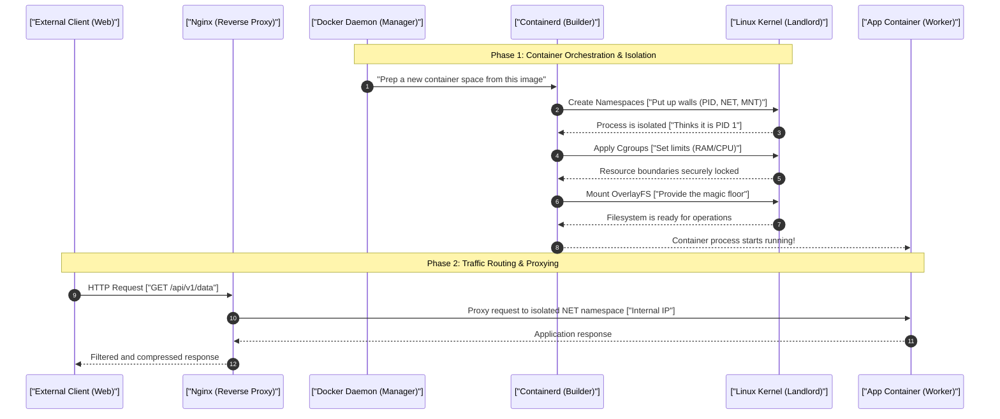

# 1. Analogy First: The Apartment Building (Namespaces, Cgroups, OverlayFS, Host OS)

Think of your bare-metal server (the Host OS) like a massive, newly constructed apartment building:
- **VMs (Virtual Machines):** Like building entirely separate houses on empty plots of land. Each house needs its own foundation (Guest OS), its own plumbing, and its own electrical grid. They are heavy, incredibly slow to build, and waste a massive amount of physical space.
- **Docker Containers:** Like efficiently designed apartments inside our massive building. They share the same foundation and building-wide utilities, but they feel completely private to the tenants.
  - **Namespaces (The Walls & Doors):** You can't see what your neighbor is doing, and you can't hear them. You feel like you have the whole apartment building to yourself. The walls logically isolate you.
  - **Cgroups (Utility Meters):** The landlord (Linux Kernel) strictly tracks your water and power usage. If you use too much (CPU/Memory limits), they throttle your supply or forcefully evict you (OOM Killer).
  - **OverlayFS (Magic Floors & Paint):** Everyone shares the exact same underlying concrete floor and base layout (the Read-Only Base Image), but tenants can paint their own temporary walls or lay temporary carpets (Writable Container Layer) on top. When the tenant leaves, the temporary paint is wiped away, but the concrete base remains intact for the next person.

# 2. Step-by-Step Flow: Anatomy of a Container

How a Docker container actually starts up and processes traffic under the hood:



# 3. Deep Linux Kernel Mechanics

To master backend infrastructure, you must understand the Linux primitives that make containers possible. A container isn't a magical box; it's just a normal Linux process wrapped in a blanket of kernel isolation features.

## The 6 Core Namespaces
Namespaces provide pure logical isolation. They trick a process into thinking it has the entire operating system to itself.

| Namespace | Isolation Provided | What the Container Sees Under the Hood |
|-----------|--------------------|----------------------------------------|
| **PID** (Process ID) | Process trees | Thinks it is PID 1 (init). Cannot see processes outside the container. |
| **NET** (Network) | Network stack, interfaces, IPs | Has its own `eth0`, `lo`, and routing tables. Needs port mapping to reach host. |
| **MNT** (Mount) | Filesystem mount points | Cannot see the host's `/var` or `/etc`. Thinks its root `/` is the whole disk. |
| **IPC** (Inter-Process) | Shared memory, semaphores | Can only communicate with processes in the same IPC namespace. |
| **UTS** (UNIX Timesharing) | Hostname and Domain name | Has a unique hostname (usually the container ID) completely different from the host machine. |
| **USER** (User/Group IDs) | User and Group privileges | Container `root` can be seamlessly mapped to a non-privileged user on the host system. |

## Cgroups (Control Groups) Resource Limits
Cgroups govern resource accounting and limiting. While Namespaces handle *what* a process can see, Cgroups handle *how much* a process can use.
- **CPU Shares (Relative):** A soft limit. If the host is busy, the container gets a proportional share of CPU time. If the host is idle, the container can use unallocated cycles.
- **CFS Quota (Absolute):** A hard limit on CPU. For example, capping a container at exactly 1.5 CPUs, regardless of how idle the host machine is.
- **Memory Hard Limits:** The absolute maximum RAM allowed.
- **OOM Killer (Out of Memory):** If a container attempts to allocate memory beyond its hard limit, the kernel steps in and abruptly terminates the container process.

## OverlayFS Storage Layout
OverlayFS is a union mount filesystem. It layers directories over one another to create a single, unified view.
- **LowerDir:** The read-only image layers (the concrete floor). These can be safely shared across hundreds of identical containers.
- **UpperDir:** The thin read-write layer created specifically when the container starts (the temporary paint).
- **MergedDir:** The unified view the container actually sees, combining the LowerDir and UpperDir.
- **WorkDir:** Used internally by OverlayFS for atomic file operations (like moving or deleting files).

# 4. Annotated Code Examples

## Production Nginx Reverse Proxy Configuration
A reverse proxy acts as a traffic cop, routing external requests to isolated internal containers while handling SSL, caching, and security.

```nginx
# /etc/nginx/nginx.conf
# Define an upstream block to load balance across multiple app containers
upstream backend_app {
    # Round-robin load balancing by default
    # Pointing to internal Docker network addresses
    server app_container_1:8080 weight=3; # Receives 3x the traffic
    server app_container_2:8080 weight=1;
    server app_container_3:8080 backup;   # Only used if others fail
}

# Rate limiting zone: limits to 10 requests per second per IP
limit_req_zone $binary_remote_addr zone=api_limit:10m rate=10r/s;

server {
    listen 443 ssl http2; # HTTP/2 enabled for multiplexing
    server_name api.example.com;

    # SSL Termination: Nginx handles the heavy crypto, passing plain HTTP to the app
    ssl_certificate /etc/nginx/ssl/cert.pem;
    ssl_certificate_key /etc/nginx/ssl/key.pem;
    ssl_protocols TLSv1.2 TLSv1.3;

    # Enable Gzip compression for faster text-based responses
    gzip on;
    gzip_types text/plain application/json application/javascript text/css;
    gzip_min_length 1000;

    location / {
        # Apply rate limiting to prevent basic DoS attacks
        limit_req zone=api_limit burst=20 nodelay;

        # Proxy the request to the upstream group
        proxy_pass http://backend_app;

        # Pass important headers to the internal container
        proxy_set_header Host $host;
        proxy_set_header X-Real-IP $remote_addr;
        proxy_set_header X-Forwarded-For $proxy_add_x_forwarded_for;
        proxy_set_header X-Forwarded-Proto $scheme;

        # Optimization: buffer responses to free up the backend faster
        proxy_buffers 16 16k;
        proxy_buffer_size 16k;
        
        # Timeout configurations
        proxy_connect_timeout 5s;
        proxy_read_timeout 60s;
    }
}
```

## Python Script: Inspecting Cgroup Metrics (Python 3.11+)

Instead of blindly assuming an application has access to all host memory, modern backend services can inspect their own `cgroup` limits dynamically. This is crucial for properly sizing internal thread pools or memory caches.

```python
import os
from typing import Optional, Dict

def get_cgroup_memory_metrics() -> Dict[str, Optional[int]]:
    """
    Reads the memory hard limit and current usage for the current containerized process.
    Modern Linux systems (and Docker) use Cgroups v2.
    """
    cgroup_dir = "/sys/fs/cgroup/"
    mem_max_file = os.path.join(cgroup_dir, "memory.max")
    mem_current_file = os.path.join(cgroup_dir, "memory.current")
    
    metrics: Dict[str, Optional[int]] = {
        "limit_bytes": None,
        "current_bytes": None
    }
    
    try:
        # 1. Read the raw memory limit value from the kernel virtual file
        if os.path.exists(mem_max_file):
            with open(mem_max_file, "r") as f:
                limit_str = f.read().strip()
                
            # 'max' indicates no hard limit is enforced
            if limit_str != "max":
                metrics["limit_bytes"] = int(limit_str)
                
        # 2. Read the current memory usage
        if os.path.exists(mem_current_file):
            with open(mem_current_file, "r") as f:
                metrics["current_bytes"] = int(f.read().strip())
                
    except PermissionError:
        print("Warning: Permission denied reading cgroup metrics.")
    except ValueError as e:
        print(f"Warning: Could not parse cgroup value: {e}")
        
    return metrics

if __name__ == "__main__":
    # In a real app, you would use this to dynamically size caches
    mem_stats = get_cgroup_memory_metrics()
    
    limit = mem_stats.get("limit_bytes")
    current = mem_stats.get("current_bytes")
    
    if limit and current:
        limit_mb = limit / (1024 * 1024)
        current_mb = current / (1024 * 1024)
        utilization = (current / limit) * 100
        
        print(f"Container Memory Limit: {limit_mb:.2f} MB")
        print(f"Current Usage: {current_mb:.2f} MB ({utilization:.1f}%)")
        
        if utilization > 80.0:
            print("ALERT: Approaching OOM killer threshold! Triggering garbage collection.")
    else:
        print("Running in an unconstrained environment (no limits detected).")
```

# 5. Interview Tips: 3-Point Elevator Pitches (Senior Architecture)

**Q: How do you debug OOM (Out of Memory) container terminations?**
1. **Differentiate the OOM:** First, determine if the application crashed because it hit its own runtime limits (like the JVM or V8 heap limit), or if the Linux Kernel Cgroup OOM Killer terminated the whole container.
2. **Inspect Kernel Logs:** Check `dmesg` or `/var/log/syslog` on the underlying host node. Look for `killed as a result of limit of /memory.max`. This confirms the exact Cgroup that triggered the kill and the specific process targeted.
3. **Analyze Memory Dumps:** Instead of blindly increasing RAM, adjust limits temporarily to capture a heap dump right before the crash. Use this to identify memory leaks or unbounded data structures.

**Q: Explain how a container escape vulnerability fundamentally works.**
1. **Shared Foundation:** Unlike Virtual Machines, containers share the exact same Linux Kernel as the host machine.
2. **Dangerous Misconfigurations:** If a container is run with `--privileged`, it disables Namespace protections and maps host device files (like `/dev/sda`) directly into the container.
3. **The Breakout:** An attacker exploits this by mounting the host's physical hard drive inside the container, writing a malicious cron job or modifying SSH keys, and gaining a root shell on the underlying host.

**Q: Why is tuning Nginx buffer limits critical for reverse proxying?**
1. **The Fast Proxy / Slow Client Problem:** If a mobile client has a slow, flaky 3G connection, it forces the backend application (which is heavy and expensive) to stay occupied while slowly streaming the response.
2. **Buffering Solution:** Nginx reads the entire response instantly from the fast backend, buffers it in memory or on disk, and immediately releases the backend connection.
3. **Resource Efficiency:** The heavy-lifting app is freed to handle new requests, while lightweight Nginx slowly drips the buffered data to the client, preventing backend starvation.

**Q: What is a zero-copy socket configuration in Nginx and when is it used?**
1. **Traditional Flow:** Serving a static file normally requires copying data from the disk to kernel space, then pulling it into user space, and copying it back to kernel space for the network socket.
2. **The \`sendfile\` Directive:** Zero-copy (\`sendfile on;\`) instructs the kernel to copy data directly from the disk to the network socket, completely bypassing user space.
3. **Massive Performance Gain:** This dramatically reduces CPU context switching and memory bandwidth consumption, making it essential for high-throughput static asset delivery and video streaming architectures.
