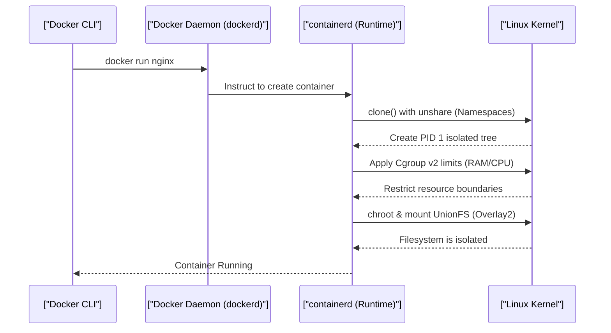

# Docker Mechanics: Namespaces, Cgroups & Reverse Proxies (Staff Architect Edition)

> **Module:** Cloud & DevOps (Topic 5.1)
> **Source Mapping:** `backend-roadmap.md` & `roadmap.md`

---

## 💡 1. Conceptual Blueprint & First Principles

Docker revolutionized DevOps by shifting from hardware virtualization (Virtual Machines) to **OS-level virtualization**. 

**Design Motivations & Trade-offs:**
- **Resource Efficiency:** VMs require a full guest OS and hypervisor mapping (expensive). Containers share the host's Linux Kernel natively, achieving bare-metal execution speed.
- **Immutability:** "Build once, run anywhere".
- **Trade-off (Security):** Shared kernel means a kernel panic or vulnerability in one container could potentially compromise the host. Strong isolation configurations are mandatory.

---

## 🔬 2. Under-the-Hood Mechanics

### Sequence Diagram: The Anatomy of a Container



### The 3 Pillars of Containerization:
1. **Namespaces:** What a process can *see*. (PID limits process visibility, NET isolates network stacks, MNT restricts filesystem views).
2. **Cgroups (Control Groups):** What a process can *use*. Enforces strict hardware quotas.
3. **UnionFS (OverlayFS):** Layered file system enabling lightweight, diff-based image builds without duplicating entire file systems.

---

## 💻 3. Production Code & Benchmarks

### Security Hardened Nginx Docker-Compose
*Running as non-root, read-only root filesystem, restricted cgroups.*

```yaml
version: '3.8'
services:
  nginx:
    image: nginx:alpine
    ports:
      - "80:80"
    deploy:
      resources:
        limits:
          cpus: '0.50'
          memory: 256M
    read_only: true
    security_opt:
      - no-new-privileges:true
    user: "101:101" # Run as non-root
    tmpfs:
      - /var/cache/nginx
      - /var/run
```

### Benchmarks (VM vs Container Boot Time)
| Environment | Boot Time | Disk Space Overhead | CPU Execution |
|-------------|-----------|---------------------|---------------|
| KVM / VMware | ~30s - 2m | ~10 GB+ | ~90-95% efficiency |
| Docker | ~0.5s - 1s | ~50 MB (Alpine) | ~99% (Native) |

---

## ⚔️ 4. Staff / Senior Interview Scenarios

1. **Question:** "What does the `chroot` command do and how does it relate to Docker?"
   - **Answer:** `chroot` (change root) changes the apparent root directory for the current running process and its children. A program cannot access files outside the designated directory tree. Docker uses `pivot_root` (a more secure evolution of chroot) alongside mount namespaces to isolate the container's filesystem.
2. **Question:** "Why is it dangerous to run a Docker container with `--privileged`?"
   - **Answer:** `--privileged` disables all protective cgroups and namespaces, gives the container root-level access to all host devices (`/dev`), and grants full Linux capabilities (`CAP_SYS_ADMIN`). A breakout from the container to host root is trivial.
3. **Question:** "How does an Nginx reverse proxy fit into a microservice Docker architecture?"
   - **Answer:** Nginx acts as the Edge Router. It binds to the host's port 80/443 (handling SSL termination) and uses Docker's internal DNS (e.g. `http://php-fpm:9000`) to proxy HTTP/FastCGI requests into internal containers that are otherwise sealed off from the public internet.
