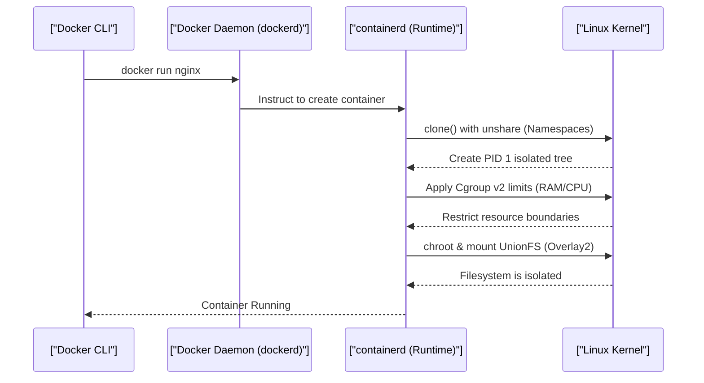

# Docker Mechanics: Namespaces, Cgroups & Reverse Proxies (Staff Architect Edition)

> **Module:** Cloud & DevOps (Topic 5.1)
> **Source Mapping:** `backend-roadmap.md` & `roadmap.md`

---

## 💡 1. First-Principles Mechanics: OS-Level Virtualization

Docker is not a VM; it's a glorified wrapper around native Linux kernel features. 
- **Namespaces (`unshare`, `clone`):** Isolate the view of the system. A process in a PID namespace thinks it is PID 1. Network namespaces provide isolated virtual ethernet interfaces (`veth`).
- **Cgroups (`/sys/fs/cgroup`):** Limit physical resource consumption (CPU time slices, memory pages). The kernel's OOM killer targets cgroups exceeding memory limits.
- **OverlayFS:** A union filesystem that layers read-only image layers and mounts a writable ephemeral layer on top, saving immense disk space.

### Sequence Diagram: The Anatomy of a Container



---

## 🏢 2. Real-World Production Example: Uber & Netflix Microservices

Companies like Uber deploy thousands of microservices using lightweight Alpine/Scratch containers. A critical pattern is the **Reverse Proxy (Nginx/Envoy)** acting as an edge gateway, terminating SSL, and routing traffic to strictly isolated, unprivileged internal containers.

### Hardened Production Code Snippet (Docker & Nginx)

```yaml
# docker-compose.yml
version: '3.8'
services:
  nginx:
    image: nginx:alpine
    ports:
      - "80:80"
    deploy:
      resources:
        limits:
          cpus: '0.50'     # Kernel Cgroup CPU quota limit
          memory: 256M     # Kernel Cgroup Memory limit
    read_only: true        # Mounts root FS as read-only (Security)
    security_opt:
      - no-new-privileges:true # Prevents privilege escalation (SUID)
    user: "101:101"        # Runs as non-root UID
    tmpfs:                 # Ephemeral writable mounts for required cache
      - /var/cache/nginx
      - /var/run
```

---

## 📈 3. Benchmarks & CLI Commands

### Exploring Namespaces and Cgroups directly

**CLI Command:**
```bash
# 1. View Docker Cgroup limits for a container directly in the kernel virtual filesystem
cat /sys/fs/cgroup/system.slice/docker-<container_id>.scope/memory.max

# 2. Benchmark Syscall Overhead (Container vs Host) using perf
perf stat -e cpu-clock,context-switches,page-faults docker run --rm alpine echo "Done"
```

**Annotated Output:**
```text
# Cgroup Output:
268435456  <-- Exactly 256MB in bytes enforced by the Kernel!

# Perf Output:
       0.89 msec cpu-clock         # Extremely fast, practically bare-metal
         12      context-switches  
         64      page-faults       
```

---

## 🛑 4. Architectural Trade-offs & Limits

- **Shared Kernel Vulnerabilities:** A zero-day in the Linux Kernel can lead to container escape, compromising the host. (e.g., Dirty COW).
- **Filesystem IO Overhead:** OverlayFS is fast, but database workloads (MySQL/Postgres) suffer heavily due to copy-on-write overhead. **Mitigation:** Always use raw block Volumes for database data directories.

---

## ⚔️ 5. Staff / Senior Interview Scenarios

**Q1: What does the `chroot` command do and how does it relate to Docker?**
*A1:* `chroot` changes the apparent root directory for the running process. A program cannot access files outside the designated tree. Docker uses `pivot_root` (a secure evolution of chroot) alongside mount namespaces to isolate the container's filesystem comprehensively.

**Q2: Why is it extremely dangerous to run a Docker container with `--privileged`?**
*A2:* `--privileged` disables protective cgroups, seccomp profiles, and namespaces. It maps all host devices (`/dev`) into the container and grants full Linux capabilities (`CAP_SYS_ADMIN`). A malicious actor can easily mount the host's root disk and gain complete control over the host OS.

**Q3: Explain the PID namespace mapping.**
*A3:* Inside a container, the main process is mapped to PID 1. However, on the host OS, that exact same process has a completely different PID (e.g., PID 14502). The kernel translates these PIDs on the fly depending on the namespace context of the observer.
