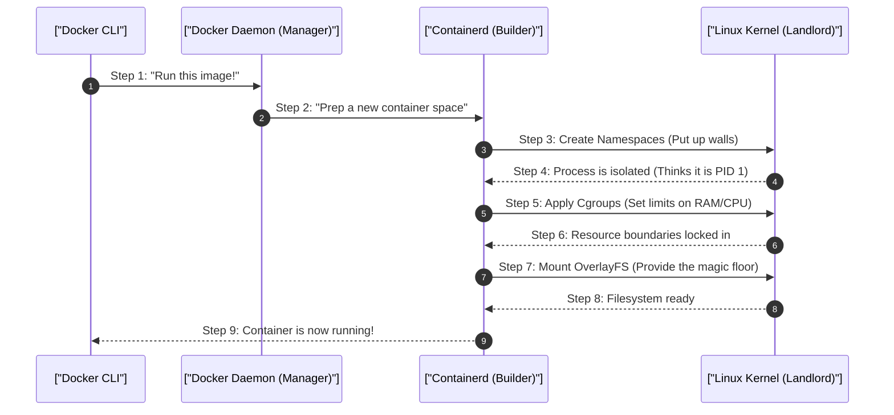

# 1. Analogy First: The Apartment Building

Think of your server (Host OS) like an apartment building:
- **VMs (Virtual Machines):** Like building entirely separate houses. Each needs its own plumbing, electricity, and foundation. Heavy and slow to build.
- **Docker Containers:** Like apartments inside one building. 
  - **Namespaces (The Walls):** You can't see what your neighbor is doing. You feel like you have the whole place to yourself.
  - **Cgroups (Utility Meters):** The landlord (Kernel) tracks your water and power usage. If you use too much, they shut off your valve.
  - **OverlayFS (Magic Floors):** Everyone shares the exact same concrete floor (Base Image), but can paint their own temporary floorboards (Writable Layer) on top.

## 2. Step-by-Step Flow: Anatomy of a Container

How a Docker container actually starts up under the hood:



## 3. Annotated Python Code: Simulating Cgroups (Resource Limits)

While Docker handles Cgroups for us, if we wrote a script inside a container, here's how we might respect constraints. (In reality, the kernel enforces this automatically!)

```python
import os
import resource

# 1. Function to simulate what Docker Cgroups do to restrict memory
def limit_memory(maxsize_bytes: int):
    # 2. Get the current memory limits for this process
    soft, hard = resource.getrlimit(resource.RLIMIT_AS)
    
    # 3. Set a new hard limit on memory consumption (simulating a Cgroup restriction)
    resource.setrlimit(resource.RLIMIT_AS, (maxsize_bytes, hard))
    print(f"Memory limited to {maxsize_bytes / (1024*1024)} MB")

# 4. Let's limit our script to 256MB, just like a secure Docker container
limit_memory(256 * 1024 * 1024)

try:
    # 5. Try to allocate a massive amount of memory (300MB)
    print("Attempting to allocate 300MB of RAM...")
    massive_list = [0] * (300 * 1024 * 1024)
except MemoryError:
    # 6. The OS steps in and blocks it! Just like Docker's OOM Killer.
    print("Blocked! The Kernel prevented us from using too much memory.")
```

## 4. Architectural Trade-offs & Security

- **Shared Kernel Risk:** Because all containers share the same Kernel (building foundation), if a hacker finds a crack in the foundation, they can compromise every apartment (container escape).
- **Filesystem Slowness:** OverlayFS is great for saving space, but terrible for heavy read/writes. 
  - *Fix:* Never store database files inside the container's normal filesystem. Always mount a raw Block Volume!

## 5. Interview Tips: 3-Point Elevator Pitches

**Q: Why is running a Docker container with `--privileged` dangerous?**
1. **Disabled Protections:** It disables the walls (Namespaces) and meters (Cgroups).
2. **Device Access:** It maps all host devices (hard drives, etc.) directly into the container.
3. **Total Control:** A hacker inside could simply mount the host's main hard drive and take over the entire server.

**Q: What is a Reverse Proxy (like Nginx) in Docker?**
1. **The Bouncer:** It sits at the edge of your network taking all incoming public traffic.
2. **Security:** It terminates SSL and filters out bad requests.
3. **Routing:** It quietly passes the good traffic to isolated, hidden internal containers that have no public internet access.
