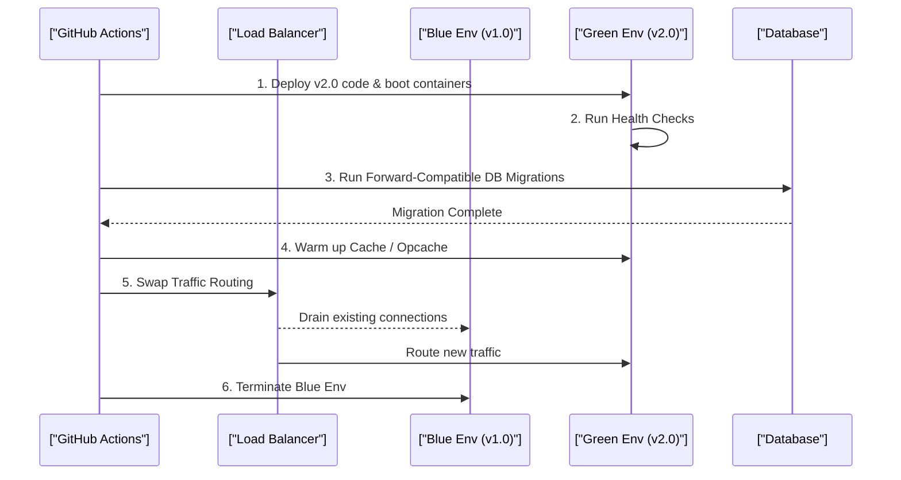

# CI/CD Pipelines, Zero-Downtime Deployments & Migrations (Staff Architect Edition)

> **Module:** Cloud & DevOps (Topic 5.2)
> **Source Mapping:** `backend-roadmap.md` & `roadmap.md`

---

## 🏭 Real-World Analogy: The Automated Assembly Line & Dual Highway Lanes

Think of shipping code and managing continuous deployments like running a precision manufacturing plant and express highway traffic:
- **Continuous Integration (CI) = The Factory Quality Inspector**: Every single product coming down the assembly line is automatically scanned, measured, and stress-tested before it can leave the factory. If any defect or test failure is found, the line halts immediately to keep bad parts from reaching users.
- **Continuous Delivery / Deployment (CD) = The Automated Conveyor Belt**: Once inspected and approved, items are placed onto an automated conveyor belt that packages, stamps, and safely ships them straight to retail shelves without requiring manual, error-prone human intervention.
- **Blue-Green Deployment = Dual Highway Lanes**: Imagine having two identical highway lanes side-by-side. Cars are currently driving smoothly on Lane A (Blue). Road workers pave and test Lane B (Green) in complete isolation. When Lane B is fully verified, a traffic switch instantly redirects all incoming cars to Lane B without stopping a single car or causing any downtime.
- **Zero-Downtime Database Migration = Replacing Train Tracks While the Train is Running**: You cannot stop the high-speed express train (live user traffic) just to lay new tracks (database schema changes). Instead, you lay new parallel tracks alongside the existing ones (Expand), guide train wheels smoothly over (Migrate), verify stability, and only then dismantle the old rails (Contract).

---

## 💡 1. Conceptual Blueprint & First Principles

The core philosophy of CI/CD and Zero-Downtime Deployments is **Risk Mitigation through Automation**. Human interaction during releases introduces variability; CI/CD pipelines enforce predictable, immutable, and testable promotion paths for code.

**Design Motivations & Trade-offs:**
- **Continuous Integration (CI):** Guarantees code quality (linting, tests) *before* merge. Trade-off: Slow CI blocks developer velocity.
- **Zero-Downtime Deployments:** Ensures 100% uptime for clients. Trade-off: Requires complex parallel environments (Blue/Green) and forward/backward-compatible database schemas.

---

## 🔬 2. Under-the-Hood Mechanics

### Sequence Diagram: The Blue-Green Deployment & Database Migration



### The Expand & Contract Database Pattern
You cannot run destructive DB commands (like `DROP COLUMN`) during a zero-downtime deployment, because the V1 code is still actively reading it. 
- **Phase 1 (Expand):** Add new column. Code writes to both old and new.
- **Phase 2 (Migrate):** Backfill old rows.
- **Phase 3 (Contract - Next Deploy):** Drop the old column.

---

## 💻 3. Production Code & Benchmarks

### Classic Symlink Zero-Downtime Deployment (Bash)
*Used heavily in PHP/Laravel (Envoyer style).*

```bash
#!/bin/bash
RELEASE_DIR="/var/www/releases/$(date +%Y%m%d%H%M%S)"
CURRENT_LINK="/var/www/current"

# 1. Clone new code to isolated release directory
git clone git@github.com:repo/app.git $RELEASE_DIR
cd $RELEASE_DIR

# 2. Build artifacts (Composer, NPM)
composer install --no-dev --optimize-autoloader
npm run build

# 3. Migrate DB (Must be forward compatible!)
php artisan migrate --force

# 4. Atomic Symlink Swap (Zero Downtime)
ln -sfn $RELEASE_DIR $CURRENT_LINK

# 5. Reload PHP-FPM cleanly without dropping requests
sudo systemctl reload php8.2-fpm
```

### Deploy Strategies Comparison
| Strategy | Downtime | Rollback Speed | Infra Cost | Risk |
|----------|----------|----------------|------------|------|
| In-Place | ~10s - 1m | Slow (Re-deploy) | Low | Very High |
| Blue-Green | None | Instant (Swap LB) | 2x (High) | Low |
| Canary | None | Fast | 2x (High) | Very Low |

---

## ⚔️ 4. Staff / Senior Interview Scenarios

1. **Question:** "A production deploy introduced a severe bug, but the DB migration already ran. How do you roll back?"
   - **Answer:** In a Zero-Downtime setup, rollbacks should ideally be code-only (switch the LB back to Blue). This mandates that DB migrations be strictly non-destructive and backward-compatible. If you dropped a table, a code rollback will break because V1 code expects that table. Never drop data until the V2 code has been stable for days.
2. **Question:** "What is the difference between `reload` and `restart` in a web server like Nginx or PHP-FPM during a deployment?"
   - **Answer:** `restart` completely kills the master process, dropping all active user connections. `reload` sends a `SIGHUP` signal. The master process spins up new child workers with the new config/code while allowing old child workers to gracefully finish their active requests.
3. **Question:** "How do you handle heavy CI pipeline bottlenecks?"
   - **Answer:** Matrix builds. Split the PHPUnit test suite by directory and run them concurrently across multiple GitHub Action runners. Cache Composer/NPM dependencies aggressively.
