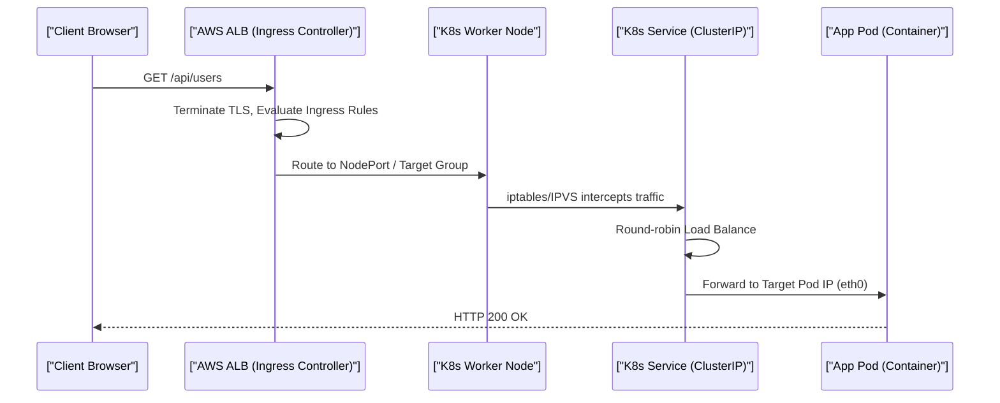

# AWS Cloud Architecture & Kubernetes (Staff Architect Edition)

> **Module:** Cloud & DevOps (Topic 5.3)
> **Source Mapping:** `backend-roadmap.md` & `roadmap.md`

---

## 💡 1. Conceptual Blueprint & First Principles

Designing a modern cloud architecture involves establishing a secure network boundary (VPC) and strategically placing compute/data resources within segmented tiers. Kubernetes (K8s) takes container orchestration a step further by abstracting away the servers entirely, allowing developers to interact purely with a declarative API.

**Design Motivations & Trade-offs:**
- **Tiered VPC Architecture:** Separating Web/App/DB tiers physically at the network level prevents lateral movement during a security breach.
- **Kubernetes (K8s) vs ECS:** ECS is deeply integrated into AWS, simpler, and faster to configure. K8s is cloud-agnostic, has a massive open-source ecosystem (Helm, Istio), but comes with an incredibly steep operational learning curve.

---

## 🔬 2. Under-the-Hood Mechanics

### Sequence Diagram: K8s Ingress Traffic Routing



### The Kubernetes Control Plane Memory Map
- **etcd:** Distributed key-value store holding cluster state.
- **kube-apiserver:** The central brain handling REST API requests.
- **kube-scheduler:** Binds unscheduled Pods to Nodes based on resource limits.
- **kubelet:** The agent on every worker node communicating with Docker/containerd.

---

## 💻 3. Production Code & Benchmarks

### Kubernetes High-Availability Deployment (YAML)

```yaml
apiVersion: apps/v1
kind: Deployment
metadata:
  name: backend-api
spec:
  replicas: 3
  strategy:
    type: RollingUpdate
    rollingUpdate:
      maxSurge: 1       # Allows 4 pods temporarily
      maxUnavailable: 0 # Guarantees 3 pods always up
  selector:
    matchLabels:
      app: backend-api
  template:
    metadata:
      labels:
        app: backend-api
    spec:
      containers:
      - name: php-fpm
        image: backend-api:v2.0
        resources:
          limits:
            memory: "512Mi"
            cpu: "500m"
        readinessProbe:
          httpGet:
            path: /health
            port: 80
          initialDelaySeconds: 5
```

### Throughput & Latency Costs
| Network Hop | Latency Added | Bandwidth Implication |
|-------------|---------------|-----------------------|
| Inter-AZ (Cross Data Center) | ~1-2ms | $$$ (AWS Cross-AZ Transfer Fees) |
| Intra-AZ (Same Data Center) | < 0.1ms | Free / Negligible |
| NAT Gateway (Private to Web) | ~0.5ms | $$$ (Data Processing Fees) |

---

## ⚔️ 4. Staff / Senior Interview Scenarios

1. **Question:** "Your database is in a Private Subnet and has no internet access. How do you download security patches to the database server?"
   - **Answer:** Deploy a NAT Gateway in the Public Subnet and update the Private Subnet's Route Table to point `0.0.0.0/0` outbound traffic to the NAT Gateway. This allows outbound-only internet access while blocking inbound connections.
2. **Question:** "What happens if a Kubernetes Worker Node suddenly dies?"
   - **Answer:** The `kube-controller-manager` detects the node is Unreachable. It evicts the Pods assigned to that node. The Deployment controller sees the actual replica count dropped below the desired state and requests the `kube-scheduler` to spin up new Pods on the remaining healthy nodes.
3. **Question:** "How does an AWS ALB route traffic into K8s Pods efficiently?"
   - **Answer:** Using the AWS Load Balancer Controller, the ALB can run in "IP Mode". Instead of routing to EC2 Node ports (requiring extra iptables hops), the ALB routes traffic *directly* to the underlying Elastic Network Interfaces (ENIs) of the Pods inside the VPC.
