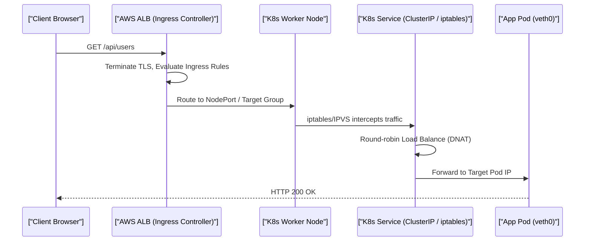

# AWS Cloud Architecture & Kubernetes (Staff Architect Edition)

> **Module:** Cloud & DevOps (Topic 5.3)
> **Source Mapping:** `backend-roadmap.md` & `roadmap.md`

---

## 💡 1. First-Principles Mechanics: K8s Networking & SDN

Kubernetes relies on Software-Defined Networking (SDN) and CNI plugins (e.g., Calico, Flannel). At the lowest level, routing is handled by the host Linux kernel's `iptables` or `IPVS` (IP Virtual Server). When you hit a K8s Service `ClusterIP`, it is not a real physical interface; it's a set of `iptables` DNAT (Destination NAT) rules distributed across all nodes that intercept the packet and rewrite the destination IP to a random backend Pod IP.

### Sequence Diagram: K8s Ingress Traffic Routing



---

## 🏢 2. Real-World Production Example: Multi-AZ Fault Tolerance

Netflix and Stripe utilize Multi-AZ (Availability Zone) deployments. A VPC spans a Region, but Subnets are bound to specific physical data centers (AZs). K8s Node Groups are distributed across these AZs so that an entire data center failure does not cause an outage.

### Production Infrastructure Code (Terraform / K8s YAML)

```yaml
# K8s Deployment with Pod Anti-Affinity (Ensuring High Availability)
apiVersion: apps/v1
kind: Deployment
metadata:
  name: backend-api
spec:
  replicas: 3
  selector:
    matchLabels:
      app: backend-api
  template:
    metadata:
      labels:
        app: backend-api
    spec:
      affinity:
        podAntiAffinity:
          requiredDuringSchedulingIgnoredDuringExecution:
          - labelSelector:
              matchExpressions:
              - key: app
                operator: In
                values:
                - backend-api
            topologyKey: "kubernetes.io/hostname" # Forces Pods onto DIFFERENT EC2 Nodes
      containers:
      - name: api
        image: backend-api:v2.0
        resources:
          limits:
            memory: "512Mi"
            cpu: "500m"
        readinessProbe: # Drops pod from Service rotation if it fails
          httpGet:
            path: /health
            port: 80
```

---

## 📈 3. Benchmarks & CLI Commands

### Diagnosing Internal Network Performance

Using `iperf3` to measure raw TCP bandwidth between two Pods in different EC2 nodes, and `kubectl` for inspection.

**CLI Command:**
```bash
# Get pod placement to verify Anti-Affinity
kubectl get pods -o wide | grep backend-api

# Run Network Benchmark inside a Pod
kubectl exec -it <pod_name> -- iperf3 -c <other_pod_ip>
```

**Annotated Output:**
```text
# kubectl get pods -o wide
backend-api-xyz  Running  10.0.1.15  ip-10-0-1-50.ec2.internal  <-- AZ A
backend-api-abc  Running  10.0.2.33  ip-10-0-2-80.ec2.internal  <-- AZ B

# iperf3 Output:
[ ID] Interval           Transfer     Bitrate         Retr
[  5]   0.00-10.00  sec  1.12 GBytes   962 Mbits/sec    0             sender
[  5]   0.00-10.04  sec  1.12 GBytes   958 Mbits/sec                  receiver
  <-- Nearly 1 Gbps throughput across AZs, but incurs AWS cross-AZ data transfer fees!
```

---

## 🛑 4. Architectural Trade-offs & Limits

- **Cross-AZ Traffic Costs:** K8s microservices often chat heavily. If Pod A in AZ-1 calls Pod B in AZ-2, AWS charges for that bandwidth. Over-segmentation leads to exorbitant cloud bills.
- **Control Plane Overhead:** Kubernetes requires dedicated master nodes running `etcd` (a Raft consensus key-value store). If `etcd` storage latency exceeds 50ms (due to slow EBS volumes), the entire cluster control plane degrades and can split-brain.

---

## ⚔️ 5. Staff / Senior Interview Scenarios

**Q1: Your database is in a Private Subnet and has no internet access. How do you download security patches?**
*A1:* Deploy a NAT Gateway in the Public Subnet. Update the Private Subnet's Route Table to point `0.0.0.0/0` outbound traffic to the NAT Gateway's ENI. The NAT Gateway performs Source NAT (SNAT), allowing outbound internet access while completely blocking unsolicited inbound connections.

**Q2: What happens under the hood if a K8s Worker Node suddenly dies?**
*A2:* The `kubelet` on the node stops sending heartbeats. The `kube-controller-manager` marks the node as `NotReady` and evicts the Pods. The Deployment controller observes the actual replica count is below the desired state, and asks the `kube-scheduler` to place new replacement Pods onto remaining healthy nodes.

**Q3: How does an AWS ALB route traffic into K8s Pods efficiently without extra network hops?**
*A3:* Using the AWS Load Balancer Controller in "IP Mode". Instead of routing to EC2 Node Ports (which requires kube-proxy `iptables` hops to find the pod), the ALB natively integrates with the VPC CNI. It routes packets directly to the underlying Elastic Network Interfaces (ENIs) of the Pods, shaving off latency and improving throughput.
