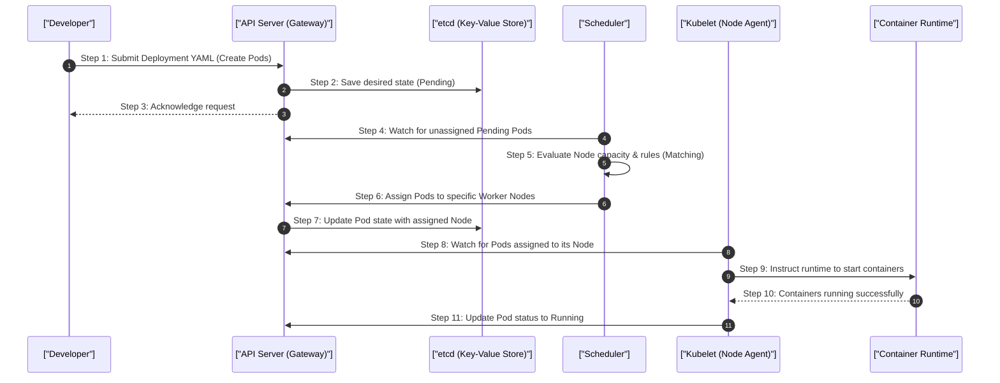

# 1. Analogy First: The Massive Post Office (Kubernetes Architecture)

Think of Kubernetes as a massive, highly efficient, and automated post office network distributed across multiple cities.

- **Control Plane (The Headquarters):** The management team that makes decisions but doesn't handle the mail directly.
  - **API Server (The Gateway):** The front desk manager. Everyone (developers, postal workers) must talk to the API Server to get or change anything. It validates and configures data for pods, services, and replication controllers.
  - **Scheduler (The Dispatcher):** Decides which warehouse (Node) has the capacity, required hardware, and right conditions to handle a new batch of mail (Pods).
  - **Controller Manager (The Floor Managers):** A collection of managers constantly walking around checking if the actual number of workers matches the desired number. 
    - *ReplicaSet Controller:* Ensures we always have 3 mailmen if we asked for 3.
    - *Node Controller:* Notices when a warehouse goes offline.
  - **etcd (The Master Logbook):** A highly secure, distributed key-value store that acts as the absolute source of truth for the cluster's state. It remembers who works where and what the current desired state is.

- **Data Plane (The Warehouses / Nodes):** Where the actual work happens.
  - **Kubelet (The Warehouse Supervisor):** The local agent on each node that talks to the API Server, takes instructions, and ensures the containers are running and healthy.
  - **Kube-Proxy (The Network Manager):** Manages the internal routing rules. It continually updates the local OS packet filtering layer (iptables/IPVS) so network traffic flows to the right containers.
  - **Container Runtime (The Workstations):** The actual software (like containerd or CRI-O) responsible for pulling images and running the isolated containers.

- **Networking (The Mail Processing):**
  - **Service / ClusterIP (The Sorting Bin):** An internal IP address that never changes. It represents a group of identical workers.
  - **iptables (The Automated Sorting Machines):** When a packet hits the sorting bin's IP, the OS instantly rewrites the destination address (DNAT) to route to a specific worker pod.
  - **Pods (The Postal Workers):** The active, atomic units of deployment containing one or more tightly coupled containers.

- **Multi-AZ Failovers (Regional Post Offices):** We spread our worker nodes across different physical data centers (Availability Zones). If a fire or power outage knocks out Zone A, the Controller Manager detects the lost workers and commands the Scheduler to spin up replacements in the surviving Zones B and C.

## 2. Step-by-Step Flow: Control Plane and Data Plane Interaction

How Kubernetes decides where and how to run your application:



## 3. Pod Lifecycle & Resource Scheduling

Understanding how Pods live, die, and consume resources is critical for building stable, self-healing systems.

### Pod States (The Lifecycle)
- **Pending:** The Pod is accepted by the cluster, but the Scheduler is still looking for a suitable Node, or container images are currently downloading.
- **Running:** The Pod is bound to a Node, and all containers have been created and at least one is actively running.
- **Succeeded:** All containers in the Pod terminated with a zero exit code (successful completion, e.g., a CronJob).
- **Failed:** All containers terminated, but at least one failed (exited with a non-zero status).
- **Unknown:** The state of the Pod cannot be determined, usually because the API Server lost communication with the Node's Kubelet.

### Health Checks (The Probes)
- **Startup Probe:** Checks if a legacy or slow-starting app has finally booted. Once it succeeds, it stops checking. If it fails, the container is killed and restarted.
- **Liveness Probe:** "Are you alive or deadlocked?" If this check fails repeatedly, the Kubelet aggressively kills the container and restarts it to recover from frozen states.
- **Readiness Probe:** "Are you ready to take traffic?" If this fails, the Pod is removed from the Service's active endpoints list. There are no restarts; the Pod just stops receiving user requests until it recovers.

### Resource Allocation & Eviction Classes (QoS)
- **Requests:** The guaranteed minimum amount of CPU/Memory a Pod needs. The Scheduler uses this threshold to find a Node with enough free capacity.
- **Limits:** The absolute maximum amount a Pod can use. Enforced directly by Linux cgroups. Exceeding CPU limits causes throttling. Exceeding Memory limits causes a brutal OOMKill (Out of Memory Kill).
- **Quality of Service (QoS) Classes (Who gets evicted first when a Node runs out of memory?):**
  - **Guaranteed (VIPs):** Requests exactly equal Limits for both CPU and Memory. These are evicted last.
  - **Burstable (Standard):** Requests are less than Limits. Evicted when the Node needs memory, but only after BestEffort pods are gone.
  - **BestEffort (Standby):** No Requests or Limits specified. These are the first to be mercilessly killed during node memory pressure.

## 4. Annotated Configuration: Kubernetes Deployment YAML

Here is a production-grade Deployment demonstrating resource limits, multi-probe health checks, and node anti-affinity rules to ensure multi-AZ resilience.

```yaml
apiVersion: apps/v1
kind: Deployment
metadata:
  name: payment-service
  labels:
    app: payment
spec:
  replicas: 3
  selector:
    matchLabels:
      app: payment
  template:
    metadata:
      labels:
        app: payment
    spec:
      # 1. Anti-Affinity: Prevent co-locating these pods on the same AZ if possible
      affinity:
        podAntiAffinity:
          preferredDuringSchedulingIgnoredDuringExecution:
          - weight: 100
            podAffinityTerm:
              labelSelector:
                matchLabels:
                  app: payment
              # Topology key ensures spread across different Availability Zones
              topologyKey: "topology.kubernetes.io/zone"
      containers:
      - name: payment-api
        image: payment-api:v1.2.0
        ports:
        - containerPort: 8080
        # 2. Resource Allocation (Burstable QoS)
        resources:
          requests:
            memory: "256Mi" # Scheduler requires a Node with 256MB free
            cpu: "200m"     # 0.2 of a CPU core reserved
          limits:
            memory: "512Mi" # Container is OOMKilled if it exceeds 512MB
            cpu: "500m"     # Process is throttled if it tries to use more than 0.5 CPU
        # 3. Startup Probe: Wait up to 60s for slow database migrations
        startupProbe:
          httpGet:
            path: /health/startup
            port: 8080
          failureThreshold: 30
          periodSeconds: 2
        # 4. Readiness Probe: Temporarily stop traffic if DB connection drops
        readinessProbe:
          httpGet:
            path: /health/ready
            port: 8080
          initialDelaySeconds: 5
          periodSeconds: 5
        # 5. Liveness Probe: Restart container if a thread deadlock occurs
        livenessProbe:
          httpGet:
            path: /health/live
            port: 8080
          initialDelaySeconds: 10
          periodSeconds: 10
```

## 5. Annotated Python Code: Health Check Implementation

Here is how a Python backend (using FastAPI) clearly separates the logic for these distinct K8s probes.

```python
from fastapi import FastAPI, Response, status
import time

app = FastAPI()

# Track initialization state
START_TIME = time.time()
DB_CONNECTED = False

def attempt_db_connection():
    global DB_CONNECTED
    # Simulate a slow 10-second database connection delay
    if time.time() - START_TIME > 10:
        DB_CONNECTED = True

@app.get("/health/startup")
def startup_probe(response: Response):
    """
    K8s Startup Probe: 
    Only succeeds once the app is fully initialized.
    Until this returns 200, K8s disables liveness and readiness probes.
    """
    attempt_db_connection()
    if not DB_CONNECTED:
        response.status_code = status.HTTP_503_SERVICE_UNAVAILABLE
        return {"status": "Starting up, DB not connected..."}
    
    return {"status": "Fully Initialized"}

@app.get("/health/ready")
def readiness_probe(response: Response):
    """
    K8s Readiness Probe: 
    Fails if downstream dependencies (like DB or Redis) are temporarily down.
    K8s stops sending user traffic here, but does NOT restart the pod.
    """
    if not DB_CONNECTED: # Imagine this executes a live ping to the DB
        response.status_code = status.HTTP_503_SERVICE_UNAVAILABLE
        return {"status": "Not ready to serve traffic"}
    
    return {"status": "Ready for traffic"}

@app.get("/health/live")
def liveness_probe():
    """
    K8s Liveness Probe: 
    Fails if the app is hopelessly deadlocked or frozen.
    K8s will hard-restart the container if this fails repeatedly.
    Usually very simple: just prove the web server event loop is running.
    """
    return {"status": "Alive and responsive"}
```

## 6. Senior Interview Scenarios & Troubleshooting

### Q: How do you troubleshoot a Pod stuck in "CrashLoopBackOff"?
1. **Identify the Loop:** The container starts, crashes almost immediately, and K8s attempts to restart it with an exponentially increasing delay (the backoff).
2. **Investigate Logs & State:** Run `kubectl logs <pod> --previous` to see the actual application crash error from the last run, and `kubectl describe pod <pod>` to see if it was an `OOMKilled` event.
3. **Common Culprits:** Usually a missing environment variable causing a startup crash, a fatal database connection error, or a misconfigured Liveness probe that restarts a slow-booting app before it has a chance to finish starting.

### Q: Why might Pods stay indefinitely in a "Pending" state (Scheduling Failures)?
1. **Out of CPU/Memory:** The cluster simply has no Nodes with enough unallocated CPU or Memory to satisfy the Pod's defined `requests`. 
2. **Taints and Tolerations Mismatch:** The available healthy Nodes have taints applied (e.g., dedicated strictly for ML workloads), and the Pod lacks the matching tolerations to be allowed on them.
3. **Strict Affinity Rules:** Rigid `podAntiAffinity` rules might prevent placing the Pod on any existing Nodes to avoid co-location, requiring the cluster autoscaler to boot a brand new EC2 instance.

### Q: How do you diagnose and resolve cross-AZ latency issues in K8s?
1. **Understand Kube-Proxy Default Behavior:** By default, Services route traffic completely randomly across all matching Pods in the cluster, completely ignoring which Availability Zone they reside in.
2. **Identify the Extra Hop:** Pod A in AZ-1 talks to a Service, which randomly forwards the TCP connection to Pod B in AZ-2. This incurs ~1-2ms of network latency and racks up expensive AWS cross-AZ data transfer costs.
3. **The Architectural Solution:** Implement "Topology Aware Routing". By enabling this, you hint to Kube-Proxy to prefer routing traffic locally to Pods in the same exact AZ, keeping traffic fast and cheap.

### Q: What happens to the cluster if the etcd database gets corrupted or loses quorum?
1. **The Brain Freezes:** etcd is the singular source of truth. Without it, the API Server cannot read, write, or update any cluster state.
2. **Data Plane Continues:** Surprisingly, existing Pods on worker nodes keep running and serving user traffic perfectly fine because Kube-Proxy routing rules are already cached in the local Linux iptables.
3. **No Updates Allowed:** You cannot deploy new applications, scale up, auto-scale, or delete crashed pods. To fix a corrupted etcd, you must perform an emergency restore from an automated backup snapshot.
