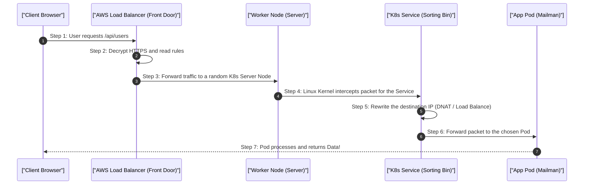

# 1. Analogy First: The Massive Post Office (K8s Networking)

Think of Kubernetes networking like a massive, highly efficient post office:
- **K8s Service (ClusterIP):** The front desk sorting bin. It doesn't actually store or open mail.
- **iptables (The Rules):** The automated sorting machines. When a letter hits the sorting bin, the machine instantly slaps a new specific address (DNAT) on the envelope.
- **Pods (The Mailmen):** The actual workers who receive the re-addressed letter and do the work.

**Multi-AZ (Availability Zones):** Imagine having warehouses in three different cities. If a power outage hits City A, Cities B and C keep processing orders. That’s why we spread our K8s nodes across different physical data centers (AZs).

## 2. Step-by-Step Flow: Ingress Traffic Routing

How a user's web request actually reaches your app inside Kubernetes:



## 3. Annotated Python Code: Health Checks (Readiness Probes)

Kubernetes needs to know if a Pod is actually ready to receive traffic. Here is how an app exposes a health check endpoint using Python/FastAPI.

```python
from fastapi import FastAPI, Response, status
import time

app = FastAPI()

# 1. Track when the app started
START_TIME = time.time()
# 2. Simulate a slow boot (e.g., connecting to a database)
BOOT_DELAY = 10 

@app.get("/health")
def health_check(response: Response):
    # 3. Calculate how long the app has been running
    uptime = time.time() - START_TIME
    
    if uptime < BOOT_DELAY:
        # 4. App is not ready yet! K8s will NOT send traffic here.
        response.status_code = status.HTTP_503_SERVICE_UNAVAILABLE
        return {"status": "Starting up..."}
    
    # 5. App is ready! K8s will start routing user requests to this Pod.
    return {"status": "Healthy, ready for traffic!"}

@app.get("/api/users")
def get_users():
    # 6. Normal business logic
    return {"users": ["Alice", "Bob"]}
```

## 4. Architectural Trade-offs & Limits

- **Cross-AZ Cloud Bills:** K8s microservices talk to each other constantly. If Pod A is in AZ-1 and Pod B is in AZ-2, AWS charges money for that cross-city data transfer. Over-segmentation can lead to huge cloud bills!
- **Control Plane Stress:** The "Brain" of K8s (etcd) requires blazing fast hard drives. If disk speed drops, the entire cluster can lose track of where pods are, causing chaos (split-brain).

## 5. Interview Tips: 3-Point Elevator Pitches

**Q: What happens if a K8s Worker Node suddenly dies?**
1. **Heartbeat Fails:** The master node notices the worker stopped sending "I'm alive" signals.
2. **Eviction:** The master marks the node as dead and officially evicts all pods that were on it.
3. **Rescheduling:** The controller sees we are short on pods, and commands the scheduler to spin up replacements on healthy nodes.

**Q: How does a NAT Gateway work for Private Subnets?**
1. **Isolation:** Servers in a private subnet have no public IP and cannot be reached from the internet.
2. **Outbound Need:** They still need to download security patches or updates.
3. **The Gateway:** Traffic goes to the NAT Gateway (in a public subnet), which fetches the data on their behalf, keeping the servers invisible to hackers.
