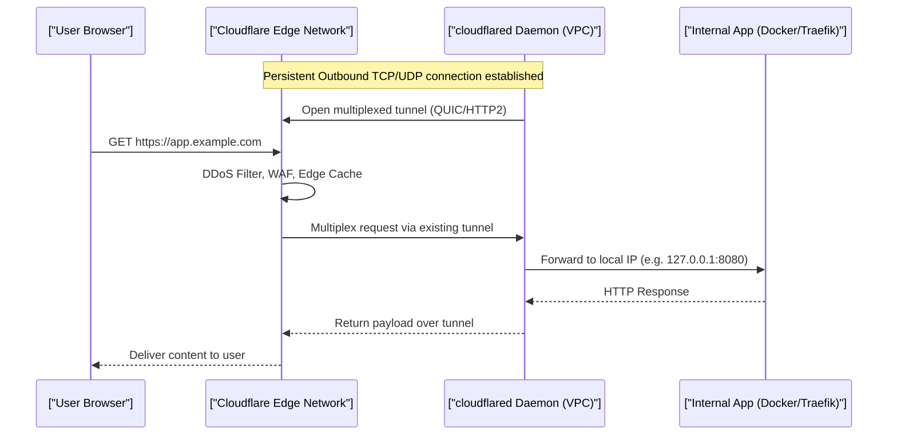

# Terraform IaC, Tunnels & Mesh Networks (Staff Architect Edition)

> **Module:** Cloud & DevOps (Topic 5.4)

---

## 🛋️ Real-World Analogy: The IKEA Manual, Receipts & Secret Passageways

Think of cloud infrastructure and private networking like assembling modular furniture and securing a private compound:
- **Terraform (IaC) = The IKEA Instruction Manual**: Instead of hammering pieces together randomly by hand (clicking around cloud web consoles), you write a clear, declarative manual. Hand that manual to anyone anywhere in the world, and they can assemble the exact same infrastructure reliably and repeatedly.
- **State File = The Purchase Receipt & Inventory Checklist**: The state file is the receipt that remembers exactly what you already purchased and built. When you want to add an extra shelf, Terraform checks the receipt first so it doesn't accidentally buy a duplicate wardrobe.
- **Cloudflare Tunnel = A Secret Underground Passage**: Instead of leaving your front door wide open to the public street with a welcome sign (opening public ports 80/443 on your router), you dig an encrypted outbound tunnel from inside your house to a secure public gatehouse (Cloudflare Edge). Strangers only see the gatehouse, while your home remains completely invisible.
- **Mesh Network (Tailscale/WireGuard) = Private Walkways Between Neighborhood Houses**: Instead of walking out onto busy public highways and passing through external toll booths to visit your neighbor, every trusted house in the community is connected by private, encrypted walkways. Devices talk directly, securely, and seamlessly.

---

## 💡 1. Conceptual Blueprint & First Principles

**Infrastructure as Code (IaC)** replaces manual UI clicks with declarative, version-controlled code, making infrastructure highly reproducible, auditable, and immutable. 

Meanwhile, **Zero Trust Networks** (Cloudflare Tunnels, Tailscale) shift the perimeter. Instead of securing a static firewall perimeter with open inbound ports, they utilize outbound-only encrypted tunnels and identity-aware peer-to-peer mesh networks.

**Design Motivations & Trade-offs:**
- **Terraform State:** Requires robust backend management (S3 + DynamoDB locking) to prevent team race conditions.
- **Tunnels / Mesh:** Eliminates public attack surfaces (no open port 80/443). Trade-off: Centralized dependency on the provider's control plane (Cloudflare/Tailscale).

---

## 🔬 2. Under-the-Hood Mechanics

### Sequence Diagram: Cloudflare Tunnel Request Flow



### Tailscale / WireGuard Mechanics
Tailscale uses WireGuard under the hood. It establishes direct P2P UDP connections (NAT Traversal / Hole Punching via STUN/TURN servers) so a laptop at Starbucks can securely route `100.x.y.z` directly to a database inside AWS without exposing the DB publicly.

---

## 💻 3. Production Code & Benchmarks

### Terraform: Locking State with S3 & DynamoDB
*To prevent two developers from applying changes simultaneously.*

```hcl
terraform {
  backend "s3" {
    bucket         = "company-terraform-state-prod"
    key            = "vpc/terraform.tfstate"
    region         = "us-east-1"
    encrypt        = true
    dynamodb_table = "terraform-state-lock"
  }
}

resource "aws_security_group" "db_sg" {
  name        = "db-security-group"
  description = "Allow MySQL from App Tier only"
  
  ingress {
    from_port       = 3306
    to_port         = 3306
    protocol        = "tcp"
    security_groups = [aws_security_group.app_sg.id]
  }
}
```

### Mesh Performance (Throughput)
| Connection Type | Overhead | Max Throughput | Latency Impact |
|-----------------|----------|----------------|----------------|
| Raw TCP/IP | None | Line Rate (10Gbps+) | 0ms |
| WireGuard (Kernel) | Low | ~1-3 Gbps | ~1-2ms |
| Tailscale (Userspace) | Medium | ~500 Mbps | ~2-5ms |

---

## ⚔️ 4. Staff / Senior Interview Scenarios

1. **Question:** "What happens if a Terraform apply fails halfway through (e.g. AWS API rate limit)?"
   - **Answer:** Terraform will save the state of the resources it successfully created up to that point. The state file becomes the source of truth. Running `terraform plan` again will compare the desired code against the partial state, and it will only attempt to create the remaining missing resources.
2. **Question:** "Why use a Cloudflare Tunnel instead of port forwarding port 443 on your router?"
   - **Answer:** Port forwarding opens your router to continuous automated mass-scanning (Shodan) and DDoS attacks. Cloudflare Tunnels initiate outbound connections only. From the internet's perspective, your network is invisible. All DDoS attacks hit Cloudflare's Edge, not your bandwidth.
3. **Question:** "How does Terraform know when a resource was manually deleted in the AWS Console?"
   - **Answer:** During the `plan` phase, Terraform runs a "Refresh". It queries the cloud provider's API for every resource ID stored in its local state file. If the API returns a 404, Terraform updates its in-memory state to reflect the drift, and plans to recreate the resource.
