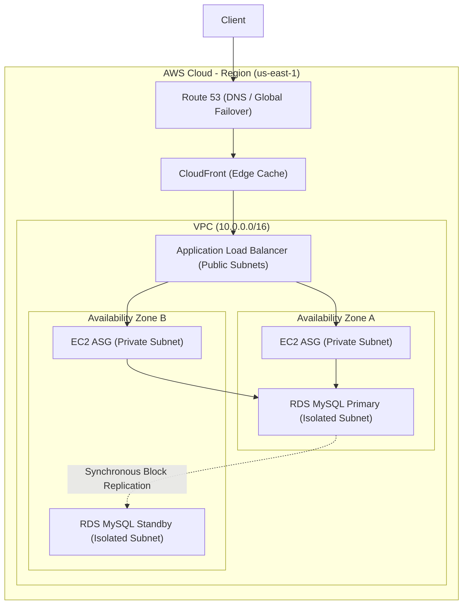

# AWS Certified Solutions Architect (SAA-C03) Guide (Staff Architect Edition)

> **Module:** Cloud & DevOps (Topic 5.5)
> **Target:** AWS SAA-C03 Certification & High-Availability Design

---

## 🏰 1. Analogy First: The AWS Medieval Empire

Before diving into IP addresses, subnets, and API calls, let's visualize AWS infrastructure as a sprawling, highly fortified medieval empire. This analogy helps contextualize why certain services exist and how they securely interact.

- **AWS Region (The Continent):** A massive geographic landmass (like North America or Europe). If a catastrophic event (like a meteor) strikes one continent, the other continents survive. When you deploy in `us-east-1`, your data physically lives on that continent.
- **Availability Zones / AZs (The Castles):** Within a Region, there are 3 or more heavily fortified castles separated by miles of terrain to prevent localized disaster impacts (floods, fires). They are connected by incredibly fast horse messengers (low-latency fiber optics). Importantly, each castle has its own independent water supply and food stores (power grids and internet providers). If Castle A loses power, Castle B is entirely unaffected.
- **VPC / Virtual Private Cloud (The Moats and Walls):** Your private slice of the kingdom. The moats and outer city walls define who can even approach your inner keep. Without a VPC, your resources would be standing naked in an open field.
- **IAM / Identity & Access Management (The Guard Checkpoints):** 
  - **Service Control Policies (SCPs)** are absolute Royal Decrees from the King ("No one in any province may ever leave the kingdom"). 
  - **IAM Policies** are local guard orders ("Sir Lancelot is allowed to enter the armory, but cannot forge new swords").
- **EC2 Instances (The Workers):** The peasants and soldiers doing the actual work inside the castle.
- **Load Balancers (The Traffic Directors):** The gatekeepers standing at the castle bridge, ensuring no single worker gets overwhelmed by dividing incoming requests evenly among the workers.

---

## 🔬 2. Under-the-Hood VPC & Networking Deep Dive

A robust VPC architecture is the absolute bedrock of AWS security and performance. A poorly designed network will lead to security breaches, IP address exhaustion, and routing loops.

### Subnet Divisions & Gateways
Subnets are subdivisions of your VPC's IP space, bound to a single Availability Zone.
- **Public Subnet:** Has a route table entry pointing `0.0.0.0/0` to the **Internet Gateway (IGW)**. Resources here (like Application Load Balancers or Bastion Hosts) receive public IP addresses and can speak directly to the internet.
- **Private Subnet:** No direct internet access. When servers here need to download OS updates, they route traffic through a **NAT Gateway**. 
  - **NAT Gateways** are fully managed, highly available across their AZ, and scale bandwidth automatically up to 45 Gbps. 
  - Avoid legacy **NAT Instances** (a single EC2 acting as a router), as they are a single point of failure and bottleneck bandwidth.
- **Isolated Subnet:** No internet access whatsoever (no NAT, no IGW). Used exclusively for backend databases (RDS, Aurora) to guarantee maximum security isolation.

### Inter-VPC & AWS Networking
- **VPC Peering:** A direct 1-to-1 connection between two VPCs using AWS's private network. It is **not transitive** (if VPC A peers with VPC B, and VPC B peers with VPC C, VPC A *cannot* talk to VPC C).
- **Transit Gateway:** A centralized hub-and-spoke mesh router. Fixes the peering mess by connecting thousands of VPCs and on-premise networks through a central hub, enabling complex routing topologies.
- **VPC Endpoints:** Keep traffic to AWS managed services off the public internet, enhancing security and reducing outbound data transfer costs.
  - **Gateway Endpoints:** Free, highly available route table entries specifically for S3 and DynamoDB only.
  - **Interface Endpoints (PrivateLink):** Elastic Network Interfaces (ENIs) deployed in your subnets with private IPs. They cost an hourly fee and are used for almost all other AWS services (KMS, SQS, SNS, Kinesis).

### Architecture Diagram: Multi-Tier HA Application



---

## 🗄️ 3. Storage & DB Reference Matrix

Matching the right storage layer to the workload is the most heavily tested concept on the exam.

### Expanded Storage Selector
| Storage Type | Ideal Usecase | Performance & Limits |
| :--- | :--- | :--- |
| **EBS (gp3)** | Boot volumes, single-node databases, general compute. | General purpose network block storage. IOPS scale independently of size (up to 16,000 IOPS). |
| **EBS (io2)** | Mission-critical low-latency databases (Oracle, SQL Server). | Provisioned IOPS block storage. Offers 99.999% durability and sub-millisecond latency. |
| **Instance Store** | Temporary caches, highly volatile fast-scratch data. | Physically attached NVMe drives. Ephemeral data is lost forever if the instance is stopped. |
| **EFS** | Content Management Systems (WordPress), shared ML data. | Shared POSIX file system. Concurrent mounts across 1,000s of EC2s in multiple AZs. |
| **S3 Standard** | Active assets, images, daily application logs. | 99.999999999% (11 9s) durability. Object storage with millisecond access. |
| **S3 IA** | Disaster recovery backups, rarely accessed reports. | Cheaper storage, but charges a retrieval fee per GB read. 30-day minimum storage duration. |
| **S3 Deep Archive**| Compliance logs retained for 7-10 years (HIPAA/FINRA). | Absolute cheapest storage. Requires 12-48 hours to restore data via standard retrieval. |

### Database Topologies
- **RDS Multi-AZ:** Designed exclusively for **Disaster Recovery**. Uses synchronous block-level replication across AZs. It provides a failover target, but you *cannot* read from the standby instance while the primary is active.
- **RDS Read Replicas:** Designed for **Performance Scaling**. Uses asynchronous replication. Offloads read-heavy analytical queries from the primary DB to improve application speed. Up to 15 replicas allowed.
- **Aurora Global Database:** Cross-region physical storage-level replication spanning the globe with sub-second latency and minimal impact on primary database performance.
- **DynamoDB Global Tables:** Multi-region, active-active replica tables for NoSQL. Writes to any region synchronize globally, resolving conflicts using a "last writer wins" heuristic.

---

## 💻 4. Production Code & Configuration

### S3 Cost Optimization Lifecycle Rule (JSON)
Automating data tiering is a massive cost-saver on the exam and in reality. Without lifecycle rules, S3 storage costs will grow infinitely over time.

```json
{
  "Rules": [
    {
      "ID": "MoveToGlacierAndExpire",
      "Status": "Enabled",
      "Prefix": "backups/",
      "Transitions": [
        {
          "Days": 30,
          "StorageClass": "STANDARD_IA"
        },
        {
          "Days": 90,
          "StorageClass": "GLACIER"
        }
      ],
      "Expiration": {
        "Days": 365
      }
    }
  ]
}
```

### Decrypting Secure Secrets with KMS (Python 3.11+)
In production, hardcoding secrets is a massive violation of the Well-Architected Framework. Here is a Python `boto3` script demonstrating how a backend service retrieves encrypted credentials natively using IAM roles.

```python
import boto3  # Import the AWS SDK for Python
import base64 # Needed for decoding KMS ciphertexts
from typing import Optional

def decrypt_database_password(encrypted_b64_string: str, region_name: str = "us-east-1") -> Optional[str]:
    """
    Decrypts a base64 encoded ciphertext string using AWS KMS.
    Assumes the EC2 instance or Lambda running this code has an IAM Role
    with the 'kms:Decrypt' permission attached.
    """
    # Initialize the KMS client
    client = boto3.client("kms", region_name=region_name)
    
    try:
        # 1. Decode the base64 string back into raw bytes
        encrypted_bytes = base64.b64decode(encrypted_b64_string)
        
        # 2. Call the KMS Decrypt API. AWS automatically knows which key 
        # was used to encrypt the data based on metadata in the ciphertext.
        response = client.decrypt(CiphertextBlob=encrypted_bytes)
        
        # 3. Extract the plaintext bytes and decode to a string
        plaintext_bytes = response["Plaintext"]
        return plaintext_bytes.decode("utf-8")
        
    except client.exceptions.AccessDeniedException:
        print("CRITICAL: The IAM Role lacks kms:Decrypt permissions for this key.")
        return None
    except Exception as e:
        print(f"Error decrypting secret: {str(e)}")
        return None

# Execute the decryption if run directly
if __name__ == "__main__":
    # Example ciphertext (this would normally be fetched from a config file or env var)
    mock_ciphertext = "AQICAHj..." 
    
    # In a real environment, this returns the plaintext DB password safely in memory
    db_password = decrypt_database_password(mock_ciphertext)
    if db_password:
        print("Successfully retrieved database credentials!")
```

### Checking RDS Multi-AZ Failover Status (Python 3.11+)
Using boto3 to programmatically audit database resilience and ensure all databases are Highly Available.

```python
import boto3
from typing import Dict, Any

def check_rds_resilience(region_name: str = "us-east-1") -> Dict[str, Any]:
    """
    Scans all RDS instances in a region to ensure Multi-AZ is enabled.
    """
    # 1. Initialize client
    client = boto3.client("rds", region_name=region_name)
    response = client.describe_db_instances()
    results = {}
    
    # 2. Parse response
    for db in response.get("DBInstances", []):
        db_id = db["DBInstanceIdentifier"]  # Unique name
        is_multi_az = db["MultiAZ"]         # Multi-AZ flag
        engine = db["Engine"]               # DB engine type
        
        results[db_id] = {"engine": engine, "multi_az_enabled": is_multi_az}
        
        # 3. Alert on single points of failure
        if not is_multi_az:
            print(f"WARNING: DB {db_id} lacks Multi-AZ redundancy! Single point of failure.")
            
    return results
```

### Spinning up a Secure EC2 Instance (Python 3.11+)
Here is how you programmatically spin up an EC2 instance in a specific private subnet, ensuring it has an IAM role attached rather than using hardcoded keys.

```python
import boto3
from typing import Optional

def launch_secure_backend_instance(
    subnet_id: str, 
    security_group_id: str, 
    iam_instance_profile_arn: str,
    ami_id: str = "ami-0c55b159cbfafe1f0", # Amazon Linux 2
    instance_type: str = "t3.micro",
    region_name: str = "us-east-1"
) -> Optional[str]:
    """
    Launches an EC2 instance into a private subnet with a strict Security Group
    and an IAM Instance Profile (Role) for AWS API access.
    """
    ec2 = boto3.client("ec2", region_name=region_name)
    
    try:
        response = ec2.run_instances(
            ImageId=ami_id,
            InstanceType=instance_type,
            MinCount=1,
            MaxCount=1,
            NetworkInterfaces=[{
                'SubnetId': subnet_id,
                'DeviceIndex': 0,
                'AssociatePublicIpAddress': False, # Deny public IP
                'Groups': [security_group_id]
            }],
            IamInstanceProfile={'Arn': iam_instance_profile_arn},
            DisableApiTermination=True 
        )
        instance_id = response["Instances"][0]["InstanceId"]
        print(f"Successfully launched secure backend instance: {instance_id}")
        return instance_id
    except Exception as e:
        print(f"Failed to launch instance. Error: {str(e)}")
        return None
```

---

## ⚔️ 5. Expanded Scenario Matrix (Exam Traps)

Here are 6 incredibly realistic scenarios that frequently trap candidates during the SAA-C03 certification and in real-world design reviews:

1. **Scenario (Credentials):** "An EC2 instance running a backend application needs to read images from an S3 bucket. How should you securely provide permissions?"
   - **Trap Answer:** Create an IAM User, generate long-lived Access Keys, and embed them in the EC2 `~/.aws/credentials` file.
   - **Architect Answer:** Create an IAM Role with an S3 read policy and attach it as an **Instance Profile**. The AWS STS (Security Token Service) handles temporary credential generation and rotation automatically behind the scenes.

2. **Scenario (Database Failover):** "Your Multi-AZ RDS primary node experiences sudden hardware failure. What happens to the application, and what manual steps are required?"
   - **Trap Answer:** The application continues without interruption. You must manually point the app to the new IP address.
   - **Architect Answer:** AWS automatically flips the DNS CNAME record to point to the Standby node. The application will experience a ~60-120 second timeout during DNS propagation, then resumes normally. **No manual intervention is required.**

3. **Scenario (S3 Consistency):** "A user uploads a new profile picture to S3, but immediately performs a GET request and receives a 404 Not Found error."
   - **Trap Answer:** S3 is eventually consistent; the user must wait a few seconds for the object to propagate.
   - **Architect Answer:** S3 provides **strong read-after-write consistency** for all objects. A 404 immediately after a successful PUT implies a permissions issue (IAM/Bucket Policy) or the application requested the wrong object key.

4. **Scenario (VPC IP Sizing):** "You are deploying an EKS Kubernetes cluster and need a new VPC. You choose a CIDR block of `10.0.0.0/24`."
   - **Trap Answer:** This is fine since it provides 256 IP addresses, which is plenty for a few worker nodes.
   - **Architect Answer:** A `/24` is far too small. AWS reserves 5 IPs per subnet inherently. In Kubernetes, every single pod receives its own secondary IP from the VPC. A `/24` will result in rapid IP exhaustion. Always use large CIDR blocks like `/16` (65,536 IPs) for modern container workloads.

5. **Scenario (Edge Latency):** "Global users experience massive latency when hitting dynamic REST API endpoints hosted on an ALB in `us-east-1`."
   - **Trap Answer:** Put a CloudFront distribution in front of the ALB and aggressively cache the responses. 
   - **Architect Answer:** Since it is a *dynamic* REST API, responses cannot be cached effectively. Instead, use **AWS Global Accelerator**. It utilizes Anycast IP routing to bring traffic onto the private AWS global backbone at the nearest edge location, drastically reducing public internet jitter and latency.

6. **Scenario (Cross-Domain Browsers):** "Your frontend React application hosted on `https://app.com` tries to load custom web fonts hosted on an S3 static website `https://assets.com`, but the browser blocks them."
   - **Trap Answer:** Change the S3 bucket to be completely public or disable bucket block public access.
   - **Architect Answer:** Configure a **CORS (Cross-Origin Resource Sharing)** policy on the S3 bucket to explicitly allow `GET` requests where the `Origin` header matches `https://app.com`. Browsers block cross-domain fetches by default without explicitly defined CORS headers.

---

### High Availability Benchmarks (RTO / RPO)
Understanding disaster recovery tiers is critical for system design.
| DR Strategy | RPO (Data Loss Potential) | RTO (Downtime Duration) | Cost Multiplier |
|-------------|---------------------------|-------------------------|-----------------|
| Backup & Restore | ~24 Hours | Hours to Days | 1x |
| Pilot Light | Hours | Tens of Minutes | ~1.5x |
| Warm Standby | Minutes | Minutes | ~2x |
| Multi-Site Active/Active | Zero | Seconds (DNS Failover) | ~4x+ |

### 🎤 Interview Tips: The 3-Point Elevator Pitches
When asked about core principles during a Staff/Senior interview, keep answers punchy:
1. **On High Availability:** "I design systems assuming the underlying hardware is already on fire. Everything must be distributed across multiple Availability Zones by default."
2. **On Security:** "I treat Identity as the true perimeter. Networks are porous, so I enforce absolute least privilege natively via IAM Roles and SCPs."
3. **On Cost Optimization:** "I map the workload strictly to the correct compute and storage tiers, utilizing auto-scaling, serverless where applicable, and aggressive S3 lifecycle policies to prevent endless data bloat."
