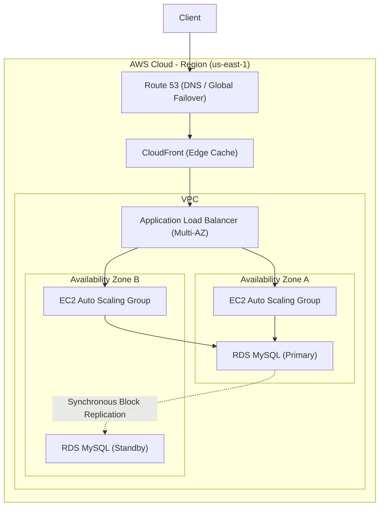

# AWS Certified Solutions Architect (SAA-C03) Guide (Staff Architect Edition)

> **Module:** Cloud & DevOps (Topic 5.5)
> **Target:** AWS SAA-C03 Certification & High-Availability Design

---

## 💡 1. Conceptual Blueprint & First Principles

The SAA-C03 exam evaluates the ability to design architectures adhering to the **AWS Well-Architected Framework**. The primary engineering principle is assuming everything will eventually fail. 

**Core Domains & Trade-offs:**
- **Secure (30%):** Enforce Least Privilege (IAM) and network isolation (VPC). Trade-off: Increased operational friction.
- **Resilient (26%):** Multi-AZ and Multi-Region failovers. Trade-off: Exponentially higher costs and data synchronization latency.
- **High-Performing (24%):** Utilizing Caching (ElastiCache, CloudFront) and optimal storage classes (EBS IOPS).
- **Cost-Optimized (20%):** Rightsizing compute (Spot, Serverless).

---

## 🔬 2. Under-the-Hood Mechanics

### Architecture Diagram: Multi-Tier HA Application



### Storage Class Memory / Disk Map
- **S3 Standard:** Fast, immediate, 3+ AZ replication.
- **S3 Glacier:** Cost-effective, data is mathematically zipped and spread across cold tapes. Retrieval requires 3-12 hours of unpacking.
- **EBS (gp3):** Network-attached block storage. Decoupled from the EC2 instance lifecycle.

### AWS Core Services Architecture Reference Matrix

| Category | AWS Service | Core Architectural Purpose | Senior Trade-off / Limit |
| :--- | :--- | :--- | :--- |
| **Compute** | **EC2 / ASG** | Virtual Machines with Auto Scaling Groups for stateful/monolithic workloads. | Slow cold-start scale times (3-5 min) compared to container pods. |
| **Compute** | **AWS Lambda** | Event-driven Serverless compute execution engine. | 15-minute execution limit; cold starts on VPC placement. |
| **Containers**| **ECS Fargate** | Serverless container orchestration (no EC2 node management). | Higher per-CPU cost than raw reserved EC2 instances. |
| **Containers**| **EKS (Kubernetes)**| Managed Kubernetes control plane (kube-apiserver/etcd). | Operational complexity & control plane hourly fee. |
| **Database** | **RDS (Aurora)** | MySQL/Postgres relational database with 6-way storage replication. | Expensive per-hour cost; hard connection limits. |
| **Database** | **DynamoDB** | Single-digit millisecond NoSQL key-value & document store. | Requires careful partition key design to avoid hot partitions. |
| **Messaging** | **SQS (Simple Queue)**| Fully managed message queue for decoupling background tasks. | Message ordering requires FIFO queue (capped at 3,000 msg/sec). |
| **Messaging** | **SNS (Notification)**| Pub/Sub fan-out message delivery to SQS, Email, HTTP endpoints. | No message persistence; messages dropped if subscriber offline. |
| **Security**  | **KMS & Secrets Manager**| Envelope encryption key management & dynamic secret rotation. | KMS API throttling limits under extreme TPS spikes. |
| **Monitoring**| **CloudWatch & GuardDuty**| Metrics, log aggregation & AI threat detection (VPC Flow Logs). | High log ingestion and retention cost at scale. |

---

## 💻 3. Production Code & Benchmarks

### S3 Cost Optimization Lifecycle Rule (JSON)

Automating data tiering is a massive cost-saver on the exam and in reality.

```json
{
  "Rules": [
    {
      "ID": "MoveToGlacierAndExpire",
      "Status": "Enabled",
      "Prefix": "backups/",
      "Transitions": [
        {
          "Days": 30,
          "StorageClass": "STANDARD_IA"
        },
        {
          "Days": 90,
          "StorageClass": "GLACIER"
        }
      ],
      "Expiration": {
        "Days": 365
      }
    }
  ]
}
```

### High Availability Benchmarks (RTO / RPO)
| Strategy | RPO (Data Loss) | RTO (Downtime) | Cost Factor |
|----------|-----------------|----------------|-------------|
| Backup & Restore | 24 Hours | Hours | 1x |
| Pilot Light | Hours | Tens of Mins | ~1.5x |
| Warm Standby | Minutes | Minutes | ~2x |
| Multi-Site Active/Active | Zero | Seconds | ~4x+ |

---

## ⚔️ 4. Staff / Senior Interview Scenarios (Exam Traps)

1. **Scenario:** "An EC2 instance needs to read objects from an S3 bucket. How should you provide permissions?"
   - **Wrong Answer (Trap):** Create an IAM User, generate Access Keys, and store them in the EC2 `~/.aws/credentials` file.
   - **Architect Answer:** Create an IAM Role with S3 read permissions and attach the Role as an Instance Profile to the EC2 instance. This automatically rotates temporary STS credentials securely.
2. **Scenario:** "Your Multi-AZ RDS instance primary node experiences hardware failure. What happens to the application?"
   - **Architect Answer:** AWS automatically flips the DNS CNAME record of the database endpoint to point to the Standby node in the other AZ. The application will experience a ~60-120 second database connection timeout during the DNS propagation, after which it will resume normally without manual intervention.
3. **Scenario:** "You need a shared file system mounted concurrently across 100 EC2 instances."
   - **Architect Answer:** Use EFS (Elastic File System). EBS volumes can only be attached to a single EC2 instance at a time. Instance Store volumes are ephemeral and lost on restart.
