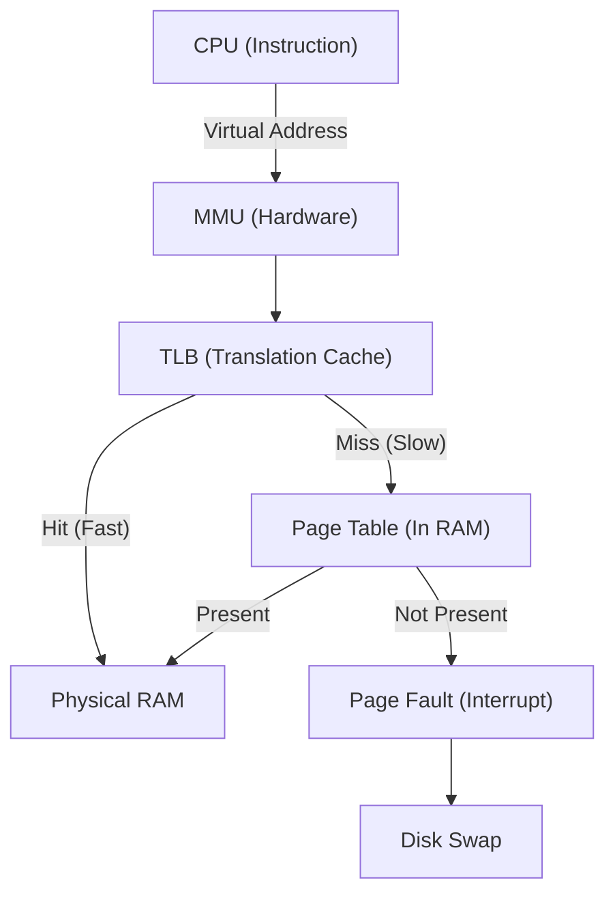

# CPU, Memory, and OS Execution: First-Principles Mechanics

## 1. CPU Architecture & Execution Mechanics

*Analogy First:* Think of the CPU as a master chef in a busy kitchen. The L1 cache is the cutting board right in front of them, the L2 cache is the fridge a few steps away, and the Main Memory (RAM) is a grocery store down the street.

At the lowest level, the CPU operates on a fetch-decode-execute-store pipeline. Modern processors optimize this heavily using **branch prediction**, **speculative execution**, and **out-of-order execution**.

### Core Mechanics (Step-by-Step)
1. **Fetch & Decode**: The CPU fetches the next instruction and decodes it.
2. **Branch Prediction**: If a branch (e.g., `if-else`) is encountered, the CPU guesses the path to avoid stopping. A wrong guess (misprediction) costs ~15-20 CPU cycles as the chef has to throw away chopped veggies and start over!
3. **Execute via Caches**: Main memory (RAM) is painfully slow. CPUs use SRAM caches:
   - **L1 Cache**: Per core, ultra-fast (~1ns).
   - **L2 Cache**: Per core, fast (~4ns).
   - **L3 Cache**: Shared across all cores, slower (~15ns), but much larger.
4. **Cache Lines**: Data is fetched in chunks called **Cache Lines** (typically 64 bytes). Modifying a single byte forces the CPU to invalidate the entire 64-byte chunk across all other core caches (Cache Coherency).

### Real-World Production Example: LMAX Disruptor
LMAX Exchange processes over 6 million transactions per second on a single thread. They did this by writing the **LMAX Disruptor**, a ring-buffer that avoids locks and optimizes for CPU cache lines. They completely avoided **False Sharing**—when two threads on different cores modify independent variables sitting on the same 64-byte cache line, causing constant, slow cache invalidations.

### Annotated Python Code: False Sharing

```python
import multiprocessing
import ctypes

# 1. BadStruct conceptually suffers from false sharing.
# A and B share the same 64-byte cache line!
class BadStruct(ctypes.Structure):
    _fields_ = [
        ("A", ctypes.c_longlong),
        ("B", ctypes.c_longlong)
    ]

# 2. GoodStruct uses padding to ensure A and B are on separate lines.
class GoodStruct(ctypes.Structure):
    _fields_ = [
        ("A", ctypes.c_longlong),
        ("_padding", ctypes.c_byte * 56), # Padding (64 - 8 bytes)
        ("B", ctypes.c_longlong)
    ]

# 3. Worker A updates variable A
def worker_a(shared_struct: multiprocessing.Value, iterations: int) -> None:
    for _ in range(iterations):
        shared_struct.A += 1

# 4. Worker B updates variable B
def worker_b(shared_struct: multiprocessing.Value, iterations: int) -> None:
    for _ in range(iterations):
        shared_struct.B += 1  # If BadStruct is used, this invalidates A's cache!

def benchmark_false_sharing() -> None:
    # 5. Allocate in shared memory to bypass GIL
    s = multiprocessing.Value(BadStruct)
    iterations = 10_000_000

    # 6. Run on two different processes (CPU cores)
    p1 = multiprocessing.Process(target=worker_a, args=(s, iterations))
    p2 = multiprocessing.Process(target=worker_b, args=(s, iterations))
    
    p1.start()
    p2.start()
    p1.join()
    p2.join()
```

## 2. Memory Management & The OS Kernel

*Analogy First:* Virtual memory is like giving every student (process) their own blank notebook. They think they have endless pages (Virtual Addresses), but the teacher (OS/MMU) secretly maps those pages to a shared binder (Physical RAM) in the back of the room.

### Mechanics (Step-by-Step)
1. **Virtual to Physical**: Every process thinks it has isolated memory. The CPU's **MMU (Memory Management Unit)** translates Virtual Addresses to Physical Addresses.
2. **TLB Caching**: Page Table walks are slow. The CPU caches recent translations in the **Translation Lookaside Buffer (TLB)**.
3. **Page Faults**: If a virtual address maps to a page not in RAM, the MMU triggers a **Page Fault**. The OS pauses the process, fetches the page from disk, and resumes.

### Visual Diagram: Virtual to Physical Memory


## 3. Senior/Staff Interview Q&A

**Q: Why is a binary search sometimes slower than a linear search on a small array?**
**Elevator Pitch Answer:**
1. **Cache Locality:** Linear search scans contiguous memory, perfect for CPU prefetching. Binary search jumps around randomly.
2. **Branch Prediction:** Linear search has a highly predictable loop. 
3. **Pipeline Flushes:** Binary search branching (`if x < arr[mid]`) is unpredictable, causing expensive CPU pipeline flushes when guesses are wrong.

**Q: How do you tune Linux for a memory-intensive database like PostgreSQL?**
**Elevator Pitch Answer:**
1. **Huge Pages:** Standard pages are tiny (4KB), meaning a 64GB DB needs 16 million page entries.
2. **TLB Blowout:** This massive table blows out the TLB cache, causing constant slow misses.
3. **The Fix:** Tell Linux to use 2MB or 1GB Huge Pages (`sysctl vm.nr_hugepages`), drastically shrinking the table and improving speed.
