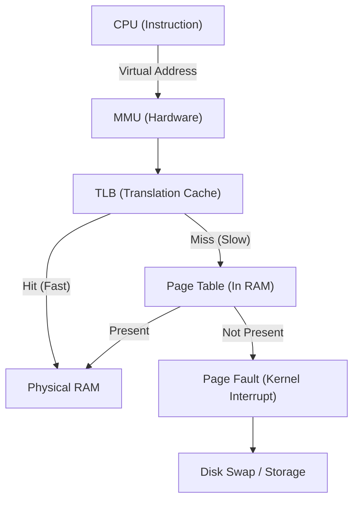

# CPU, Memory, and OS Execution: First-Principles Mechanics

## 1. CPU Architecture & Execution Mechanics

At the lowest level, the CPU operates on an fetch-decode-execute-store pipeline. Modern processors optimize this pipeline heavily using **branch prediction**, **speculative execution**, and **out-of-order execution**.

### Core Mechanics
1. **Instruction Pipeline**: CPUs process instructions in stages. If a branch (e.g., `if-else`) is encountered, the CPU tries to predict the path (Branch Prediction) to avoid pipeline stalls. A misprediction costs ~15-20 CPU cycles as the pipeline is flushed.
2. **CPU Caches (L1, L2, L3)**: Main memory (RAM) is painfully slow (~100ns). CPUs use SRAM caches.
   - L1 Cache: Per core, ultra-fast (~1ns), divided into instruction (L1i) and data (L1d).
   - L2 Cache: Per core, fast (~4ns).
   - L3 Cache: Shared across all cores on a die, slower (~15ns), but much larger.
3. **Cache Lines**: Data is fetched from memory in chunks called **Cache Lines** (typically 64 bytes). Modifying a single byte invalidates the entire 64-byte chunk across all other core caches (Cache Coherency via MESI protocol).

### Real-World Production Example: LMAX Disruptor (Financial Trading)
LMAX Exchange processes over 6 million transactions per second on a single thread. They achieved this by writing the **LMAX Disruptor**, a ring-buffer data structure that completely avoids locks and strictly adheres to mechanical sympathy (optimizing for CPU cache lines). 
They avoided **False Sharing**—a scenario where two threads on different cores modify independent variables that happen to reside on the same 64-byte cache line, causing constant cache invalidations.

### Code Snippet: False Sharing in Go

```go
package main

import (
	"sync"
	"testing"
)

// BadStruct suffers from false sharing.
// Thread 1 updates A, Thread 2 updates B. Both are on the same cache line.
type BadStruct struct {
	A int64
	B int64 
}

// GoodStruct uses padding to ensure A and B are on separate 64-byte cache lines.
type GoodStruct struct {
	A int64
	_ [56]byte // Padding (64 bytes - 8 bytes for int64)
	B int64
}

func BenchmarkFalseSharing(b *testing.B) {
	s := &BadStruct{}
	var wg sync.WaitGroup
	wg.Add(2)

	// Thread 1
	go func() {
		for i := 0; i < b.N; i++ {
			s.A++
		}
		wg.Done()
	}()

	// Thread 2
	go func() {
		for i := 0; i < b.N; i++ {
			s.B++ // Causes L1 cache invalidation for Thread 1!
		}
		wg.Done()
	}()
	wg.Wait()
}
```

### CLI Benchmark: Profiling Cache Misses with `perf`
```bash
# Run the Go benchmark and attach Linux perf to measure cache misses
go test -c
perf stat -e cache-misses,cache-references,instructions,cycles ./your_binary -test.bench=.

# Annotated Output:
#  14,562,123      cache-references                                            
#   9,421,051      cache-misses              # 64.695 % of all cache refs (False Sharing!)
#  45,213,991      cycles                                                      
```

## 2. Memory Management & The OS Kernel

The OS abstract physical RAM using **Virtual Memory**. Every process thinks it has a contiguous, isolated block of memory. The CPU's **MMU (Memory Management Unit)** translates Virtual Addresses to Physical Addresses using Page Tables.

### Translation Lookaside Buffer (TLB)
Since Page Table walks are expensive (requiring memory access), the CPU caches recent translations in the TLB. A TLB miss means the CPU must pause, traverse the page table (often a 4-level deep radix tree in Linux), and find the physical address.

### Page Faults
When a virtual address maps to a page that isn't currently in physical RAM, the MMU triggers a **Page Fault** interrupt. The kernel takes over, fetches the page from disk (swap) or maps a zeroed page, and resumes the process.

### Real-World Production Example: Redis BGSAVE & Copy-on-Write (CoW)
Redis uses the `fork()` system call to create a child process for background persistence (BGSAVE). The child process initially shares the exact same physical memory as the parent (via Copy-on-Write). Only when the parent modifies a page does the OS duplicate it. 
**Failure Mode:** If Redis handles heavy writes during a BGSAVE, CoW triggers massive memory duplication and page faults, leading to OOM (Out of Memory) crashes or severe latency spikes.

### Mermaid Diagram: Virtual to Physical Memory Translation


## 3. Senior/Staff Interview Q&A

**Q: Why is a binary search sometimes slower than a linear search on a small array?**
**A:** Branch prediction and cache locality. A linear search sequentially scans contiguous memory (perfect for CPU prefetching) and has predictable branching until the end. Binary search jumps around memory (cache misses) and has highly unpredictable branching (`if x < arr[mid]`), causing expensive CPU pipeline flushes.

**Q: How do you tune Linux for a memory-intensive database like PostgreSQL?**
**A:** Enable **Huge Pages**. Standard pages are 4KB. A 64GB RAM database requires 16 million page table entries, blowing out the TLB and causing constant TLB misses. By setting Linux to use 2MB or 1GB Huge Pages (`sysctl vm.nr_hugepages`), we drastically reduce the page table size and TLB misses.

```bash
# Check current Huge Page usage
cat /proc/meminfo | grep Huge

# Allocate 1024 huge pages (2MB each = 2GB total)
sysctl -w vm.nr_hugepages=1024
```
