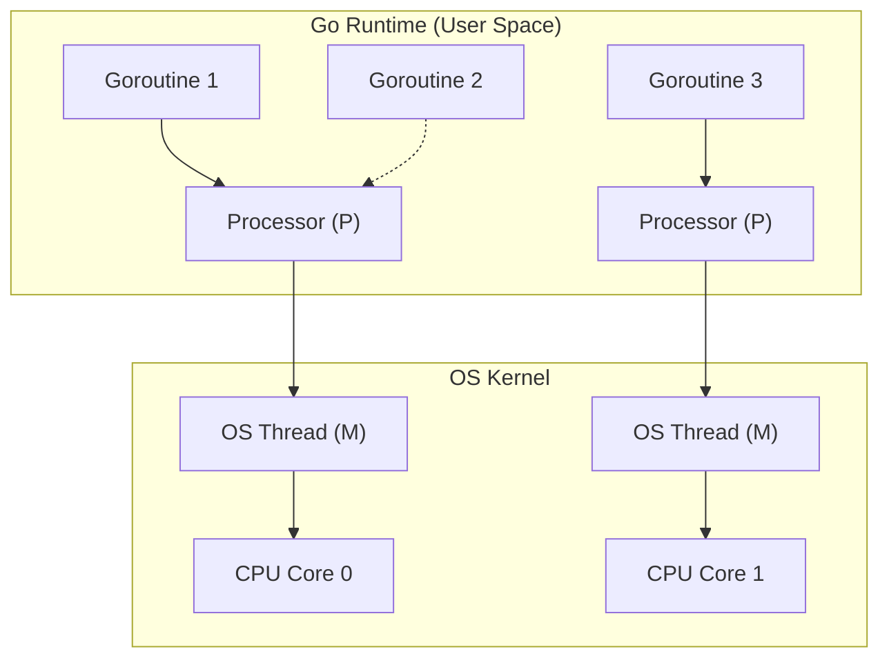

# Processes, Threads, and Concurrency: First-Principles Mechanics

## 1. Process vs. Thread vs. Coroutine

At the OS (Linux) level, threads and processes are practically the same thing. The kernel schedules **tasks** (`task_struct` in C). 
- **Process**: A task with its own independent Virtual Memory space, file descriptors, and PID.
- **Thread**: A task created via `clone()` that shares the Virtual Memory space, file descriptors, and signal handlers with its parent, but maintains its own stack and registers.
- **Coroutine / Goroutine / Async Task**: User-space threads mapped onto OS threads (M:N scheduling). The OS kernel knows nothing about them; they are managed by a runtime (like the Go Scheduler or Node.js event loop).

### Context Switching Mechanics
When a CPU switches from Thread A to Thread B, it must:
1. Save the CPU registers (PC, SP) of Thread A.
2. Flush the CPU pipeline.
3. Switch the MMU context if it's a process switch (TLB flush!).
4. Load the registers for Thread B.

A thread context switch costs ~1-2 microseconds. A coroutine switch (e.g., Goroutine) is purely user-space, just swapping a few registers, costing ~200 nanoseconds.

### Real-World Production Example: Uber's Thread-Per-Request Limits
Early architectures (like early Apache HTTPd or Tomcat) used a Thread-Per-Request model. When Uber experienced massive traffic spikes, their JVM-based services spawned tens of thousands of threads. This led to **Thread Thrashing**—the CPU spent more time context-switching between threads than executing application code, causing cascading timeouts. Uber migrated heavily to async/event-driven models (Node.js/Go) to bound the number of OS threads to the number of CPU cores.

## 2. Synchronization and Locking Primitives

To safely share memory across threads, we use synchronization.
- **Mutex (Mutual Exclusion)**: Protects a critical section. If Thread A holds it, Thread B sleeps (descheduled by OS) until it's released.
- **Spinlock**: Thread B loops infinitely checking if the lock is free. Burns CPU, but avoids the expensive context switch of going to sleep. Useful only for *very* short critical sections.
- **Waitgroup / CountDownLatch**: Synchronization barrier that waits for N operations to complete.

### Code Snippet: Go Mutex vs RWMutex
```go
package main

import (
	"sync"
	"time"
)

// A standard Mutex blocks EVERYONE else (readers and writers)
var mu sync.Mutex

// An RWMutex allows MULTIPLE readers simultaneously, but only ONE writer
var rw sync.RWMutex
var data int

func ReadDataRWMutex() int {
	rw.RLock() // Multiple threads can acquire this lock concurrently!
	defer rw.RUnlock()
	return data
}

func WriteDataRWMutex(val int) {
	rw.Lock() // Blocks all readers AND writers
	defer rw.Unlock()
	data = val
}
```

### CLI Benchmark: Monitoring Context Switches
```bash
# Use pidstat (from sysstat package) to monitor context switches of a process
pidstat -w -p <PID> 1

# Annotated Output:
# 12:00:01      UID       PID   cswch/s nvcswch/s  Command
# 12:00:02     1000     12345    150.00     25.00  my_java_app
# cswch/s: Voluntary context switches (thread blocked on I/O or mutex)
# nvcswch/s: Non-voluntary context switches (time slice expired, thread preempted)
# High nvcswch/s indicates severe CPU contention/thrashing!
```

## 3. Advanced Concurrency Models

### The Actor Model (Erlang, Akka)
Instead of sharing memory and using Mutexes (which lead to deadlocks), threads/actors communicate strictly by **passing messages** via mailboxes. 
**Real-World**: **WhatsApp** relies on Erlang and the Actor Model to route millions of messages concurrently per server. State is strictly localized to the actor; no shared memory means no locks.

### The Global Interpreter Lock (GIL) in Python
Python (CPython) uses reference counting for garbage collection. To make this thread-safe, a giant Mutex (the GIL) protects the entire interpreter. Python threads cannot run Python bytecode in parallel on multiple cores. 

```python
import threading

def cpu_bound_task():
    count = 0
    for i in range(10**7):
        count += 1

# Even with 4 threads on a 4-core machine, this will take exactly as long 
# as running them sequentially on 1 core because of the GIL!
threads = [threading.Thread(target=cpu_bound_task) for _ in range(4)]
for t in threads: t.start()
for t in threads: t.join()
```
*Fix for Python:* Use `multiprocessing` (spawns separate OS processes) for CPU-bound tasks, or use threads strictly for I/O-bound tasks (where the GIL is released during `recv()`/`send()`).

## 4. Senior/Staff Interview Q&A

**Q: What is priority inversion and how did it affect the Mars Pathfinder?**
**A:** Priority Inversion happens when a low-priority thread holds a mutex that a high-priority thread needs, but a medium-priority thread keeps preempting the low-priority thread. Thus, the high-priority thread never runs. The Mars Pathfinder robot reset itself constantly due to this. The fix is **Priority Inheritance**: the low-priority thread temporarily inherits the high-priority thread's priority until it releases the lock.

**Q: In Go, what happens if a Goroutine makes a blocking syscall (like reading a file)? Does it block the OS thread?**
**A:** Yes, the underlying OS thread is blocked. However, the Go runtime intercepts the syscall, parks the OS thread, and instantly spins up (or wakes) another OS thread to run the remaining Goroutines in the run queue. This is why Go is so scalable.

### Mermaid Diagram: Go M:N Scheduler

