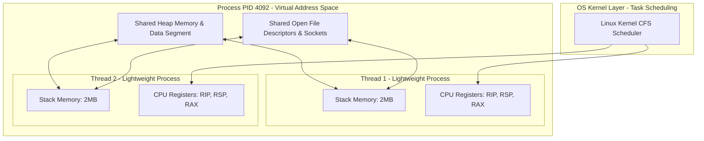
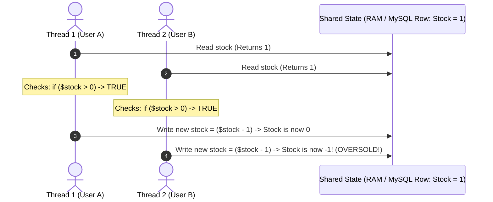
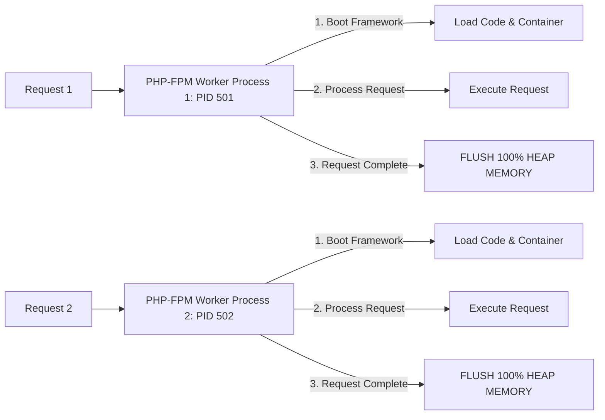
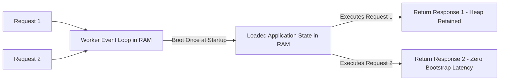

# Deep Dive: Processes, Threads, Concurrency & Race Conditions

> **Module:** CS Fundamentals (Topic 1.1)  
> **Target:** Master OS Process Virtual Address Spaces, Thread Scheduling, Mutex/Atomic Synchronization, Concurrency vs Parallelism, and Shared-Nothing (PHP-FPM) vs Persistent Runtimes (Octane).

---

## 🏛️ 1. Process vs. Thread (Kernel Memory Layout)

At the Linux Kernel level, a **Process** is an instance of an executing program with its own isolated virtual memory space (`mm_struct`). A **Thread** is an execution context (`task_struct`) inside a process.



### Comprehensive Kernel Comparison Table

| Metric / Feature | OS Process (e.g. PHP-FPM Worker) | OS Thread (e.g. Go Goroutine / C Thread) |
| :--- | :--- | :--- |
| **Virtual Address Space** | **100% Isolated.** Cannot read/write memory of other processes without kernel IPC. | **Shared Heap & Data.** All threads can read/write the same pointers. |
| **Creation Overhead** | **High (~100µs - 1ms).** Allocates new Page Tables, File Descriptor tables, and PCB. | **Low (~1µs - 10µs).** Allocates only stack space and thread control block (TCB). |
| **Inter-Thread/Process Comm** | **Slow IPC.** Must pass data via Unix Sockets, Pipes, or Shared Memory segments (`shmget`). | **Ultra-Fast Direct RAM.** Reads/writes pointers on the shared heap directly. |
| **Crash Blast Radius** | **Isolated.** If Process A segfaults, Process B keeps running unaffected. | **High Risk.** If Thread 1 triggers a Segmentation Fault, **the entire Process crashes!** |

---

## ⚡ 2. Concurrency vs. Parallelism (Time Slicing vs Multi-Core Execution)

- **Concurrency:** Dealing with many things at once. The OS CPU scheduler rapidly context-switches between threads using **Time Slicing** (Preemptive Scheduling).
- **Parallelism:** Executing many things at once. Requires multiple physical CPU cores processing instructions at the exact same nanosecond.

```mermaid
gantt
    title Concurrency (Time Slicing on 1 CPU Core) vs Parallelism (2 CPU Cores)
    dateFormat  ss
    axisFormat  %S

    section Single Core (Concurrent)
    Thread A :a1, 00, 02s
    Thread B :a2, 02, 04s
    Thread A :a3, 04, 06s

    section Core 1 (Parallel)
    Thread A (Core 1) :p1, 00, 06s

    section Core 2 (Parallel)
    Thread B (Core 2) :p2, 00, 06s
```



---

## ⚠️ 3. The Race Condition & Critical Section Problem

A **Critical Section** is any segment of code that reads and writes a shared mutable state (shared RAM heap, database row, or file).



---

## 🛡️ 4. Solutions Across the Application Stack

### Level 1: In-Memory Hardware Mutex Lock (Low-Level C / Go / Persistent PHP)
```c
pthread_mutex_t lock;

void withdraw(int amount) {
    pthread_mutex_lock(&lock); // 1. Acquire Lock (Other threads block here)
    
    if (balance >= amount) {
        balance -= amount;     // 2. Critical Section Execution
    }
    
    pthread_mutex_unlock(&lock); // 3. Release Lock
}
```

### Level 2: Database Atomic Updates & Pessimistic Locks (MySQL / Postgres)
```sql
-- Solution A: Atomic Query (Hardware CPU LOCK instruction executed by MySQL Engine)
UPDATE products SET stock = stock - 1 WHERE id = 42 AND stock >= 1;

-- Solution B: Pessimistic Row Lock (Blocks other SELECT FOR UPDATE queries until COMMIT)
START TRANSACTION;
SELECT stock FROM products WHERE id = 42 FOR UPDATE;
-- Execute application checks...
UPDATE products SET stock = 0 WHERE id = 42;
COMMIT;
```

---

## 🐘 5. Architecture Deep Dive: Shared-Nothing (PHP-FPM) vs Persistent Process (Laravel Octane)

### PHP-FPM: Shared-Nothing Process Architecture



- **Safety Advantage:** Heap memory is completely reset after every request. Static properties or global variables **cannot leak between users**.

### Laravel Octane / Swoole / FrankenPHP: Persistent Memory Architecture



- **Performance Boost:** Boosts throughput **5x–10x** by skipping `bootstrap/app.php` overhead on every request.
- **Developer Trade-off:** Mutating static arrays or singletons will bleed data between Request 1 and Request 2!
