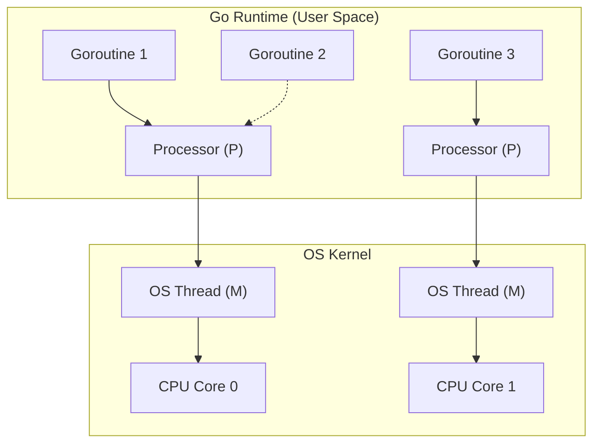

# Processes, Threads, and Concurrency: First-Principles Mechanics

## 1. Process vs. Thread vs. Coroutine

*Analogy First:* 
- A **Process** is like a completely separate house. It has its own address, plumbing, and locks.
- A **Thread** is like roommates living in the same house. They share the kitchen and living room (memory) but have their own bedrooms (stack).
- A **Coroutine** (or Goroutine) is like a single roommate multitasking chores—switching between laundry and cooking without needing extra people.

### Mechanics (Step-by-Step)
1. **Process**: A task with its own independent Virtual Memory space, file descriptors, and PID. Heavy to switch.
2. **Thread**: Shares Virtual Memory with its parent, but keeps its own stack. Lighter to switch.
3. **Coroutine**: User-space threads mapped onto OS threads. The OS doesn't know they exist; the language runtime manages them. Ultra-light.

### Context Switching
When switching from Thread A to B, the CPU must:
1. Save the registers of Thread A.
2. Flush the CPU pipeline.
3. Switch the MMU context (if a process switch, flushing the TLB!).
4. Load the registers for Thread B.

## 2. Synchronization and Locking Primitives

*Analogy First:* A **Mutex** is the bathroom key in a shared house. Only one person gets it at a time. A **Spinlock** is someone aggressively jiggling the doorknob repeatedly instead of sitting down to wait.

### Mechanics (Step-by-Step)
1. **Mutex**: Protects a critical section. If Thread A has it, Thread B sleeps (descheduled) until it's free.
2. **Spinlock**: Thread B loops infinitely checking if the lock is free. Burns CPU, but avoids the sleep/wake context switch.
3. **Waitgroup**: A barrier that waits for N tasks to finish before proceeding.

### Annotated Python Code: Concurrency & The GIL

```python
import threading
import multiprocessing

# 1. A CPU-bound task that just spins the CPU
def cpu_bound_task() -> None:
    count = 0
    for _ in range(10**7):
        count += 1

# 2. Python's Global Interpreter Lock (GIL) prevents threads from 
# running bytecode in parallel. These 4 threads will run sequentially!
threads: list[threading.Thread] = [threading.Thread(target=cpu_bound_task) for _ in range(4)]

for t in threads:
    t.start()
for t in threads:
    t.join()

# 3. The Fix: Use multiprocessing for CPU-bound tasks in Python!
processes = [multiprocessing.Process(target=cpu_bound_task) for _ in range(4)]
for p in processes:
    p.start()
for p in processes:
    p.join()
```

## 3. Advanced Concurrency Models

### Visual Diagram: Go M:N Scheduler


## 4. Senior/Staff Interview Q&A

**Q: What is priority inversion?**
**Elevator Pitch Answer:**
1. **The Trap:** A low-priority thread holds a lock that a high-priority thread needs.
2. **The Sabotage:** A medium-priority thread keeps interrupting the low-priority thread, freezing out the high-priority one forever.
3. **The Fix:** Priority Inheritance—the low thread temporarily inherits the high thread's priority until it releases the lock.

**Q: In Go, what happens if a Goroutine makes a blocking syscall (like reading a file)?**
**Elevator Pitch Answer:**
1. **OS Thread Blocks:** The underlying OS thread physically blocks.
2. **Runtime Magic:** The Go runtime intercepts this, parks the blocked OS thread, and immediately spins up a new OS thread.
3. **Non-Stop:** It moves the remaining Goroutines to the new thread, keeping the system moving seamlessly!
