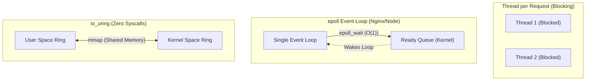

# Linux I/O Models and epoll: First-Principles Mechanics

## 1. Blocking vs Non-Blocking I/O

*Analogy First:* 
- **Blocking I/O:** Standing in line at a fast-food counter waiting for your specific burger. You can't do anything else.
- **Non-Blocking I/O:** The cashier hands you a buzzer. You can sit down, read a book, and only go up when it buzzes (epoll).

### Mechanics (Step-by-Step)
1. **Blocking I/O**: Calling `read()` on a socket sleeps the thread until data arrives. 10,000 users = 10,000 OS threads (The C10K problem).
2. **Non-Blocking I/O**: Set a socket to `O_NONBLOCK`. `read()` returns instantly. But you must manually poll it constantly, burning CPU.
3. **I/O Multiplexing (`epoll`)**: The OS kernel notifies you exactly when data is ready!

## 2. I/O Multiplexing: `epoll`

*Analogy First:* Older models (`select`/`poll`) are like a teacher asking every single student in a 10,000-person auditorium if they have a question. `epoll` is the teacher only looking at the specific students who have their hands raised.

### Mechanics (Step-by-Step)
1. **The Old Guard (`select`)**: O(N) complexity. You give the kernel an array, it checks all of them. Slow!
2. **The Modern Standard (`epoll`)**: O(1) complexity. Uses an interrupt and a Red-Black Tree. When a packet arrives, the kernel immediately puts the ready socket into a list.
3. **The Result**: A single thread (like Node.js or NGINX) can handle 100,000+ connections seamlessly.

### Annotated Python Code: Raw `epoll`
```python
import socket
import select

def start_server() -> None:
    # 1. Create a non-blocking TCP server
    server = socket.socket(socket.AF_INET, socket.SOCK_STREAM)
    server.bind(('0.0.0.0', 8080))
    server.listen()
    server.setblocking(False)

    # 2. Create the epoll object and register the server socket
    epoll = select.epoll()
    epoll.register(server.fileno(), select.EPOLLIN)

    connections: dict[int, socket.socket] = {}

    while True:
        # 3. Block until AT LEAST ONE event occurs (O(1) wait!)
        events = epoll.poll(1)
        
        for fileno, event in events:
            if fileno == server.fileno():
                # 4. New connection! Accept and register it.
                conn, addr = server.accept()
                conn.setblocking(False)
                epoll.register(conn.fileno(), select.EPOLLIN)
                connections[conn.fileno()] = conn
            elif event & select.EPOLLIN:
                # 5. Data ready to read!
                data = connections[fileno].recv(1024)
                if data:
                    connections[fileno].send(b"HTTP/1.1 200 OK\r\n\r\nHello!")
                else:
                    epoll.unregister(fileno)
                    connections[fileno].close()
```

## 3. The Future: `io_uring`

### Visual Diagram: I/O Models Compared


## 4. Senior/Staff Interview Q&A

**Q: If Redis is single-threaded and uses epoll, how does it handle a slow disk if virtual memory swaps?**
**Elevator Pitch Answer:**
1. **The Trap:** `epoll` handles *network* I/O asynchronously, but if memory is swapped to disk, accessing it triggers a Page Fault.
2. **The Block:** This Page Fault is handled by the kernel, hard-blocking the single Redis thread!
3. **The Fix:** Disable disk swap completely on Redis servers to ensure memory stays strictly in RAM.

**Q: Why does Go use a blocking I/O API if it's supposed to be highly concurrent?**
**Elevator Pitch Answer:**
1. **Developer UX:** Go provides a blocking API because it is much easier for developers to read and write.
2. **Under the Hood:** The Go runtime intercepts the block, registers it with a secret background `epoll` loop, and parks the Goroutine.
3. **Best of Both Worlds:** It runs asynchronously, but code looks wonderfully synchronous.
