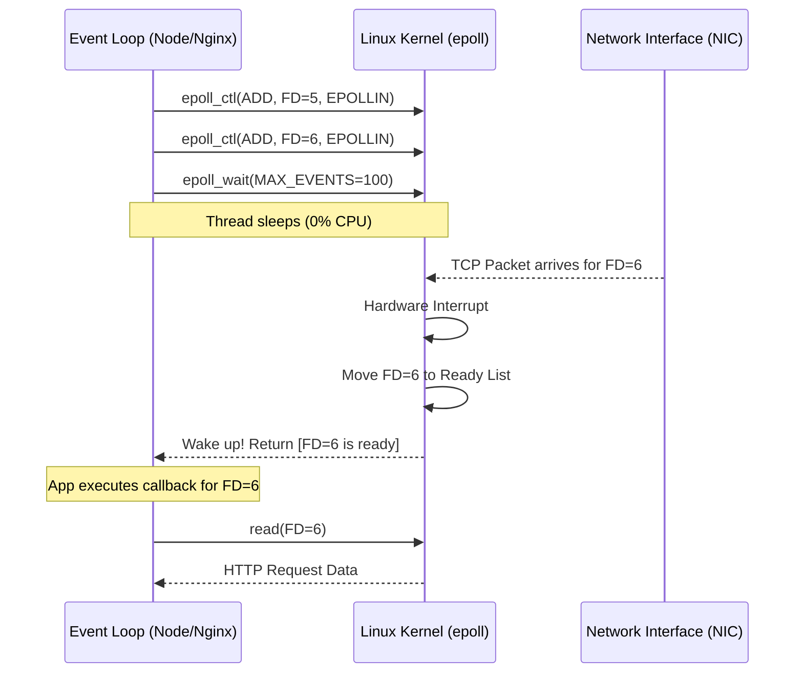

# Linux I/O Models & epoll: Mastering Concurrent Connections

> **Module:** CS Fundamentals (Topic 1.2)  
> **Source Mapping:** `backend-roadmap.md` (Level 0: #16, Level 25: #511-#513) & `roadmap.md` (Tier 1: #15-#17)

## 💡 Conceptual Blueprint & First Principles

In high-performance backend systems, handling tens of thousands of simultaneous connections (the C10K problem) requires fundamentally rethinking how the operating system manages Input/Output (I/O). 

At the OS level, every network connection is represented by a **File Descriptor (FD)**. How the server process interacts with these FDs defines the I/O model:

1. **Blocking I/O:** The traditional model (e.g., standard PHP-FPM, Apache mod_php). A thread calls `read()` on a network socket and completely halts execution until data arrives. If you have 10,000 idle connections, you need 10,000 blocked threads, consuming gigabytes of RAM just for thread stacks.
2. **Non-Blocking I/O:** The process sets the FD to non-blocking. If no data is available, `read()` immediately returns an error (`EAGAIN`). The app must poll the socket constantly in a loop (busy-waiting), which spikes CPU usage to 100%.
3. **I/O Multiplexing (`epoll` / `kqueue`):** The engine of modern async servers (Nginx, Node.js, Redis, Swoole). A single master thread registers thousands of FDs with the OS kernel. The thread sleeps until the kernel explicitly wakes it up, providing a list of exactly which FDs have data ready to read or write.

**The Restaurant Analogy:**
- **Blocking:** One waiter per customer. The waiter stands at the kitchen waiting for the food to finish. High memory cost.
- **Multiplexing:** One waiter for the entire restaurant. When a chef finishes a dish, a bell rings ("Event"), and the waiter takes the dish to the correct table. Extremely efficient.

## 🔬 Under-the-Hood Mechanics

When a server uses `epoll` (Linux's highly scalable I/O multiplexer), it interacts with the kernel via three system calls:
1. `epoll_create()`: Creates an epoll instance in the kernel.
2. `epoll_ctl()`: Registers, modifies, or deletes FDs to be monitored (e.g., watching a socket for `EPOLLIN` - read events).
3. `epoll_wait()`: Blocks the event loop thread until at least one registered event occurs.



**Memory Map:** Unlike older models (`select`/`poll`) which require passing the entire array of thousands of FDs to the kernel on every loop iteration, `epoll` maintains a persistent Red-Black tree of monitored FDs inside kernel space, and only copies the ready list to user space via a shared memory mechanic, making it $O(1)$ for ready events regardless of total connections.

## 💻 Production Code & Benchmarks

Here is how asynchronous, multiplexed I/O looks in PHP using **Swoole** (which wraps `epoll` under the hood in C).

```php
<?php
// Swoole Async HTTP Server using epoll
$server = new Swoole\Http\Server("0.0.0.0", 9501);

$server->set([
    'worker_num' => 4, // 4 OS processes, each with its own epoll event loop
    'max_request' => 10000,
]);

// This callback is fired by the epoll event loop when HTTP data arrives
$server->on("Request", function ($request, $response) {
    // Non-blocking Coroutine DB query
    // The CPU yields control back to epoll while waiting for MySQL
    $db = new Swoole\Coroutine\MySQL();
    $db->connect(['host' => '127.0.0.1', 'user' => 'root', 'password' => 'root', 'database' => 'test']);
    $result = $db->query('SELECT sleep(1)'); 
    
    $response->header("Content-Type", "text/plain");
    $response->end("Hello World\n");
});

$server->start();
```

**Benchmark Comparison:**
- **Sync PHP-FPM (100 workers):** Handles 100 concurrent requests. Connection 101 waits. Maxes out around ~2,000 req/sec on typical hardware. Memory usage is high.
- **Swoole / Node.js (epoll):** Handles 10,000+ concurrent connections on a single core. Can achieve 50,000+ req/sec.

## ⚔️ Staff / Senior Interview Scenarios

### 1. Level-Triggered (LT) vs Edge-Triggered (ET) epoll
**Question:** Nginx uses Edge-Triggered epoll, while Redis uses Level-Triggered. What is the difference and why does it matter?
**Staff Answer:** 
- **Level-Triggered (LT):** `epoll_wait` will keep returning the FD as ready as long as there is unread data in the kernel buffer. It's safer but can cause overhead if you don't drain the buffer completely.
- **Edge-Triggered (ET):** `epoll_wait` only notifies you *once* when state changes from empty to readable. If you don't read all data until `EAGAIN` is thrown, you'll never be notified about the remaining data again, leading to hung connections. Nginx uses ET for maximum performance, avoiding redundant wake-ups.

### 2. The CPU-Bound Trap in Event Loops
**Question:** What happens if you execute a massive regex or image resizing operation inside a Node.js or Swoole request handler?
**Staff Answer:** Because the event loop runs on a single thread, executing CPU-bound work blocks the thread from calling `epoll_wait()`. Even if thousands of packets arrive at the network card, the server cannot accept them. The entire application experiences a stall. CPU-bound tasks must be offloaded to separate worker threads or a background queue (e.g., RabbitMQ).

### 3. epoll Thundering Herd Problem
**Question:** If multiple worker processes wait on the same server socket FD, what happens when a new connection arrives?
**Staff Answer:** In older Linux kernels, a single incoming connection would wake up *all* worker processes (the "Thundering Herd"), but only one could successfully `accept()` it, wasting CPU cycles on context switches for the others. Modern Linux (using `EPOLLEXCLUSIVE`) solves this by ensuring only one thread is woken up per incoming connection.
