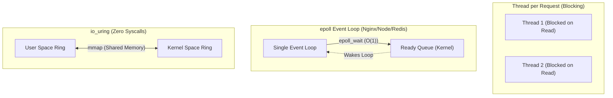

# Linux I/O Models and epoll: First-Principles Mechanics

## 1. The C10K Problem & Blocking vs Non-Blocking I/O

In the early 2000s, handling 10,000 concurrent network connections (The C10K problem) was a monumental challenge.

### Blocking I/O (The Apache HTTPd way)
When you call `read()` on a socket, the thread blocks (sleeps) until data arrives over the network. To handle 10,000 users, you need 10,000 OS threads. 
**Problem**: The RAM overhead (8MB stack per thread = 80GB RAM) and Context Switching thrashing will kill the server.

### Non-Blocking I/O
You can set a socket to Non-Blocking (`O_NONBLOCK`). Calling `read()` immediately returns an error (`EAGAIN` or `EWOULDBLOCK`) if no data is ready.
**Problem**: To know when data is ready, you'd have to constantly loop and poll every socket, burning 100% CPU.

## 2. I/O Multiplexing: `select`, `poll`, and `epoll`

To solve this, the OS provides **I/O Multiplexing**. A single thread can ask the kernel: "Tell me when *any* of these 10,000 sockets have data ready."

### The Old Guard: `select` and `poll`
- **Mechanics**: You pass an array of file descriptors to the kernel. The kernel iterates through all of them. When it returns, the application *also* has to iterate through all of them to figure out which one is ready.
- **Complexity**: O(N). For 10,000 connections, every network event requires iterating over 10,000 elements twice.

### The Modern Standard: `epoll` (Linux) / `kqueue` (macOS/BSD)
- **Mechanics**: `epoll` uses an event-driven architecture powered by an **Interrupt Service Routine (ISR)** and a **Red-Black Tree** in kernel space. When a network packet arrives at the NIC (Network Interface Card), an interrupt fires, the kernel places the specific ready socket into a ready list, and wakes your thread.
- **Complexity**: O(1). You only iterate over the sockets that are actually ready.

### Real-World Production Example: NGINX vs Apache / Node.js
- **Nginx** revolutionized web servers by using a single-threaded Event Loop powered by `epoll`. One Nginx process can handle 100,000+ connections with just megabytes of RAM.
- **Node.js** uses `libuv`, a C library that abstracts `epoll` (Linux) and `kqueue` (macOS), providing an asynchronous JS runtime.
- **Redis** is famously single-threaded (mostly). It achieves millions of ops/sec purely by processing memory instantly and multiplexing network I/O via `epoll`.

### Code Snippet: Raw `epoll` in Python

```python
import socket
import select

# 1. Create a non-blocking TCP server
server = socket.socket(socket.AF_INET, socket.SOCK_STREAM)
server.setsockopt(socket.SOL_SOCKET, socket.SO_REUSEADDR, 1)
server.bind(('0.0.0.0', 8080))
server.listen()
server.setblocking(False)

# 2. Create the epoll object
epoll = select.epoll()
# Register the server socket to listen for incoming connections (EPOLLIN)
epoll.register(server.fileno(), select.EPOLLIN)

connections = {}

print("Listening on port 8080 (epoll loop)...")
while True:
    # 3. Block until AT LEAST ONE event occurs on registered file descriptors (O(1))
    events = epoll.poll(1)
    
    for fileno, event in events:
        if fileno == server.fileno():
            # New connection!
            conn, addr = server.accept()
            conn.setblocking(False)
            epoll.register(conn.fileno(), select.EPOLLIN)
            connections[conn.fileno()] = conn
        elif event & select.EPOLLIN:
            # Data ready to read!
            data = connections[fileno].recv(1024)
            if data:
                connections[fileno].send(b"HTTP/1.1 200 OK\r\n\r\nHello!")
            else:
                epoll.unregister(fileno)
                connections[fileno].close()
                del connections[fileno]
```

## 3. Level-Triggered (LT) vs. Edge-Triggered (ET)
- **Level-Triggered (LT)** (Default): The kernel will keep nagging you ("Event ready!") as long as there is unread data in the socket buffer.
- **Edge-Triggered (ET)**: The kernel tells you exactly *once* when state changes from "no data" to "data". If you don't read the entire buffer, the kernel will never tell you about that old data again. (Nginx uses ET for maximum performance, requiring loops until `EAGAIN`).

### CLI Benchmark: Investigating System Calls with `strace`
```bash
# Attach strace to NGINX worker process and count syscalls
strace -c -p <NGINX_WORKER_PID>

# Annotated Output:
# % time     seconds  usecs/call     calls    errors syscall
# ------ ----------- ----------- --------- --------- ----------------
#  45.12    0.005123           1      4123           epoll_wait   # O(1) wait!
#  30.41    0.003451           1      3451           read
#  20.15    0.002231           1      2231           write
```

## 4. The Future: `io_uring`

`epoll` is fast, but it still requires a **System Call** context switch (user space -> kernel space) every time you call `epoll_wait`, `read`, or `write`.
`io_uring` (introduced in Linux 5.1) solves this using two shared ring buffers (Submission Queue and Completion Queue) in memory mapped (`mmap`) between user space and the kernel. You can push reads/writes onto the queue and read results *without a single system call*. This allows disk and network I/O at extreme velocities.

### Mermaid Diagram: I/O Models Compared


## 5. Senior/Staff Interview Q&A

**Q: If Redis is single-threaded and uses epoll, how does it handle a slow disk if virtual memory swaps?**
**A:** This is a classic Redis failure mode! `epoll` handles *network* I/O asynchronously, but if a page of memory is swapped to disk, accessing it triggers a kernel Page Fault, which blocks the *entire* single thread. Redis latency spikes catastrophically. The fix is to disable swap completely on Redis servers.

**Q: Why does Go use a blocking I/O API if it's supposed to be highly concurrent?**
**A:** It's an illusion. Go exposes a blocking API to the developer (easier to read), but under the hood, the Go runtime uses a **Netpoller** (based on `epoll`). When you call `conn.Read()`, the Go runtime registers the fd with epoll, parks the Goroutine, and schedules a different Goroutine. When `epoll` fires, it wakes the parked Goroutine. Best of both worlds!
