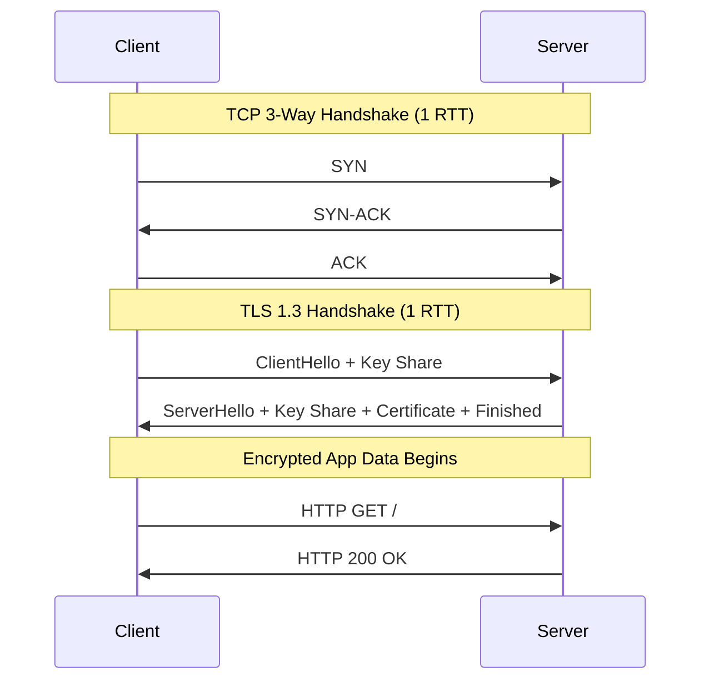

# Networking: TCP, TLS, and HTTP Deep Dive

## 1. TCP Mechanics: The Engine of Reliability

*Analogy First:* TCP is like sending a heavy puzzle through the mail piece by piece. You number every piece (Ordering), the receiver texts you when they get a piece (Acknowledgments), and if one gets lost, you mail a replacement (Reliability).

### The 3-Way Handshake (Step-by-Step)
1. **SYN**: Client says "I want to talk, my starting number is X."
2. **SYN-ACK**: Server says "Got X, my starting number is Y."
3. **ACK**: Client says "Got Y. Let's talk!"
*Latency Cost*: 1 Full Round Trip Time (RTT). 

## 2. TLS: Cryptography and Handshakes

*Analogy First:* If TCP is the envelope, TLS is the wax seal and armored car. It provides Encryption (no peeking), Authentication (proving who you are via certificates), and Integrity (no tampering).

### Mechanics (Step-by-Step)
1. **TLS 1.2**: Required 2 RTTs. The client and server ping-pong to agree on ciphers and keys before sending data.
2. **TLS 1.3**: Reduced to **1 RTT**. The client guesses the cipher and sends the key share immediately. 
3. **0-RTT**: If you've talked recently, TLS 1.3 lets you send encrypted data on the very first packet!

### Visual Diagram: HTTPS Handshake (TLS 1.3)


## 3. HTTP Evolution: HTTP/1.1 -> HTTP/2 -> HTTP/3

*Analogy First:*
- **HTTP/1.1 (Single Lane Highway):** One car (request) at a time. A slow truck blocks everyone behind it (Head-of-Line Blocking).
- **HTTP/2 (Multi-Lane Highway):** Multiple cars can drive side-by-side using one big tunnel (TCP). But if the tunnel collapses (dropped packet), all lanes stop!
- **HTTP/3 (Flying Cars):** Uses UDP instead of TCP. Cars fly independently. If one crashes, the others keep flying.

### Annotated Python Code: Tuning TCP Connections
```python
import socket
import urllib3
from urllib3.util.retry import Retry

def create_tuned_client() -> urllib3.PoolManager:
    # 1. Advanced TCP Keep-Alive tuning options (OS specific)
    socket_options = [
        (socket.SOL_SOCKET, socket.SO_KEEPALIVE, 1),
        (socket.IPPROTO_TCP, socket.TCP_KEEPIDLE, 30), # Keep-Alive probes after 30s
        (socket.IPPROTO_TCP, socket.TCP_KEEPINTVL, 10),
        (socket.IPPROTO_TCP, socket.TCP_KEEPCNT, 3),
    ]

    # 2. Connection pooling avoids the expensive 3-way handshake on reuse
    return urllib3.PoolManager(
        num_pools=10,
        maxsize=100, 
        timeout=urllib3.Timeout(connect=1.0, read=4.0), 
        socket_options=socket_options,
        retries=Retry(total=3, backoff_factor=0.5)
    )
```

## 4. Senior/Staff Interview Q&A

**Q: Can you explain TIME_WAIT and why a server might run out of ports?**
**Elevator Pitch Answer:**
1. **The Ghost Protocol:** When a connection closes, the port enters `TIME_WAIT` for ~60s to catch delayed, wandering packets.
2. **Port Exhaustion:** If a microservice makes thousands of HTTP requests per second without connection pooling, it rapidly consumes all 65,535 available ports.
3. **The Fix:** Use HTTP Keep-Alive (Connection Pooling) to reuse the same TCP sockets endlessly.

**Q: What is SNI (Server Name Indication) in TLS?**
**Elevator Pitch Answer:**
1. **The Problem:** A server hosts multiple domains (e.g., a.com, b.com), but only gets the HTTP Host header *after* the TLS handshake.
2. **The Catch-22:** It needs to know which SSL Certificate to present *during* the handshake!
3. **The Solution:** SNI solves this by making the client send the target domain unencrypted in the initial `ClientHello`.
