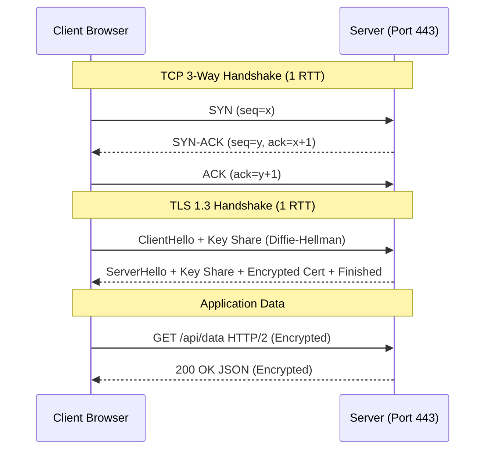

# TCP/IP Stack, TLS 1.3 & HTTP Evolution

> **Module:** CS Fundamentals (Topic 1.3)  
> **Source Mapping:** `backend-roadmap.md` (Level 4: #96–#103) & `roadmap.md` (Tier 1: #05, #06)

## 💡 Conceptual Blueprint & First Principles

Network communication over the internet relies on a layered architecture. When a backend engineer designs an API, they must understand the interplay of these protocols:

1. **IP (Network Layer):** Routes packets from Source IP to Destination IP. Best-effort, no guarantee of delivery or ordering.
2. **TCP (Transport Layer):** Sits on top of IP. Provides reliability, ordered delivery, and congestion control. It acts as an unbreakable pipe, but requires setup time.
3. **TLS (Security Layer):** Encrypts data in transit. Prevents man-in-the-middle (MITM) attacks and ensures data integrity.
4. **HTTP (Application Layer):** The semantic format of the payload (`GET`, `POST`, Headers).

**The Evolution Constraint:** The speed of light cannot be changed. Therefore, modern protocol evolution (TLS 1.3, HTTP/2, HTTP/3) focuses entirely on **reducing Round Trip Times (RTT)** and minimizing **Head-of-Line (HOL) blocking**.

## 🔬 Under-the-Hood Mechanics

Let's dissect the modern connection setup combining TCP and TLS 1.3, which requires only **2 RTT** before application data can be sent (down from 3 or 4 RTT in older TLS versions).



**HTTP Evolution Mechanics:**
- **HTTP/1.1:** Sequential requests. One request per TCP connection (keep-alive helps, but pipelining is broken). High latency.
- **HTTP/2:** Multiplexes concurrent requests over a **single TCP connection** via binary streams. Solves HTTP-level HOL blocking.
- **HTTP/3 (QUIC):** Replaces TCP completely with UDP. TCP inherently suffers from HOL blocking (if packet 3 drops, packets 4 and 5 are buffered in the kernel until packet 3 is retransmitted). QUIC streams are independent; packet loss in Stream A does not stall Stream B.

## 💻 Production Code & Benchmarks

Backend performance heavily relies on TCP connection pooling and OS tuning. Creating a TCP connection is extremely expensive.

**Production Nginx Tuning (`nginx.conf`) for HTTP/2 & Keep-Alive:**
```nginx
http {
    # Enable HTTP/2 for performance
    listen 443 ssl http2;
    
    # SSL/TLS 1.3 Optimization
    ssl_protocols TLSv1.2 TLSv1.3;
    ssl_prefer_server_ciphers off;
    ssl_session_cache shared:SSL:10m; # Cache TLS sessions to enable 0-RTT resumption
    ssl_session_timeout 1d;

    # TCP Keep-Alive tuning to avoid 3-way handshakes on every request
    keepalive_timeout 65s;
    keepalive_requests 1000; # Number of requests a client can make over a single keep-alive connection
}
```

**Linux Kernel Tuning (`/etc/sysctl.conf`):**
```bash
# Protect against SYN Flood attacks by dropping initial packets and using cookies
net.ipv4.tcp_syncookies = 1

# Reduce TIME_WAIT duration to reclaim ports faster on high-throughput proxies
net.ipv4.tcp_tw_reuse = 1
net.ipv4.tcp_fin_timeout = 15
```

## ⚔️ Staff / Senior Interview Scenarios

### 1. TCP Head-of-Line (HOL) Blocking
**Question:** HTTP/2 introduced multiplexing to solve HOL blocking. Does HTTP/2 eliminate HOL blocking entirely?
**Staff Answer:** No. HTTP/2 eliminates *Application-layer* HOL blocking (one slow HTTP request holding up the queue). However, because HTTP/2 runs over a single TCP connection, it suffers from *Transport-layer* HOL blocking. TCP guarantees in-order delivery. If a single network packet is dropped, the OS kernel will withhold all subsequent received packets from the application until the missing packet is retransmitted. This halts all multiplexed HTTP/2 streams on that connection. HTTP/3 fixes this by moving to UDP (QUIC).

### 2. The TIME_WAIT State Pool Exhaustion
**Question:** In a microservices architecture, Service A calls Service B thousands of times per second. Suddenly, Service A fails with "Cannot assign requested address". What is happening?
**Staff Answer:** Ephemeral port exhaustion. When Service A closes a TCP connection, the socket enters the `TIME_WAIT` state for 60 seconds (to handle delayed stray packets). At 1,000 req/sec without connection pooling, the 65,000 available client ports are exhausted in 65 seconds. 
**Solution:** Implement HTTP Connection Pooling (e.g., Guzzle/cURL keep-alive, Node.js HTTP Agent) so connections are reused, and enable `tcp_tw_reuse` in the kernel.

### 3. SYN Flood Attack Mitigation
**Question:** How does a SYN flood attack take down a server, and how do SYN Cookies prevent it?
**Staff Answer:** Attackers send thousands of TCP `SYN` packets but never complete the handshake with an `ACK`. The server allocates memory in its SYN queue for each half-open connection. Once the queue is full, legitimate connections are dropped. `TCP SYN Cookies` solve this by avoiding state allocation. The server encodes connection state cryptographically into the `SYN-ACK` sequence number and immediately forgets it. When the client replies with an `ACK`, the server validates the sequence number and reconstructs the connection state.
