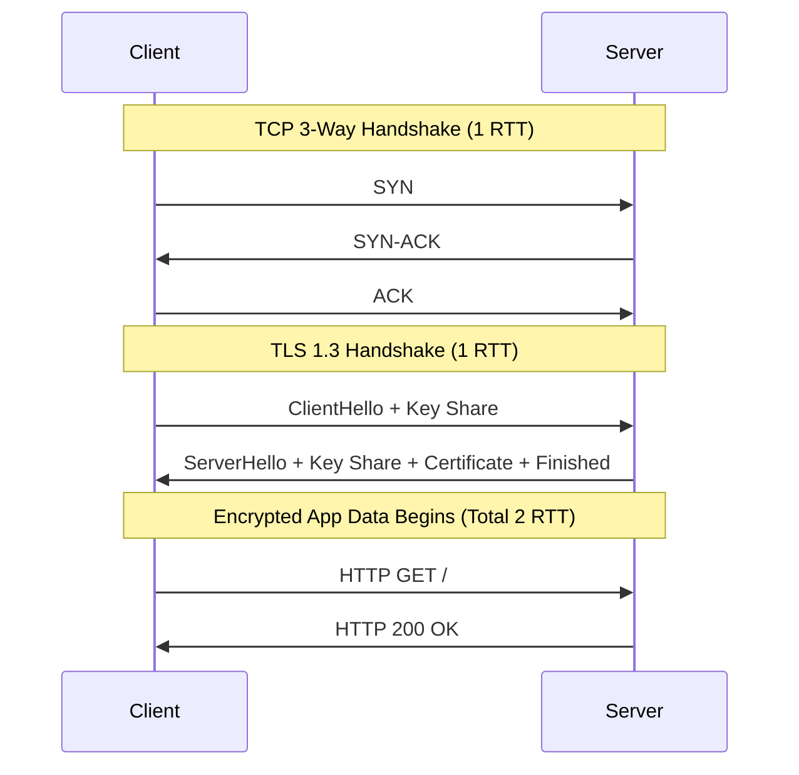

# Networking: TCP, TLS, and HTTP Deep Dive

## 1. TCP Mechanics: The Engine of Reliability

Transmission Control Protocol (TCP) sits at Layer 4 (Transport) of the OSI model. It transforms unreliable IP packets into a reliable, ordered, byte-stream.

### The 3-Way Handshake
Before sending data, TCP establishes a connection:
1. **SYN**: Client sends an Initial Sequence Number (ISN).
2. **SYN-ACK**: Server acknowledges the ISN and sends its own ISN.
3. **ACK**: Client acknowledges the server's ISN.
*Latency Cost*: 1 Full Round Trip Time (RTT). If a server is 100ms away, connection setup takes 100ms before a single byte of HTTP is sent.

### Flow Control vs Congestion Control
- **Flow Control (Window Size)**: Protects the *Receiver*. The receiver tells the sender "My buffer can only hold 64KB, don't send faster than that."
- **Congestion Control (Cubic, BBR)**: Protects the *Network*. The sender dynamically guesses how congested the routers are in between. TCP starts slow (Slow Start) and ramps up until packets drop.

### Real-World Production Example: Cloudflare and TCP BBR
Traditional algorithms (like TCP CUBIC) assume packet loss means network congestion, so they halve their speed immediately. On modern Wi-Fi or LTE networks, packets drop randomly (interference, not congestion). Cloudflare moved to **TCP BBR** (Bottleneck Bandwidth and Round-trip propagation time, by Google). BBR models the network based on actual latency and delivery rate, not packet drops, drastically improving throughput for mobile users on spotty connections.

## 2. TLS: Cryptography and Handshakes

Transport Layer Security (TLS) operates just above TCP, providing Encryption (Confidentiality), Authentication (Identity via Certificates), and Integrity (Tamper-proofing via MAC).

### TLS 1.2 vs TLS 1.3
- **TLS 1.2**: Requires 2 RTTs. The client and server have to exchange keys, agree on cipher suites, and verify certificates before sending data. Total connection time: 1 RTT (TCP) + 2 RTT (TLS) = 3 RTT.
- **TLS 1.3**: Reduces handshake to **1 RTT**. The client guesses the cipher suite (usually X25519) and sends the key share in the very first hello packet. If the server supports it, we are done!
- **0-RTT**: If a client has talked to the server before, TLS 1.3 allows sending encrypted HTTP data in the very first packet. *Risk*: Replay attacks.

### Mermaid Diagram: HTTPS Handshake Latency (TLS 1.3)


## 3. HTTP Evolution: HTTP/1.1 -> HTTP/2 -> HTTP/3

### HTTP/1.1 (Keep-Alive & Head-of-Line Blocking)
Connections are kept alive, but requests are sequential. If Request 1 is a huge 10MB image, Request 2 (a tiny CSS file) is blocked waiting for Request 1 to finish. This is **Head-of-Line (HoL) Blocking** at the application layer.

### HTTP/2 (Multiplexing)
Introduced **Multiplexing** over a *single* TCP connection. It breaks requests into binary frames. Request 1 and Request 2 frames can be interleaved. 
*Failure Mode*: Since HTTP/2 relies on ONE TCP connection, if a single TCP packet drops on the network, the OS TCP stack pauses the *entire stream* for retransmission. This is **TCP Head-of-Line Blocking**. On bad networks, HTTP/2 can actually be slower than HTTP/1.1.

### HTTP/3 (QUIC)
Runs on **UDP**, not TCP. Google built QUIC (Quick UDP Internet Connections) in user-space.
- **No TCP Handshake**: QUIC bakes the TLS 1.3 handshake and connection setup into a single 1 RTT (or 0 RTT) flow.
- **No TCP HoL Blocking**: If packet 5 (belonging to the image) drops, the UDP packets containing the CSS file are immediately processed by the application. They don't block.

### Real-World Production Example: Stripe Webhooks
Stripe sends millions of webhooks to clients. To prevent slow clients (who accept connections but read data slowly) from tying up Stripe's internal infrastructure, Stripe engineers meticulously tune TCP Socket buffers (`SO_SNDBUF`, `SO_RCVBUF`) and implement aggressive Read/Write timeouts on their HTTP clients to quickly recycle Go routines and TCP connections.

## 4. Code & CLI Benchmarks

### Code Snippet: Go HTTP Client with Deep TCP Tuning
```go
package main

import (
	"context"
	"net"
	"net/http"
	"time"
)

func createTunedClient() *http.Client {
	return &http.Client{
		Timeout: 5 * time.Second, // Global timeout (DNS + TCP + TLS + HTTP processing)
		Transport: &http.Transport{
			DialContext: (&net.Dialer{
				Timeout:   1 * time.Second,  // Max time for TCP handshake
				KeepAlive: 30 * time.Second, // TCP Keep-Alive probes
			}).DialContext,
			ForceAttemptHTTP2:     true,
			MaxIdleConns:          100, // Connection pooling (reusing TCP/TLS setup)
			IdleConnTimeout:       90 * time.Second,
			TLSHandshakeTimeout:   1 * time.Second,
			ExpectContinueTimeout: 1 * time.Second,
		},
	}
}
```

### CLI Benchmark: Packet Analysis with `tcpdump` and `ss`
```bash
# Capture raw TCP handshakes and packet drops for a specific IP
tcpdump -i eth0 host 10.0.0.5 and tcp port 443 -n -S

# View real-time TCP socket statistics, queue sizes, and congestion algorithms
ss -ti

# Annotated Output:
# State   Recv-Q  Send-Q     Local Address:Port      Peer Address:Port
# ESTAB   0       5432       192.168.1.5:443         10.0.0.8:53214
#  bbr wscale:7,7 rto:204 rtt:14.2/2.1 ato:40 mss:1460 cwnd:45 bytes_acked:14562 
# (Send-Q > 0 means the application is writing faster than the network can send!)
```

## 5. Senior/Staff Interview Q&A

**Q: Can you explain TIME_WAIT and why a server might run out of ports?**
**A:** When a server actively closes a TCP connection, the socket goes into the `TIME_WAIT` state (usually 60 seconds). It does this to ensure any delayed packets on the network don't accidentally get assigned to a new connection using the same source/dest IP/Port tuple. If a high-throughput microservice makes thousands of outbound HTTP requests per second without using Connection Pooling (Keep-Alive), it will consume all 65,535 ephemeral ports and hit connection errors (`EADDRNOTAVAIL`). The fix is to use HTTP Keep-Alive (Connection Pooling).

**Q: What is SNI (Server Name Indication) in TLS?**
**A:** Before TLS 1.2, the client didn't tell the server which domain it wanted until the HTTP packet. But the server needs to know which SSL Certificate to present *during* the TLS handshake! SNI solved this by sending the requested hostname unencrypted in the ClientHello packet. (ESNI / Encrypted ClientHello is now fixing this privacy leak).
