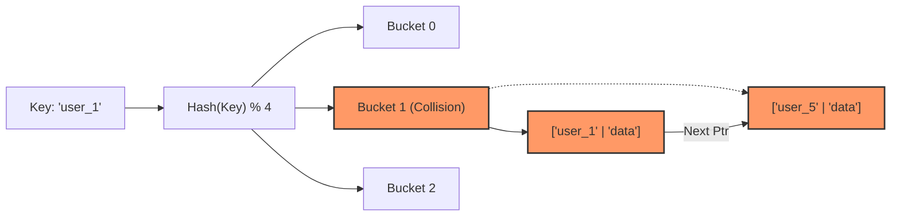
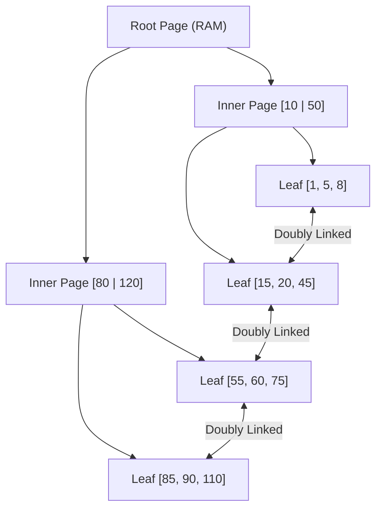

# Data Structures & Big-O: The Bedrock of Backend Engineering

> **Module:** CS Fundamentals (Topic 1.4)  

---

## 🏛️ Real-World Analogy: Everyday Objects & Delivery Services

To master data structures and Big-O notation, think of how we organize, store, and retrieve physical items in everyday life:

- 📬 **Array = A Row of Numbered Mailboxes (Instant Access):**
  Imagine an apartment lobby with mailboxes numbered 0 through 99 arranged in a continuous, uninterrupted line (contiguous memory). If the mail carrier has a letter for mailbox `#42`, they walk straight to box 42 in a single step without checking any other box ($O(1)$ constant time lookup). However, if management wants to insert a brand-new mailbox at position `#10`, every tenant from box 10 to 99 must physically shift down one slot ($O(N)$ linear time).

- 🗺️ **Linked List = A Scavenger Hunt (Clue by Clue):**
  Instead of mailboxes neatly lined up, imagine a treasure hunt. You start with Clue #1. Clue #1 gives you directions to Clue #2; Clue #2 points you to Clue #3. To read Clue #10, you cannot jump straight there—you have to visit all 9 clues in sequence ($O(N)$ lookup). But inserting a new clue between #3 and #4 is effortless: simply rewrite Clue #3 to point to the new clue, and point the new clue to #4 ($O(1)$ insertion).

- 📖 **Hash Map = A Coat Check / Phone Book (Instant Label Lookup):**
  When you check your coat at a concert, the attendant hands you a ticket `#88`. When you return, you hand over ticket `#88` and get your coat immediately without searching through the entire closet ($O(1)$ lookup). A Hash Map uses a mathematical function to turn any key (like a user's email) into an exact shelf location (bucket index).

- 🌳 **Tree = A Family Tree / Corporate Org Chart (Hierarchical Splitting):**
  Think of a company hierarchy: the CEO sits at the top (Root), managing VPs (Parent Nodes), who oversee Directors and Managers (Child Nodes), down to individual engineers (Leaf Nodes). In a balanced Binary Search Tree, every decision eliminates half of the remaining choices ($O(\log N)$), just like finding someone's team by following department branches downward.

- 🚚 **Big-O Notation = Comparing Delivery Service Speeds (Scaling with Load):**
  Big-O does not measure seconds on a stopwatch; it measures **how delivery effort scales as package volume ($N$) explodes**:
  - **$O(1)$ Constant Time:** Sending a broadcast announcement—takes the same instant whether 1 person or 1,000,000 people are listening.
  - **$O(\log N)$ Logarithmic Time:** A "20 Questions" guessing game where each yes/no question eliminates half the remaining possibilities.
  - **$O(N)$ Linear Time:** One delivery courier dropping packages off at $N$ houses in a single neighborhood. 10 packages take 10 stops; 1,000 packages take 1,000 stops.
  - **$O(N \log N)$ Linearithmic Time:** Organizing and sorting thousands of letters into zip code order using an efficient sorting machine (Merge Sort / Quick Sort).
  - **$O(N^2)$ Quadratic Time:** The party handshake problem where every single guest must shake hands with every other guest. 10 guests = 100 handshakes; 1,000 guests = 1,000,000 handshakes!

---

## 💡 Conceptual Blueprint & First Principles

Understanding Data Structures and Big-O notation is not just for interviews; it dictates how your database indexes, caches, and memory allocations scale in production.

- **Big-O Notation:** A mathematical way to describe how the runtime (Time) or memory usage (Space) of an algorithm scales as the input size ($N$) approaches infinity. We care about the *worst-case* scenario.
- **Contiguous vs. Dispersed Memory:** 
  - **Arrays:** Occupy a single, contiguous block of RAM. Because of CPU caching lines (L1/L2 cache), iterating over arrays is physically much faster than linked lists, even if Big-O says both are $O(N)$.
  - **Linked Lists/Trees:** Nodes are scattered across the heap, requiring pointer dereferencing, leading to CPU cache misses.

**Primary Backend Structures:**
- **Hash Maps (Dictionaries):** $O(1)$ lookups. The backbone of Redis, Memcached, and language-level state.
- **B+ Trees:** $O(\log N)$ search/insert. Optimized for block storage (disk). The backbone of MySQL/PostgreSQL indexes.
- **Skip Lists:** Probabilistic data structure for $O(\log N)$ search. Used in Redis Sorted Sets (ZSET).

## 🔬 Under-the-Hood Mechanics

### The Hash Map Collision Engine
When you write `$map["key"] = "value"`, the engine computes a hash, modulos it by the array capacity, and assigns it to a bucket.


If two keys map to Bucket 1, we handle the collision. Most languages (Java, PHP) use **Chaining** (a linked list inside the bucket). If the chain gets too long, performance degrades from $O(1)$ to $O(N)$.

### The B+ Tree (Database Indexing)
A B+ Tree differs from a standard Binary Search Tree by having a massive branching factor (fan-out) and storing data *only* at the leaf nodes.



## 💻 Production Code & Benchmarks

Here is a simplified demonstration of how a basic Hash Map with Chaining is implemented in C-like pseudocode to handle collisions:

```c
typedef struct Node {
    char* key;
    char* value;
    struct Node* next;
} Node;

typedef struct HashMap {
    Node** buckets;
    int capacity;
} HashMap;

void insert(HashMap* map, char* key, char* value) {
    int index = hash(key) % map->capacity;
    
    // Create new node
    Node* newNode = malloc(sizeof(Node));
    newNode->key = key;
    newNode->value = value;
    
    // Insert at head of the chain (O(1) insertion)
    newNode->next = map->buckets[index];
    map->buckets[index] = newNode;
    
    // Note: In production, if capacity is exceeded, 
    // the map must be dynamically resized and rehashed.
}
```

**Benchmark Insight:** In MySQL InnoDB, a B+ Tree block size is typically 16KB. With pointers taking minimal space, a single node can hold ~1200 keys. A tree height of 3 can index $1200^3 \approx 1.7$ billion rows. Thus, finding any record among a billion rows takes a maximum of **3 disk I/O operations** ($O(\log N)$ base 1200).

## ⚔️ Staff / Senior Interview Scenarios

### 1. Hash Collision Denial of Service (Hash DoS)
**Question:** How can an attacker take down an API endpoint that parses JSON payloads, relying on Hash Maps?
**Staff Answer:** If an attacker discovers the hashing algorithm used by the language (e.g., older versions of PHP or Java), they can send a massive JSON payload with thousands of keys mathematically crafted to hash to the *exact same bucket*. This forces the Hash Map to degrade into a single massive Linked List. Every subsequent insertion or lookup becomes $O(N)$, causing CPU utilization to hit 100% and completely freezing the server. Modern languages mitigate this by using randomized hashing seeds per process or converting long bucket chains into Red-Black Trees ($O(\log N)$).

### 2. UUIDs vs Auto-Increment in B+ Trees
**Question:** Why is it heavily discouraged to use random UUIDs (v4) as a Primary Key in a relational database like MySQL?
**Staff Answer:** MySQL InnoDB organizes the physical table data based on the Primary Key (Clustered Index B+ Tree). Sequential IDs (like auto-increment or ULIDs) are appended sequentially to the right-most leaf node. Random UUIDs cause random insertions across the entire tree structure. This causes massive page fragmentation, frequent B+ Tree page splits, and excessive disk I/O because the required pages are rarely in the RAM buffer pool. Space complexity increases, and insert performance tanks.

### 3. LRU Cache Implementation
**Question:** Design an In-Memory LRU (Least Recently Used) cache with $O(1)$ operations.
**Staff Answer:** You need a composite data structure. 
1. A **Hash Map** provides $O(1)$ lookups for the keys.
2. A **Doubly Linked List** tracks the recency of usage. 
When a key is accessed, you use the Hash Map to find its node pointer, detach it from the list, and move it to the Head of the list ($O(1)$). When capacity is reached, you delete the node at the Tail ($O(1)$) and remove it from the Hash Map.
