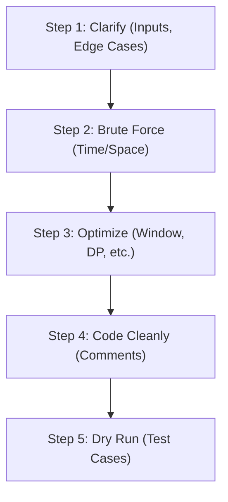

# Graph Algorithms & Dynamic Programming: The Blueprint

## 1. The Real-World Analogy: The Maze Runner & The Treasure Map

Imagine you are in a massive, interconnected underground maze searching for a hidden treasure map. 

- **Breadth-First Search (BFS)** is like sending out a coordinated team of explorers in an expanding circle. They check all paths exactly one step away, then two steps away, and so on. It perfectly guarantees finding the shortest path to the treasure map, but requires a lot of communication (memory) to coordinate the front line.
- **Depth-First Search (DFS)** is like a single, determined explorer walking down one specific path until they hit an absolute dead end. When blocked, they leave a breadcrumb, backtrack to the last fork, and try the next path. It uses less memory but might take a very long winding route before finding the target.
- **Sliding Window** is like carrying a rectangular magnifying glass that can only view a specific section of the map at a time. As you slide the glass across the map, you can dynamically expand it or shrink it to frame a specific sequence of symbols without having to re-read the entire map.
- **Dynamic Programming (DP)** is like creating an ultimate cheat sheet. If you solve a complex puzzle in one room, you write the exact solution down in a ledger. When you encounter the same type of puzzle later, you just look at your ledger (memoization or tabulation) instead of painstakingly solving it from scratch again.

## 2. Top 5 Algorithmic Coding Patterns

### Pattern 1: Sliding Window

**Problem:** *Longest Substring Without Repeating Characters*
Find the length of the longest substring without repeating characters in a given string.

**Logic:**
1. Use two pointers (`left` and `right`) to represent the boundaries of a dynamic window.
2. Expand the window by moving `right` and adding characters to a dictionary that maps the character to its most recent index.
3. If a duplicate character is found inside the current window boundary, contract the window by moving `left` past the previous occurrence.
4. Keep track of the maximum window size seen so far.

**Complexity:** Time: $O(N)$, Space: $O(min(N, M))$ where $M$ is the character set size.

```python
def length_of_longest_substring(s: str) -> int:
    # Dictionary to store the most recent index of each character encountered
    char_index_map: dict[str, int] = {}
    # Left pointer representing the start of the sliding window
    left: int = 0
    # Variable to store the maximum length of a valid substring found
    max_length: int = 0
    
    # Iterate through the string using the right pointer to expand the window
    for right, char in enumerate(s):
        # If character is already in the window (its recorded index >= left boundary)
        if char in char_index_map and char_index_map[char] >= left:
            # Move the left pointer one step past the previous occurrence of this character
            left = char_index_map[char] + 1
            
        # Update the character's most recent index in the hash map
        char_index_map[char] = right
        # Calculate the current window size (inclusive of both boundaries)
        current_length: int = right - left + 1
        # Update max_length if the current window is the largest we have seen
        max_length = max(max_length, current_length)
        
    # Return the maximum length found across the entire string
    return max_length
```

### Pattern 2: Two Pointers

**Problem:** *Container With Most Water*
Given an integer array `height` representing vertical lines, find two lines that form a container holding the most water.

**Logic:**
1. Place one pointer at the extreme start (`left`) and one at the extreme end (`right`).
2. Calculate the area: `min(height[left], height[right]) * (right - left)`.
3. To maximize area, we must keep taller lines. Always move the pointer pointing to the shorter line inward.
4. Repeat this evaluation until the two pointers meet in the middle.

**Complexity:** Time: $O(N)$, Space: $O(1)$.

```python
def max_area(height: list[int]) -> int:
    # Initialize left pointer at the very beginning of the array
    left: int = 0
    # Initialize right pointer at the very end of the array
    right: int = len(height) - 1
    # Variable to keep track of the maximum water area discovered
    max_water: int = 0
    
    # Continue evaluating containers until the pointers cross paths
    while left < right:
        # Calculate the width of the current container along the x-axis
        width: int = right - left
        # Calculate the effective height of the current container (bottlenecked by shorter line)
        current_height: int = min(height[left], height[right])
        # Calculate the area and update max_water if it exceeds the previous maximum
        current_area: int = width * current_height
        max_water = max(max_water, current_area)
        
        # Greedily move the pointer pointing to the shorter line inward
        if height[left] < height[right]:
            # Left line is the bottleneck, move left pointer to the right
            left += 1
        else:
            # Right line is the bottleneck (or they are equal), move right pointer to the left
            right -= 1
            
    # Return the maximum water area found during the traversal
    return max_water
```

### Pattern 3: Graph BFS / Grid Search

**Problem:** *Number of Islands*
Given a 2D grid of `'1'`s (land) and `'0'`s (water), count the total number of distinct islands.

**Logic:**
1. Iterate through every single cell in the 2D grid matrix.
2. When an unvisited `'1'` is found, increment the island counter and initiate a BFS to visit all connected land masses.
3. In BFS, use a double-ended queue. For each popped cell, immediately mark it as visited (e.g., set to `'0'`) and enqueue its valid orthogonal land neighbors.

**Complexity:** Time: $O(M \times N)$, Space: $O(min(M, N))$ for the BFS queue in the worst case.

```python
from collections import deque

def num_islands(grid: list[list[str]]) -> int:
    # Edge case: empty grid or grid with no columns
    if not grid or not grid[0]:
        return 0
        
    # Get grid dimensions for boundary checking
    rows: int = len(grid)
    cols: int = len(grid[0])
    # Variable to count the cumulative number of isolated islands
    islands: int = 0
    
    # Helper function to perform Breadth-First Search from a given start node
    def bfs(r: int, c: int) -> None:
        # Initialize queue with the starting coordinates as a tuple
        q: deque[tuple[int, int]] = deque([(r, c)])
        # Mark the starting cell as visited by changing it to '0' to avoid infinite loops
        grid[r][c] = '0'
        # Define the four possible orthogonal directions (down, up, right, left)
        directions: list[tuple[int, int]] = [(1, 0), (-1, 0), (0, 1), (0, -1)]
        
        # Process cells in the queue level by level
        while q:
            # Pop the first cell from the left of the queue
            curr_r, curr_c = q.popleft()
            # Iterate through all four potential neighbors
            for dr, dc in directions:
                nr: int = curr_r + dr
                nc: int = curr_c + dc
                # If neighbor is within grid bounds and is currently land ('1')
                if 0 <= nr < rows and 0 <= nc < cols and grid[nr][nc] == '1':
                    # Enqueue the neighbor for future processing
                    q.append((nr, nc))
                    # Mark neighbor as visited immediately to prevent duplicate queuing by other neighbors
                    grid[nr][nc] = '0'
                    
    # Iterate linearly over all cells in the grid row by row
    for r in range(rows):
        for c in range(cols):
            # If an unvisited land cell is found, it's the start of a new island
            if grid[r][c] == '1':
                # Increment the total island count
                islands += 1
                # Run BFS to traverse and sink all connected land cells of this island
                bfs(r, c)
                
    # Return the total cumulative count of islands
    return islands
```

### Pattern 4: Dynamic Programming (Tabulation)

**Problem:** *Climbing Stairs*
You are climbing a staircase. It takes `n` steps to reach the top. Each time you can either climb 1 or 2 steps. In how many distinct ways can you climb to the top?

**Logic:**
1. Recognize the overlapping subproblems: reaching step `i` inherently means coming from step `i-1` or `i-2`.
2. The recurrence relation is $DP[i] = DP[i-1] + DP[i-2]$.
3. Optimize space complexity by only storing the last two values in memory instead of maintaining a full DP array.

**Complexity:** Time: $O(N)$, Space: $O(1)$.

```python
def climb_stairs(n: int) -> int:
    # Base cases: if 1 or 2 steps, the number of ways is equal to n
    if n <= 2:
        return n
        
    # Variables to store the number of ways for the previous two steps
    # prev1 represents ways to reach step i-1 (starts at step 2 -> 2 ways)
    prev1: int = 2
    # prev2 represents ways to reach step i-2 (starts at step 1 -> 1 way)
    prev2: int = 1
    
    # Iterate from step 3 up to the target step n
    for i in range(3, n + 1):
        # Current ways is the summation of ways to reach the two immediately previous steps
        current: int = prev1 + prev2
        # Shift values forward for the next iteration (sliding the evaluation window)
        prev2 = prev1
        prev1 = current
        
    # The last calculated value (prev1) holds the total ways for step n
    return prev1
```

### Pattern 5: Fast & Slow Pointers

**Problem:** *Linked List Cycle Detection*
Given the head of a linked list, determine if it contains a cycle.

**Logic:**
1. Use Floyd's Tortoise and Hare algorithm to detect cycles efficiently.
2. Initialize a slow pointer (moves 1 step at a time) and a fast pointer (moves 2 steps at a time).
3. If there is a cycle, the fast pointer will eventually lap the slow pointer, and they will meet at the same node.
4. If the fast pointer reaches the end (`None`), it means there is no cycle.

**Complexity:** Time: $O(N)$, Space: $O(1)$.

```python
from typing import Optional

# Definition for singly-linked list node structure.
class ListNode:
    def __init__(self, val: int = 0, next: 'Optional[ListNode]' = None):
        self.val = val
        self.next = next

def has_cycle(head: Optional[ListNode]) -> bool:
    # Initialize slow pointer at the head of the list
    slow: Optional[ListNode] = head
    # Initialize fast pointer at the head of the list
    fast: Optional[ListNode] = head
    
    # Traverse the list while the fast pointer and its next node exist
    # (Checking fast.next is necessary because fast moves two steps)
    while fast and fast.next:
        # Move slow pointer forward by exactly 1 step
        slow = slow.next
        # Move fast pointer forward by exactly 2 steps
        fast = fast.next.next
        
        # If the slow and fast pointers converge to the same node, a cycle exists
        if slow == fast:
            return True
            
    # If the loop terminates, the fast pointer hit a null terminator (no cycle)
    return False
```

## 3. How to Communicate in a Coding Interview

Mastering the algorithms is only half the battle. Communicating your thought process cleanly is critical for senior evaluations. Use this structured 5-step approach:



1. **Clarify Requirements:** Never jump straight to coding. Ask about input sizes, edge cases (e.g., empty inputs, negative numbers, extreme values), and expected return formats.
2. **Brute Force Solution:** Quickly describe the naive approach verbally. State its Time and Space complexity explicitly. This establishes a baseline. *Example:* "The naive approach would use nested loops, resulting in an $O(N^2)$ time complexity."
3. **Optimize Approach:** Introduce your target algorithmic pattern. *Example:* "We can optimize this to $O(N)$ time by utilizing a Sliding Window with a hash map." Always wait for interviewer buy-in before proceeding to code.
4. **Code Cleanly:** Write modular, readable code. Use highly descriptive variable names (`max_length` instead of `m`, `char_index_map` instead of `map`). Talk through your logic out loud as you type.
5. **Dry Run Test Cases:** Trace through your code line-by-line using a small, concrete example. Update variables on a commented-out section on the side as you step through the loop.

## 4. Interview Scenarios & Elevator Pitches

### Scenario 1: Distributed Deadlock Detection
**Context:** A system architecture relies on numerous microservices that hold mutually exclusive locks on databases. You need to detect if there is a circular dependency causing a systemic deadlock.
- **Identify:** This is fundamentally a cycle detection problem in a directed graph.
- **Approach:** Use DFS with three coloring states (unvisited, visiting, visited) or apply Kahn's Algorithm (Topological Sort).
- **Pitch:** 
  1. "I would strictly model the microservice lock dependencies as a directed graph."
  2. "We can efficiently use a depth-first search (DFS) with a recursion stack array to detect any back-edges."
  3. "If we ever encounter a node that is currently in the active recursion stack, we can definitively prove a deadlock cycle exists."

### Scenario 2: Rate Limiting Algorithms
**Context:** You are building a high-throughput API gateway and need to strictly limit users to 100 requests per minute without dropping legitimate bursts.
- **Identify:** Fixed Window versus Sliding Window algorithmic pattern.
- **Approach:** Fixed window (resetting exactly at the start of the minute) allows unfair bursts at boundaries. Sliding Window Log or Sliding Window Counter provides much smoother limits.
- **Pitch:** 
  1. "A basic Fixed Window Counter is simple to implement but inherently allows double the traffic if massive spikes occur directly at minute boundaries."
  2. "I highly recommend employing a Sliding Window Counter algorithm instead."
  3. "This interpolates traffic mathematically from the previous minute, offering a remarkably smooth and fair $O(1)$ memory solution per user."

### Scenario 3: Task Scheduling (Greedy vs DP)
**Context:** Given a vast list of jobs with specific start times, end times, and varying profits, find the maximum profit possible without scheduling overlapping jobs.
- **Identify:** Weighted interval scheduling problem.
- **Approach:** Standard Greedy fails here because weights vary. We require Dynamic Programming combined with binary search.
- **Pitch:** 
  1. "Since these scheduled jobs possess varying profits, a naive greedy approach will fundamentally fail to guarantee the maximum profit."
  2. "I'd optimally sort the jobs by their respective end times first."
  3. "Then, I would employ dynamic programming and apply binary search to efficiently locate the last non-overlapping job, significantly reducing the overall time complexity to $O(N \log N)$."
