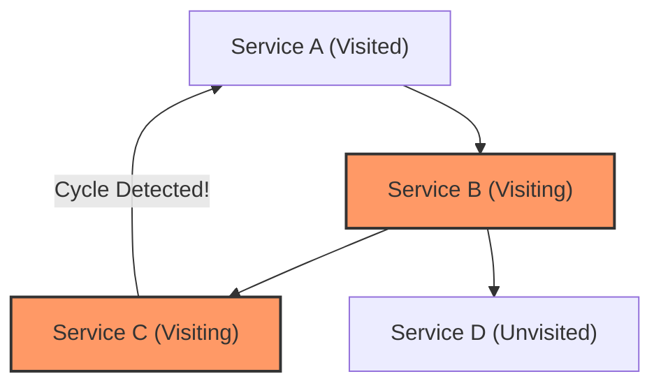
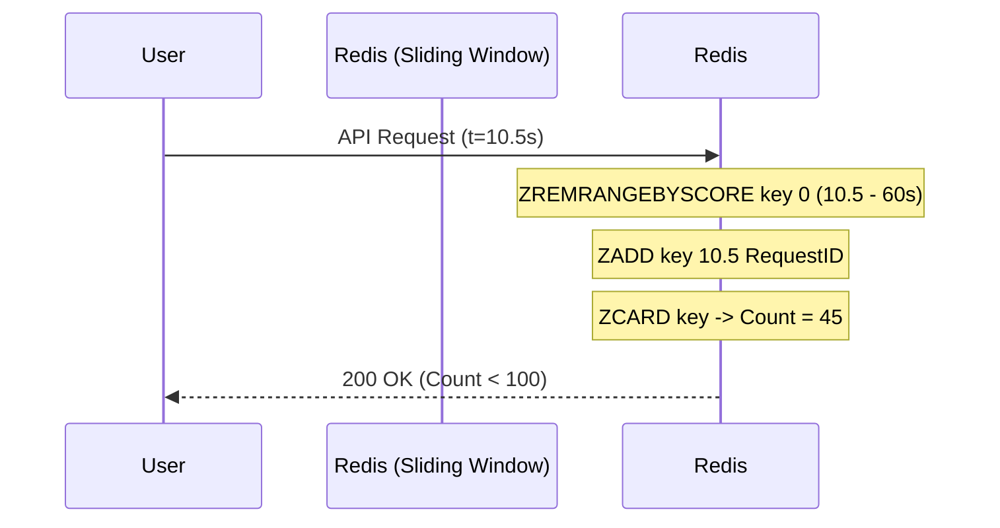

# Advanced Algorithms, Graphs & Dynamic Programming

> **Module:** CS Fundamentals (Topic 1.6)  
> **Source Mapping:** `backend-roadmap.md` (Level 3: #73–#95) & `roadmap.md` (Tier 1: Data Structures & Algorithms)

## 💡 Conceptual Blueprint & First Principles

Algorithms are formalized patterns for solving computational problems efficiently. In modern backend engineering, we rarely write complex algorithms from scratch for business logic, but they form the underpinnings of the distributed systems we use daily.

1. **Sliding Window & Two Pointers:** Techniques to process arrays/streams in $O(N)$ time instead of $O(N^2)$. Essential for rate limiting, log aggregation, and real-time metric calculation.
2. **Graph Algorithms:** Systems are graphs. The internet is a graph. A database schema with foreign keys is a directed graph. 
   - **BFS (Breadth-First Search):** Explores equally in all directions. Ideal for finding the *shortest path* (e.g., routing, degrees of separation).
   - **DFS (Depth-First Search):** Explores deeply into one path before backtracking. Ideal for topological sorting, detecting cycles, and parsing trees.
3. **Dynamic Programming (DP):** An optimization technique. When a recursive algorithm solves the same subproblem multiple times, DP caches those results (Memoization) or builds them iteratively from the bottom up (Tabulation).

## 🔬 Under-the-Hood Mechanics

### Cycle Detection in Directed Graphs (DFS)
Imagine a microservice architecture where Service A calls B, B calls C, and an accidental code commit makes C call A. This is a cyclic dependency.


A DFS tracks nodes in three states: Unvisited, Visiting (currently in the recursion stack), and Visited. If DFS encounters a node in the "Visiting" state, a cycle exists.

### Sliding Window Rate Limiting
A window of fixed size moves over a time series array to calculate thresholds.



## 💻 Production Code & Benchmarks

Here is a practical implementation of Dynamic Programming (Memoization) in PHP to optimize a complex pricing or combinatorics calculation.

```php
<?php
/**
 * Dynamic Programming: Compute number of ways to reach target amount 
 * using specific coin denominations. (Coin Change Problem)
 * Time Complexity: O(Amount * Coins)
 * Space Complexity: O(Amount)
 */
function coinChangeWays(int $amount, array $coins, array &$memo = []): int {
    // Base cases
    if ($amount === 0) return 1;
    if ($amount < 0) return 0;
    if (empty($coins)) return 0;

    $memoKey = $amount . '-' . count($coins);
    if (isset($memo[$memoKey])) {
        return $memo[$memoKey];
    }

    $currentCoin = $coins[0];
    $remainingCoins = array_slice($coins, 1);

    // Option 1: Use the coin (amount decreases, coins stay same)
    // Option 2: Do not use the coin (amount stays same, coins decrease)
    $ways = coinChangeWays($amount - $currentCoin, $coins, $memo) 
          + coinChangeWays($amount, $remainingCoins, $memo);

    $memo[$memoKey] = $ways;
    return $ways;
}

// Without memoization, this would cause a combinatorial explosion (O(2^N))
echo coinChangeWays(100, [1, 5, 10, 25]); 
```

**Benchmark Insight:** Without the `$memo` array, calculating combinations for amount `100` would take billions of recursive calls (seconds to minutes). With DP memoization, it executes in $< 1$ millisecond, doing only proportional work to `100 * 4 = 400` iterations.

## ⚔️ Staff / Senior Interview Scenarios

### 1. The Distributed Deadlock (Graph Cycles)
**Question:** In a distributed task queue system, tasks can declare dependencies on other tasks before they execute. How do you prevent a distributed deadlock where Task X waits for Y, and Y waits for X?
**Staff Answer:** Represent the dependency matrix as a Directed Graph. Before accepting a new task submission into the queue, run a Depth-First Search (DFS) Cycle Detection algorithm on the graph. If a back-edge is found (a node pointing to an ancestor currently in the DFS recursion stack), reject the payload synchronously and return a 400 Bad Request to prevent queue stagnation.

### 2. Thundering Herd and Redis Sliding Window
**Question:** Why is a Redis Sliding Window algorithm (using ZSETs) better for API Rate Limiting than a Fixed Window (simple `INCR` with a TTL)?
**Staff Answer:** A Fixed Window (e.g., 100 req/minute resetting at the top of the minute) allows traffic bursts. A user could send 100 requests at 12:00:59 and another 100 at 12:01:01. The backend absorbs 200 requests in 2 seconds, crushing the database. A Sliding Window tracks exact millisecond timestamps in a Sorted Set (ZSET). We remove entries older than 60 seconds. This enforces a smooth, continuous limit, preventing boundary-burst attacks.

### 3. Dynamic Programming vs. Greedy Approaches
**Question:** When optimizing route distances or bin packing, why can't we just pick the locally best option at every step (Greedy Algorithm)?
**Staff Answer:** Greedy algorithms (like Dijkstra's for shortest path) are fast and memory-efficient but only work optimally if the problem has the "Greedy Choice Property" (local optimums guarantee global optimums). In complex scenarios like the 0/1 Knapsack problem or scenarios with negative edge weights, a greedy choice might lock you out of a globally superior path. Dynamic Programming systematically explores all relevant subproblems, guaranteeing the mathematical global optimum at the cost of higher space complexity (tabulation tables).
