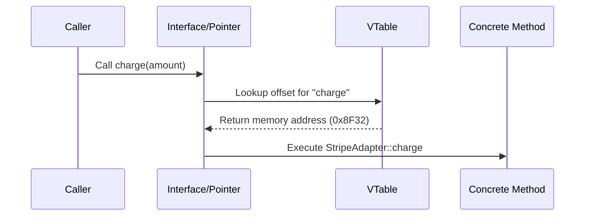

# OOP Principles, SOLID, Clean Architecture & Design Patterns

> **Module:** CS Fundamentals (Topic 1.7)  
> **Source Mapping:** `backend-roadmap.md` (Level 1 & Level 21) & `roadmap.md` (Tier 1: #01, #02, #03)

---

## 💡 1. Conceptual Blueprint & First Principles

At the Staff Architect level, Object-Oriented Programming (OOP) and SOLID are not just rules for syntax; they are **boundary management tools**. The goal of architecture is to minimize the cost of change over the system's lifecycle. 
- **Encapsulation** protects invariants and state transitions. It prevents "anemic domain models."
- **Polymorphism** allows us to invert dependencies (Dependency Inversion), pushing concrete infrastructure details (like a database or 3rd party API) behind interfaces, thus isolating the core domain.
- **Composition over Inheritance** mitigates the rigid hierarchies that cause the "Fragile Base Class" problem, promoting mix-and-match behaviors.

## 🔬 2. Under-the-Hood Mechanics

How does polymorphism actually work at the CPU level in compiled languages (like C++) vs dynamic languages (like PHP/Python)?

### Virtual Method Tables (vtable) in Memory

When a class implements an interface or overrides a base method, the compiler/interpreter maintains a `vtable` (Virtual Table). 



- **VTable Indirection:** Every polymorphic method call requires a pointer dereference. This means polymorphism has a slight performance overhead due to L1 cache misses during dynamic dispatch, though it is negligible in most web backends.

## 💻 3. Production Code & Benchmarks

Here is an example of applying SOLID and the **Strategy/Factory** patterns in PHP, showcasing dependency inversion.

```php
<?php

interface PaymentGatewayInterface {
    public function charge(float $amount): bool;
}

// 1. Concrete Implementations (Infrastructure Layer)
class StripeGateway implements PaymentGatewayInterface {
    public function charge(float $amount): bool {
        // Stripe API integration
        return true;
    }
}

class PayPalGateway implements PaymentGatewayInterface {
    public function charge(float $amount): bool {
        // PayPal API integration
        return true;
    }
}

// 2. Factory Pattern (Creational)
class PaymentGatewayFactory {
    public static function make(string $provider): PaymentGatewayInterface {
        return match($provider) {
            'stripe' => new StripeGateway(),
            'paypal' => new PayPalGateway(),
            default => throw new InvalidArgumentException("Unsupported provider"),
        };
    }
}

// 3. Domain Service relying on Abstraction (Dependency Inversion)
class OrderCheckoutService {
    public function __construct(private PaymentGatewayInterface $gateway) {}

    public function process(float $total): void {
        if (!$this->gateway->charge($total)) {
            throw new Exception("Payment failed");
        }
        // Proceed with order confirmation
    }
}
```

**Benchmark Insight:** Using interfaces and dynamic instantiation overhead adds microseconds per request in PHP. The real architectural "benchmark" is developer velocity: adding a `CryptoGateway` requires zero modifications to `OrderCheckoutService` (Open/Closed Principle).

## ⚔️ 4. Staff / Senior Interview Scenarios

**Scenario 1:** *A junior dev extends `User` to `AdminUser`, then to `SuperAdminUser`. What architectural smell is this?*
- **Staff Answer:** This is a classic violation of Composition over Inheritance. It leads to the Fragile Base Class problem. Roles and permissions should be composed (e.g., a `User` *has* a `Role` or `PermissionSet`), not baked into the class hierarchy. This allows a user to dynamically change roles without object reconstitution.

**Scenario 2:** *How do you decide between the Factory pattern and the Builder pattern?*
- **Staff Answer:** Use a Factory when you need to polymorphically create one of several concrete instances based on a parameter (like selecting a payment gateway). Use a Builder when constructing a *single* complex object requires multiple sequential steps and variations in internal configuration (e.g., building a complex SQL query or a highly customized `Report` object).
