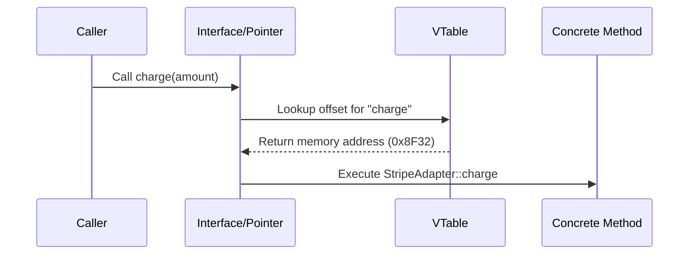

# OOP Principles, SOLID, Clean Architecture & Design Patterns

> **Module:** CS Fundamentals (Topic 1.7)  

---

## 🧱 Real-World Analogy: Building with LEGO Bricks

Think of Object-Oriented Software Engineering as designing and building modular creations with **LEGO bricks**:

- 🧩 **Object-Oriented Programming (OOP) = The LEGO System:**
  - **Encapsulation (The Sealed Motor Box):** A LEGO Technic motor has intricate gears, coils, and wiring sealed inside a plastic shell. You do not touch the internal copper wires directly; you simply interact with the external power switch and connection studs.
  - **Inheritance (Building on a Base Chassis):** You start with a standard 4-wheel LEGO rolling chassis (Base Class). From there, you build a sports car or a delivery van on top. Both inherit the axles and wheels without re-engineering the rolling mechanism from scratch.
  - **Polymorphism (Same Studs, Interchangeable Bricks):** A standard $2 \times 4$ LEGO brick connects to any standard plate regardless of whether it is red, blue, transparent, or rubberized. As long as the interface (stud pattern) matches, components are hot-swappable.
  - **Abstraction (The Instruction Manual):** The LEGO booklet shows high-level assembly steps ("attach front bumper") without forcing you to understand the chemical formula of ABS plastic or factory mold tolerances.

- 📐 **SOLID Principles = 5 Rules for Clean, Sturdy LEGO Builds:**
  - **S - Single Responsibility:** A single brick should have one distinct role (e.g., a wheel rolls, a hinge pivots; never craft a brittle motorized hinge-wheel-light hybrid brick).
  - **O - Open/Closed:** Design sub-assemblies so you can snap on a roof spoiler without dismantling the entire engine block.
  - **L - Liskov Substitution:** If you replace a smooth race tire with an all-terrain mud tire, the vehicle must still roll without snapping the axle mounts.
  - **I - Interface Segregation:** Don't force a simple mini-figure to connect to a 40-pin motorized crane harness. Give each component only the connection points it actually needs.
  - **D - Dependency Inversion:** Both the chassis and wheels connect via standardized universal connector pins (abstractions), rather than fusing the wheel directly into the car frame.

- 🏗️ **Design Patterns = Proven Master-Builder Blueprints:**
  Instead of figuring out steering gear geometry by trial and error every time, you consult tested Master-Builder blueprints (e.g., Factory, Strategy, Observer, Adapter) that thousands of builders have verified for durability and maintainability.

---

## 💡 1. Conceptual Blueprint & First Principles

At the Staff Architect level, Object-Oriented Programming (OOP) and SOLID are not just rules for syntax; they are **boundary management tools**. The goal of architecture is to minimize the cost of change over the system's lifecycle. 
- **Encapsulation** protects invariants and state transitions. It prevents "anemic domain models."
- **Polymorphism** allows us to invert dependencies (Dependency Inversion), pushing concrete infrastructure details (like a database or 3rd party API) behind interfaces, thus isolating the core domain.
- **Composition over Inheritance** mitigates the rigid hierarchies that cause the "Fragile Base Class" problem, promoting mix-and-match behaviors.

## 🔬 2. Under-the-Hood Mechanics

How does polymorphism actually work at the CPU level in compiled languages (like C++) vs dynamic languages (like PHP/Python)?

### Virtual Method Tables (vtable) in Memory

When a class implements an interface or overrides a base method, the compiler/interpreter maintains a `vtable` (Virtual Table). 



- **VTable Indirection:** Every polymorphic method call requires a pointer dereference. This means polymorphism has a slight performance overhead due to L1 cache misses during dynamic dispatch, though it is negligible in most web backends.

## 💻 3. Production Code & Benchmarks

Here is an example of applying SOLID and the **Strategy/Factory** patterns in Python, showcasing dependency inversion.

```python
from typing import Protocol

# 1. Interface / Protocol
class PaymentGatewayInterface(Protocol):
    def charge(self, amount: float) -> bool:
        ...

# 2. Concrete Implementations (Infrastructure Layer)
class StripeGateway:
    def charge(self, amount: float) -> bool:
        # Stripe API integration
        return True

class PayPalGateway:
    def charge(self, amount: float) -> bool:
        # PayPal API integration
        return True

# 3. Factory Pattern (Creational)
class PaymentGatewayFactory:
    @staticmethod
    def make(provider: str) -> PaymentGatewayInterface:
        match provider:
            case "stripe":
                return StripeGateway()
            case "paypal":
                return PayPalGateway()
            case _:
                raise ValueError("Unsupported provider")

# 4. Domain Service relying on Abstraction (Dependency Inversion)
class OrderCheckoutService:
    def __init__(self, gateway: PaymentGatewayInterface) -> None:
        self.gateway = gateway

    def process(self, total: float) -> None:
        if not self.gateway.charge(total):
            raise Exception("Payment failed")
        # Proceed with order confirmation
```

**Benchmark Insight:** Using interfaces and dynamic instantiation overhead adds microseconds per request in Python. The real architectural "benchmark" is developer velocity: adding a `CryptoGateway` requires zero modifications to `OrderCheckoutService` (Open/Closed Principle).

## ⚔️ 4. Staff / Senior Interview Scenarios

**Scenario 1:** *A junior dev extends `User` to `AdminUser`, then to `SuperAdminUser`. What architectural smell is this?*
- **Staff Answer:** This is a classic violation of Composition over Inheritance. It leads to the Fragile Base Class problem. Roles and permissions should be composed (e.g., a `User` *has* a `Role` or `PermissionSet`), not baked into the class hierarchy. This allows a user to dynamically change roles without object reconstitution.

**Scenario 2:** *How do you decide between the Factory pattern and the Builder pattern?*
- **Staff Answer:** Use a Factory when you need to polymorphically create one of several concrete instances based on a parameter (like selecting a payment gateway). Use a Builder when constructing a *single* complex object requires multiple sequential steps and variations in internal configuration (e.g., building a complex SQL query or a highly customized `Report` object).
