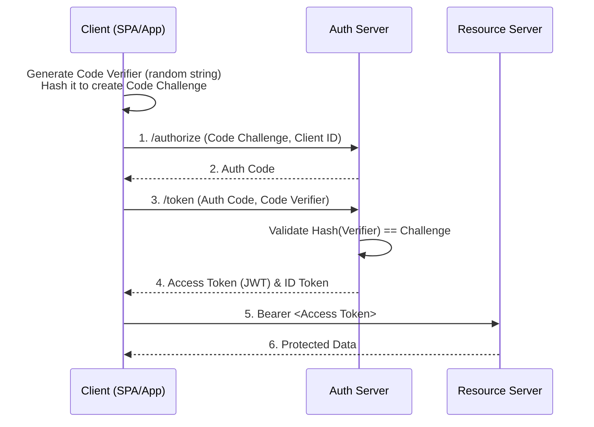

# Web Application Security, OWASP Top 10 & OAuth 2.0

> **Module:** CS Fundamentals (Topic 1.8)  
> **Source Mapping:** `backend-roadmap.md` (Level 18: #381–#404) & `roadmap.md` (Tier 1: #215–#233)

---

## 💡 1. Conceptual Blueprint & First Principles

Security at a Staff level is about **Defense in Depth** and **Zero Trust Architecture**. No single layer (network, application, database) is assumed secure. 
- **Least Privilege:** Services, DB roles, and users only get access to what they explicitly need.
- **OWASP Top 10** represents structural flaws (like injection or broken access control). 
- **OAuth 2.0 / OIDC** solves the problem of *delegated authorization* (OAuth) and *authentication/identity* (OIDC) without handing over plain-text credentials to third parties.

## 🔬 2. Under-the-Hood Mechanics

### The OAuth 2.0 + OIDC Authorization Code Flow (PKCE)

For SPAs and mobile apps, traditional OAuth2 is vulnerable to Auth Code Interception. We use **PKCE (Proof Key for Code Exchange)**.



### Password Hashing (Argon2id) Memory Hardness
Modern hashing algorithms like `Bcrypt` or `Argon2id` are not just computationally expensive; they are *memory-hard*. This defeats GPU/ASIC brute-forcing by forcing the algorithm to require large blocks of RAM.

## 💻 3. Production Code & Benchmarks

**Defending against SQL Injection (PHP/PDO):**
```php
<?php
// VULNERABLE (DO NOT USE)
// $db->query("SELECT * FROM users WHERE email = '" . $_POST['email'] . "'");

// SECURE: Parameterized Query
$stmt = $pdo->prepare('SELECT * FROM users WHERE email = :email LIMIT 1');
$stmt->execute(['email' => $emailInput]);
$user = $stmt->fetch();
```

**Content Security Policy (CSP) Header (Nginx):**
```nginx
# Prevents XSS by strictly defining where scripts can load from
add_header Content-Security-Policy "default-src 'self'; script-src 'self' https://trusted-cdn.com; object-src 'none';" always;
```

**Benchmark/Trade-off:** Argon2id parameters (memory cost, time cost, parallelism) must be tuned. Setting memory cost too high (e.g., 1GB) will cause your login servers to crash under concurrent login load (DoS). Aim for a hash calculation time of ~250-500ms on your production CPU.

## ⚔️ 4. Staff / Senior Interview Scenarios

**Scenario 1:** *Your system validates JWTs locally by verifying the signature. What is the risk, and how do you handle instantaneous token revocation?*
- **Staff Answer:** Stateless JWTs cannot be easily revoked before their expiry. If a user's account is compromised, the JWT remains valid. The solution is to keep token lifetimes very short (e.g., 5-15 minutes) and rely on a longer-lived Refresh Token. When the user logs out or changes passwords, we revoke the Refresh Token in the database. For critical actions (e.g., money transfer), we query a high-speed blacklist cache (Redis) for explicitly revoked JWT JTI (JWT ID) claims.

**Scenario 2:** *Explain how SSRF happens and how to prevent it in a webhook processor.*
- **Staff Answer:** SSRF occurs when an attacker inputs a URL (like `http://169.254.169.254/latest/meta-data/`) that the server blindly fetches, exposing internal cloud credentials. To prevent this: 
  1. Resolve the user-provided domain to an IP.
  2. Validate the IP is not in private/reserved ranges (10.0.0.0/8, 127.0.0.1, etc.).
  3. Force the HTTP client to use the resolved, validated IP rather than re-resolving the host, to prevent DNS rebinding attacks.
