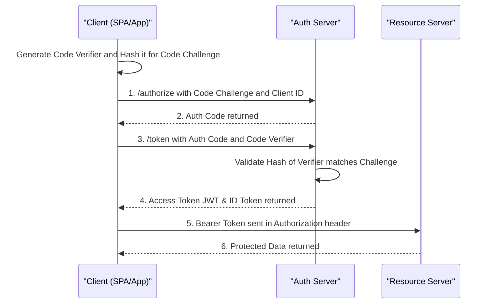

# Web Application Security, OWASP Top 10 & OAuth 2.0

> **Module:** CS Fundamentals (Topic 1.8)
> **Source Mapping:** `backend-roadmap.md` & `roadmap.md`

---

## 💡 1. The Real-World Analogy: House Security

Think of web application security like designing a comprehensive security system for a modern **House**:
- **Authentication (Locks/Keys):** Proving you are who you say you are. Just because you have a key doesn't mean you own the house, but it lets you in the front door.
- **Authorization (Access Control):** You can enter the living room, but the safe in the bedroom requires an additional combination. You only get access to what you are explicitly allowed to see.
- **WAF & Firewalls (Fences & Gates):** Keeping obvious bad actors out before they even reach the front door. It filters out malicious traffic based on known bad patterns.
- **Encryption (Curtains & Safes):** Making sure people looking through the windows (network interception) can't see your valuables, and if they steal the safe, they can't open it.
- **Logging & Monitoring (Alarms & Cameras):** If someone breaks in, you need a recording of exactly when and how they did it, and an alarm should notify you immediately.
- **Zero Trust Architecture:** Never trusting anyone just because they are already inside the house. Every time a person opens a door inside the house, they must present their key again.

---

## 🛡️ 2. OWASP Top 10 (2021)

The Open Worldwide Application Security Project (OWASP) Top 10 represents the most critical security risks to web applications. Understanding these is essential for any backend engineer.

### A01: Broken Access Control
Users acting outside their intended permissions. This is the most common and dangerous vulnerability.
- **Example:** IDOR (Insecure Direct Object Reference) where changing a URL parameter `?user_id=1` to `?user_id=2` lets you view another user's private data. Privilege escalation from standard user to admin.
- **Mitigation (Python 3.11+):**
```python
# Import HTTPException for errors and Depends for dependency injection
from fastapi import HTTPException, Depends

# Function to get user data with dependency injection for current user
def get_user_data(target_user_id: int, current_user_id: int = Depends(get_current_user)) -> dict:
    # Check if the user is requesting data for someone else
    # and if they are not an administrator
    if target_user_id != current_user_id and not is_admin(current_user_id):
        # If true, raise a 403 Forbidden HTTP Exception immediately
        raise HTTPException(status_code=403, detail="Forbidden: Insufficient permissions")
        
    # Fetch the data from the database safely once authorized
    return db.fetch_user(target_user_id)
```

### A02: Cryptographic Failures
Exposure of sensitive data due to weak encryption or hardcoded secrets.
- **Example:** Storing passwords in plaintext, using MD5, or hardcoding API keys in GitHub repositories.
- **Mitigation:** Use Argon2id for passwords. Use TLS 1.2+ for data in transit. Use environment variables or a Secret Manager (like AWS Secrets Manager or HashiCorp Vault) for secrets.

### A03: Injection
Untrusted data is sent to an interpreter as part of a command or query.
- **Example:** SQL Injection, NoSQL Injection, OS Command Injection.
- **Mitigation (Python 3.11+):**
```python
# Import the built-in sqlite3 database library
import sqlite3

# Function to query user by email securely
def get_user_by_email(email: str) -> dict:
    # Connect to the SQLite database file
    conn = sqlite3.connect("app.db")
    # Create a cursor object to execute queries
    cursor = conn.cursor()
    
    # Define the query using a parameterized placeholder question mark
    query = "SELECT * FROM users WHERE email = ?"
    
    # Execute the query passing the email as a tuple
    # The database driver will safely escape the string automatically
    cursor.execute(query, (email,))
    
    # Return the first matching record from the database
    return cursor.fetchone()
```

### A04: Insecure Design
Flaws in the architectural design, like missing threat modeling or missing rate limiting on a login page.
- **Mitigation:** Implement "Secure by Design". Add rate limiting, use CAPTCHAs, require complex passwords, and implement business logic validation early in the development lifecycle.

### A05: Security Misconfiguration
Insecure default settings, open cloud storage, verbose error messages, or overly permissive CORS.
- **Example:** An S3 bucket left public, or a wildcard `Access-Control-Allow-Origin: *` on authenticated routes. Returning full stack traces to the user.
- **Mitigation:** Harden servers, disable default accounts, return generic error messages to clients, and regularly audit cloud permissions.

### A06: Vulnerable and Outdated Components
Using libraries or frameworks with known vulnerabilities.
- **Example:** The famous Log4Shell in Java, or outdated unpatched Python packages.
- **Mitigation:** Run `pip-audit` or Dependabot, patch regularly, maintain a Software Bill of Materials (SBOM) to track dependencies.

### A07: Identification and Authentication Failures
Compromising user identities.
- **Example:** Credential stuffing (reusing leaked passwords from other sites), brute-forcing, weak password policies.
- **Mitigation:** Enforce Multi-Factor Authentication (MFA), implement password complexity, delay failed logins to thwart brute-forcing.

### A08: Software and Data Integrity Failures
Code and infrastructure that does not protect against integrity violations.
- **Example:** Insecure deserialization (e.g., Python's `pickle.loads` on untrusted data), or a compromised NPM package in the supply chain.
- **Mitigation:** Use safe formats like JSON instead of `pickle`. Sign artifacts, use checksums, and verify the provenance of software.

### A09: Security Logging and Monitoring Failures
Not logging critical events, or storing logs insecurely.
- **Example:** Missing audit trails for admin actions. An attacker stays hidden for months because no one noticed the anomalies.
- **Mitigation:** Log all login failures, high-value transactions, and access control failures. Ship logs to a secure, append-only centralized system (like ELK, Splunk, or Datadog).

### A10: Server-Side Request Forgery (SSRF)
The server fetches a remote resource based on user input without validating the URL.
- **Example:** Passing a URL to fetch an image, but the attacker inputs `http://169.254.169.254/latest/meta-data/` to steal AWS cloud metadata.
- **Mitigation:** Use an allow-list of domains. Block internal IP ranges (127.0.0.1, 10.0.0.0/8). Require IMDSv2 in AWS.

---

## 🔒 3. Web Security Headers & Browser Protections

Browsers have built-in defenses. We trigger them using HTTP headers sent by the backend.

- **CORS (Cross-Origin Resource Sharing):** Controls which domains can call your API from a browser.
  - *Preflight:* Browsers send an HTTP `OPTIONS` request before a `POST`/`PUT` to ask permission.
  - *Mitigation:* Never use `Access-Control-Allow-Origin: *` with `Access-Control-Allow-Credentials: true`. Be specific with allowed domains.
- **CSRF (Cross-Site Request Forgery):** An attacker tricks the browser into sending an authenticated request to your site.
  - *Mitigation:* Use `SameSite=Lax` or `Strict` on cookies. Use CSRF tokens for form submissions.
- **CSP (Content Security Policy):** Prevents XSS by strictly defining where scripts, styles, and images can load from.
  - *Header Example:* `Content-Security-Policy: default-src 'self'; script-src 'self' https://trusted-cdn.com;`
- **HSTS (HTTP Strict Transport Security):** Forces the browser to strictly use HTTPS, preventing man-in-the-middle downgrade attacks.
  - *Header Example:* `Strict-Transport-Security: max-age=31536000; includeSubDomains`
- **Session Fixation Prevention:** Always issue a brand new session ID immediately *after* a successful login.

---

## 🔑 4. OAuth 2.0 & Authentication

### The Authorization Code Flow + PKCE
Traditional OAuth 2.0 Auth Code flow required a static Client Secret, which is unsafe in mobile apps or Single Page Applications (SPAs). **PKCE (Proof Key for Code Exchange)** replaces the static secret with a dynamically generated hash for each request.



### Client Credentials Flow
Used for Machine-to-Machine (M2M) communication where there is no user involved (e.g., a backend CRON job calling a billing API). The client authenticates using its Client ID and Secret directly to get an access token.

### JWT Anatomy & Attacks
JSON Web Tokens (JWTs) have three parts separated by dots: `Header.Payload.Signature`.
- **Anatomy:** 
  - *Header:* Metadata like algorithm (`HS256`, `RS256`).
  - *Payload:* Claims like `user_id`, `exp` expiration, `iat` issued at.
  - *Signature:* Cryptographic hash to ensure integrity.
- **Attack:** `alg: none`. An attacker modifies the header to specify no algorithm, bypassing signature validation.
- **Attack:** Key Confusion. An attacker uses the public key as the secret for a symmetric HMAC validation.
- **Mitigation:** Hardcode the expected algorithm (e.g., `HS256` or `RS256`) in your validation library. Keep token lifetimes short (e.g., 15 minutes) and rely on Refresh Tokens.

### Password Hashing (Argon2id)
Argon2id is the current industry standard for password hashing. It provides resistance against GPU cracking by being computationally and memory-hard.

```python
# Import the argon2 library for secure password hashing
import argon2 # pip install argon2-cffi

# Initialize the PasswordHasher with specific parameters
ph = argon2.PasswordHasher(
    # Set iterations time cost to increase computational effort
    time_cost=3,      
    # Set memory cost to 64MB to make it memory-hard against GPUs
    memory_cost=65536,
    # Set parallelism number of threads to speed up hashing on the CPU
    parallelism=4     
)

# Hash a plaintext password into a secure string
# The salt is automatically generated and included in the output
hash_str = ph.hash("correcthorsebatterystaple")

# Try block to verify a login attempt
try:
    # Verify the provided plaintext password against the hash
    ph.verify(hash_str, "correcthorsebatterystaple")
    # If successful, no exception is raised
    print("Login successful")
# Catch the specific exception for a mismatch
except argon2.exceptions.VerifyMismatchError:
    # Handle the invalid login gracefully
    print("Invalid password")
```

---

## 🪝 5. Webhook Security

When receiving webhooks (like from Stripe, GitHub, or Twilio), you must verify the payload hasn't been tampered with and isn't a replay attack.

```python
# Import hmac for cryptographic signatures
import hmac
# Import hashlib for hashing algorithms like SHA256
import hashlib
# Import time to check for replay attacks
import time
# Import Request and HTTPException from FastAPI
from fastapi import Request, HTTPException

# Define the shared secret key used for signing webhooks
WEBHOOK_SECRET = b"whsec_super_secret_key"

# Async function to process and verify incoming webhook requests
async def verify_webhook(request: Request) -> dict:
    # Read the raw request body payload
    payload_body = await request.body()
    
    # Extract the signature from the incoming headers
    signature_header = request.headers.get("X-Signature")
    # Extract the timestamp from the incoming headers
    timestamp_header = request.headers.get("X-Timestamp")
    
    # Check if any of the required security headers are missing
    if not signature_header or not timestamp_header:
        # Reject the request if headers are absent
        raise HTTPException(status_code=400, detail="Missing security headers")
        
    # Get the current time in seconds since the epoch
    current_time = int(time.time())
    
    # Check if the webhook timestamp is older than 5 minutes
    if current_time - int(timestamp_header) > 300:
        # Reject to prevent replay attacks
        raise HTTPException(status_code=400, detail="Webhook timestamp too old")
        
    # Create the signature payload by concatenating the timestamp and body
    signed_payload_str = f"{timestamp_header}.{payload_body.decode('utf-8')}"
    # Encode the payload string into bytes for HMAC processing
    signed_payload = signed_payload_str.encode('utf-8')
    
    # Generate the expected HMAC using SHA256
    expected_signature = hmac.new(
        # The shared secret key
        key=WEBHOOK_SECRET,
        # The payload to sign
        msg=signed_payload,
        # The hashing algorithm
        digestmod=hashlib.sha256
    # Get the final hexadecimal representation of the hash
    ).hexdigest()
    
    # Compare the expected signature with the header signature
    # Use compare_digest to prevent timing attacks
    if not hmac.compare_digest(expected_signature, signature_header):
        # Reject if the signatures do not match
        raise HTTPException(status_code=401, detail="Invalid signature")
        
    # Return success response if all checks pass
    return {"status": "Webhook verified"}
```

---

## 🎤 6. Interview Pitches

**1. How do you secure a REST API?**
- **Transport & Access:** Enforce HTTPS/TLS everywhere. Use OAuth2/JWT for stateless authentication and validate tokens on every single request.
- **Input Validation:** Parameterize all database queries to prevent SQL injection and aggressively validate/sanitize incoming JSON payloads using strict schemas.
- **Rate Limiting & Headers:** Implement rate limiting per IP/User to prevent brute-forcing, and set strict security headers (CORS, CSP, HSTS) to protect the client.

**2. Explain CSRF and how to prevent it.**
- **The Concept:** An attacker tricks a victim's browser into submitting an unauthorized request to a site where they are already authenticated.
- **The Exploit:** Browsers automatically send cookies (like session IDs) with cross-origin requests, so the server thinks the malicious request is legitimate.
- **The Fix:** Set cookies to `SameSite=Lax` or `Strict` to prevent them from being sent cross-origin. Additionally, use Anti-CSRF tokens for form submissions.

**3. How do you prevent SSRF (Server-Side Request Forgery)?**
- **The Concept:** The server takes a user-supplied URL and makes an HTTP request to it, potentially exposing internal services or cloud metadata.
- **Validation:** Only allow external domains via a strict allowlist, and resolve the DNS locally.
- **Network Level:** Block the HTTP client from accessing reserved/private IP ranges (like `169.254.169.254` or `10.0.0.0/8`).

**4. What is the difference between OAuth 2.0 and OpenID Connect (OIDC)?**
- **OAuth 2.0:** Is an *authorization* framework. It grants access (Access Tokens) to specific resources on behalf of the user, but doesn't tell the client who the user is.
- **OIDC:** Is an *authentication* layer built on top of OAuth 2.0. It adds the ID Token (a JWT), which securely provides the client with the user's identity details.
- **Analogy:** OAuth is like giving a valet the key to drive your car (authorization). OIDC is like showing your driver's license (identity).
