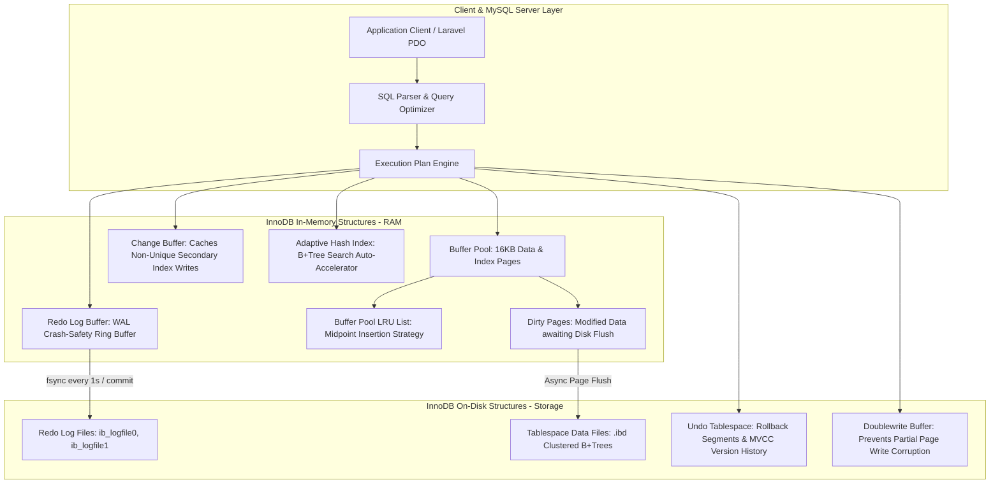
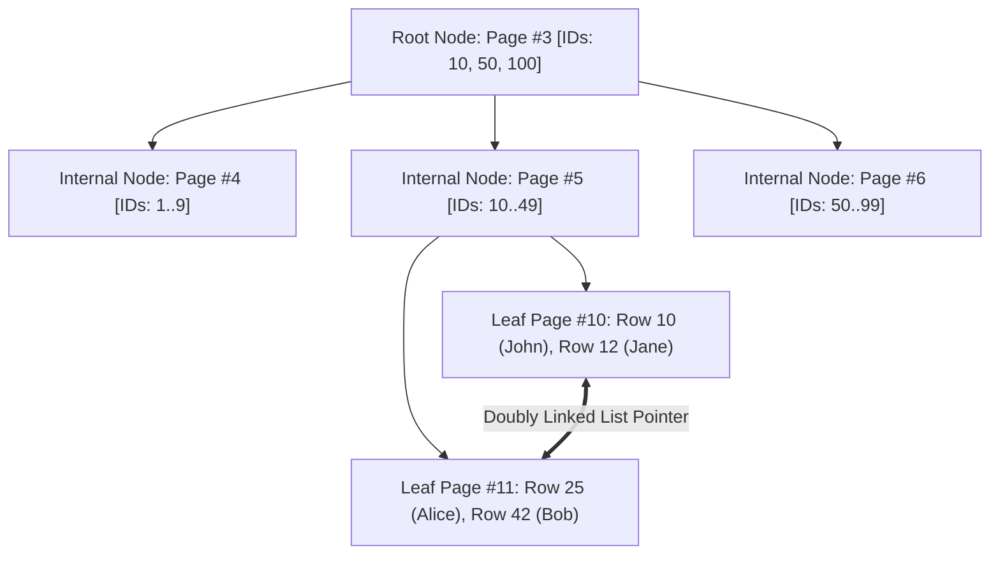
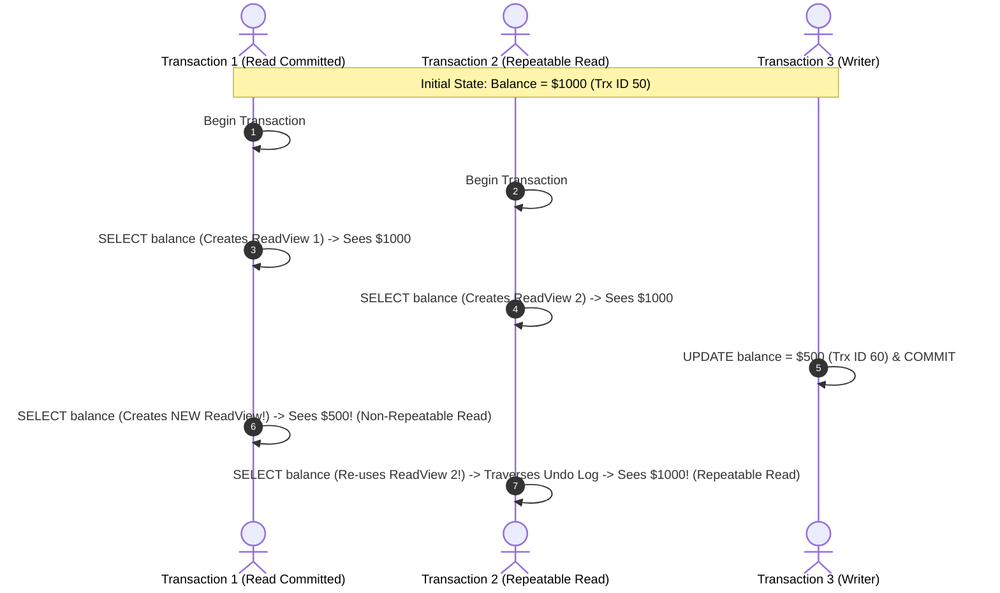

# Deep Dive: MySQL InnoDB Storage Engine Internals, B+Trees & MVCC

> **Module:** Database Deep Dives (Topic 2.1)  
> **Target:** Master MySQL InnoDB Memory Architecture, B+Tree Physical Disk Structures, Buffer Pool LRU Algorithms, Locking Mechanics & MVCC Concurrency.

---

## 🏛️ 1. Complete InnoDB Storage Engine Architecture

InnoDB is a high-reliability, ACID-compliant transactional storage engine. To balance ultra-low latency memory speeds with durable disk persistence, InnoDB divides its execution engine between **In-Memory Structures (RAM)** and **On-Disk Structures (SSD)**.



---

## 🔬 2. Low-Level Memory Mechanics: The InnoDB Buffer Pool

The **Buffer Pool** is the single most critical RAM component in MySQL (typically allocated 70%–80% of total system RAM on dedicated database servers).

### A. Physical Page Size & Organization
- Data on disk and in RAM is organized into **16KB Pages**.
- When a query executes (`SELECT * FROM users WHERE id = 42`), InnoDB does not read 1 row from disk—it loads the entire **16KB Page** containing that row into the Buffer Pool.

### B. Modified Midpoint LRU Eviction Algorithm
Standard LRU (Least Recently Used) places newly read items at the head (`Oldest ➔ Newest`). Standard LRU is vulnerable to **Buffer Pool Pollution**: a single full-table scan (`SELECT * FROM logs`) would evict 100% of cached hot application data!

InnoDB uses a **Sub-List Midpoint LRU** algorithm:
- **New Sub-list (5/8 of pool):** Stores hot, frequently accessed pages.
- **Old Sub-list (3/8 of pool):** Stores cold pages. Newly read pages are inserted at the **midpoint boundary** (38% from the tail).
- A cold page is only promoted to the New Sub-list if it is accessed again after `innodb_old_blocks_time` milliseconds (default: 1000ms).

---

## 🌲 3. Physical B+Tree Index Structures: Clustered vs. Secondary

### A. Clustered Index (Primary Key)
In InnoDB, **the table IS the Clustered Index**. 
- Non-leaf nodes contain index keys and page pointer addresses.
- Leaf nodes contain the **actual full physical row data** (`id`, `name`, `email`, `created_at`).
- Rows are physically ordered on disk by the Primary Key.



### B. Secondary Indexes & The "Secondary Lookup" Overhead
A secondary index (`INDEX idx_email (email)`) creates a separate B+Tree:
- Secondary B+Tree leaf nodes store the **Indexed Column Value + Primary Key Value** (NOT the full row data).

```sql
-- Production Table Example
CREATE TABLE orders (
    id BIGINT UNSIGNED AUTO_INCREMENT PRIMARY KEY, -- Clustered Index
    user_id BIGINT UNSIGNED NOT NULL,
    status VARCHAR(50) NOT NULL,
    amount_cents BIGINT NOT NULL,
    INDEX idx_user_status (user_id, status)        -- Secondary Composite Index
);
```

#### Detailed Query Comparison: Non-Covering vs Covering Index

```sql
-- QUERY A: Non-Covering Query (Requires Bookmark Lookup)
SELECT * FROM orders WHERE user_id = 42 AND status = 'COMPLETED';
```
1. **Traverse Secondary Index B+Tree (`idx_user_status`):** Matches `user_id = 42` & `status = 'COMPLETED'`. Reads primary key `id = 9081`.
2. **Bookmark Lookup (Secondary Read):** Traverses the **Clustered Primary B+Tree** using `id = 9081` to load remaining columns (`amount_cents`). **Cost: 2 separate B+Tree traversals per row.**

```sql
-- QUERY B: Covering Query (Zero Bookmark Lookup)
SELECT id, user_id, status FROM orders WHERE user_id = 42 AND status = 'COMPLETED';
```
The engine fetches `id`, `user_id`, and `status` **entirely from the leaf nodes of `idx_user_status`** without ever touching the primary clustered index! (EXPLAIN output: `Using index`). **Cost: 1 single B+Tree traversal.**

---

## 🔒 4. Multi-Version Concurrency Control (MVCC) & Isolation Deep-Dive

InnoDB uses **MVCC** to achieve high concurrency: **Reads never block Writes, and Writes never block Reads.**

### A. The Hidden Row Columns
Every row written by InnoDB secretly contains 3 hidden system fields:
1. `DB_TRX_ID` (6 Bytes): The Transaction ID of the last transaction that inserted or updated the row.
2. `DB_ROLL_PTR` (7 Bytes): A pointer pointing to the **Undo Log record** containing the previous version of the row before modification.
3. `DB_ROW_ID` (6 Bytes): Auto-increment row ID created if no Primary Key was defined.

### B. Undo Log Rollback Pointer Chain
When a row is repeatedly updated, InnoDB builds a **linked list chain** of historical row versions in the Undo Tablespace:

```
Current Row in Buffer Pool:
[ ID: 42 | Balance: $500 | DB_TRX_ID: 105 | DB_ROLL_PTR: 0x90A1 ]
                                                        │
                                                        ▼ (Points to Undo Log)
Undo Version 1: [ Balance: $800 | DB_TRX_ID: 102 | DB_ROLL_PTR: 0x80F4 ]
                                                        │
                                                        ▼
Undo Version 2: [ Balance: $1000 | DB_TRX_ID: 99 | DB_ROLL_PTR: NULL ]
```

### C. Isolation Levels & Read Views

When a query executes `SELECT`, InnoDB generates a **Read View** snapshot containing:
- `m_ids`: List of active transactions running when the Read View was created.
- `min_trx_id`: Lowest active transaction ID.
- `max_trx_id`: Next transaction ID to be assigned.



1. **Read Committed:** Generates a **NEW Read View on EVERY `SELECT` statement**. If another transaction commits mid-way, subsequent queries immediately see the new committed data (Non-Repeatable Read).
2. **Repeatable Read (InnoDB Default):** Generates a **SINGLE Read View on the FIRST `SELECT` statement** and re-uses it for the entire duration of the transaction. Queries always traverse the Undo Log chain back to the original snapshot version!

---

## ⚡ 5. Production Performance Tuning & Metrics

### Key InnoDB Tuning Parameters (`my.cnf`)
- `innodb_buffer_pool_size`: Set to **70–80%** of total RAM on dedicated MySQL servers.
- `innodb_buffer_pool_instances`: Split pool into multiple instances (e.g. `8`) to reduce thread lock contention on high CPU core servers.
- `innodb_flush_log_at_trx_commit`:
  - `1` (Default - Full ACID): Flush Redo Log to disk on **every commit**. Highest durability, higher disk I/O.
  - `2` (High Throughput): Write Redo Log to OS cache on commit, flush to disk once per second. Extremely fast, max 1 second data loss risk on power failure.

### Diagnostic Verification Commands
```sql
-- Check Buffer Pool Hit Ratio (Should be > 99%)
SHOW GLOBAL STATUS LIKE 'Innodb_buffer_pool_read%';

-- Detailed Engine Status (Inspect Lock Waits & Buffer Pool LRU)
SHOW ENGINE INNODB STATUS\G
```
