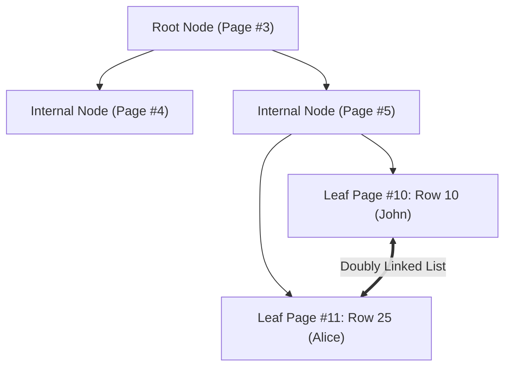

# Deep Dive: MySQL InnoDB Storage Engine Internals, B+Trees & MVCC

> **Module:** Database Deep Dives (Topic 2.1)
> **Target:** Master MySQL InnoDB Memory Architecture, B+Tree Physical Disk Structures, Buffer Pool LRU Algorithms, Locking Mechanics & MVCC Concurrency.

---

## 🏛️ 1. Complete InnoDB Storage Engine Architecture

InnoDB is a high-reliability, ACID-compliant transactional storage engine. To balance ultra-low latency memory speeds with durable disk persistence, InnoDB divides its execution engine between **In-Memory Structures (RAM)** and **On-Disk Structures (SSD)**.

### First-Principles Mechanics (CPU/OS/Memory)
When a query is issued, InnoDB does not read or write to disk directly. Everything flows through the **Buffer Pool** (RAM). Memory pages (16KB blocks) are mapped to disk pages. OS `fsync()` calls are carefully orchestrated to flush the **Redo Log** (Sequential I/O) quickly, while data pages are flushed asynchronously (Random I/O) to avoid blocking CPU threads.

```mermaid
graph TD
    subgraph Client & MySQL Server Layer
        Client["Application Client (PDO/JDBC)"] --> Parser["SQL Parser & Optimizer"]
        Parser --> ExecPlan["Execution Plan Engine"]
    end

    subgraph InnoDB In-Memory Structures (RAM)
        ExecPlan --> BP["Buffer Pool (16KB Pages)"]
        BP --> DirtyPages["Dirty Pages (Awaiting Flush)"]
        BP --> LRU["Buffer Pool LRU (Midpoint)"]
        ExecPlan --> ChangeBuffer["Change Buffer (Non-Unique Writes)"]
        ExecPlan --> AdaptiveHash["Adaptive Hash Index (Search Accel)"]
        ExecPlan --> LogBuffer["Redo Log Buffer (Ring Buffer)"]
    end

    subgraph InnoDB On-Disk Structures (SSD/HDD)
        LogBuffer -->|fsync every 1s / commit| RedoLogs["Redo Log Files (ib_logfile)"]
        DirtyPages -->|Async Page Flush| SystemTablespace["Tablespace Files (.ibd)"]
        ExecPlan --> UndoLogs["Undo Tablespace (MVCC History)"]
        ExecPlan --> DoublewriteBuffer["Doublewrite Buffer (Corrupt Prev)"]
    end
```

---

## 🔬 2. Low-Level Memory Mechanics: The InnoDB Buffer Pool

The **Buffer Pool** is the single most critical RAM component in MySQL (typically allocated 70%–80% of total system RAM).

### A. Physical Page Size & Organization
- Data on disk and in RAM is organized into **16KB Pages**.
- When a query executes (`SELECT * FROM users WHERE id = 42`), InnoDB does not read 1 row from disk—it loads the entire **16KB Page** containing that row into RAM.

### B. Modified Midpoint LRU Eviction Algorithm
Standard LRU is vulnerable to **Buffer Pool Pollution**: a single full-table scan (e.g., `mysqldump` or analytics query) would evict 100% of cached hot application data.

InnoDB uses a **Sub-List Midpoint LRU** algorithm:
- **New Sub-list (5/8 of pool):** Hot, frequently accessed pages.
- **Old Sub-list (3/8 of pool):** Cold pages. Newly read pages are inserted at the **midpoint boundary**.
- A cold page is only promoted to the New Sub-list if it is accessed again after `innodb_old_blocks_time` milliseconds (default: 1000ms).

---

## 🌲 3. Physical B+Tree Index Structures

### A. Clustered Index (Primary Key)
In InnoDB, **the table IS the Clustered Index**.
- Leaf nodes contain the **actual full physical row data**.



### B. Secondary Indexes & "Secondary Lookup" Overhead
A secondary index (`INDEX idx_email (email)`) creates a separate B+Tree where leaf nodes store the **Indexed Column + Primary Key Value**.

#### Concrete Working Code & Execution Plans
```sql
CREATE TABLE orders (
    id BIGINT UNSIGNED AUTO_INCREMENT PRIMARY KEY,
    user_id BIGINT UNSIGNED NOT NULL,
    status VARCHAR(50) NOT NULL,
    amount_cents BIGINT NOT NULL,
    INDEX idx_user_status (user_id, status)
);

-- QUERY A: Non-Covering Query (Requires Bookmark Lookup)
EXPLAIN FORMAT=JSON SELECT * FROM orders WHERE user_id = 42 AND status = 'COMPLETED';
-- Cost: 2 separate B+Tree traversals per row (idx_user_status -> Clustered Index).
```

```sql
-- QUERY B: Covering Query (Zero Bookmark Lookup)
EXPLAIN FORMAT=JSON SELECT id, user_id, status FROM orders WHERE user_id = 42 AND status = 'COMPLETED';
-- Engine fetches completely from the leaf nodes of idx_user_status (EXPLAIN output: Using index).
-- Cost: 1 single B+Tree traversal.
```

---

## 🔒 4. Multi-Version Concurrency Control (MVCC)

InnoDB uses MVCC to achieve high concurrency: **Reads never block Writes, and Writes never block Reads.**
Rows secretly contain `DB_TRX_ID` (Transaction ID) and `DB_ROLL_PTR` (Undo Log Pointer).

### Real-World Production Example: GitHub's 2018 Outage
GitHub experienced an outage due to long-running transactions holding MVCC state open.
- **Mechanic:** If a stale transaction stays open in `REPEATABLE READ`, InnoDB cannot purge old Undo Logs. The Undo Tablespace grows massively, causing disk I/O spikes and eventually exhausting disk space or degrading read performance (queries must traverse 10,000+ linked list pointers in the Undo Log to find their snapshot version).

---

## ⚡ 5. Production Performance & Benchmarks

### Exact CLI Benchmark Command (Sysbench)
```bash
# Run a read-write benchmark with 64 threads for 60 seconds
sysbench oltp_read_write \
  --table-size=1000000 \
  --mysql-db=test \
  --mysql-user=root \
  --threads=64 \
  --time=60 \
  run
```

**Annotated Output:**
```text
SQL statistics:
    queries performed:
        read:                            1120000  # MVCC Read Views utilized
        write:                           320000   # Redo Log fsyncs occurring
        other:                           160000
        total:                           1600000
    transactions:                        80000  (1333.33 per sec.)
    queries:                             1600000 (26666.67 per sec.)
    ignored errors:                      0      (0.00 per sec.)
    reconnects:                          0      (0.00 per sec.)

General statistics:
    total time:                          60.0012s
    total number of events:              80000

Latency (ms):
         min:                                  1.12
         avg:                                 48.00  # Average transaction latency
         95th percentile:                    115.00  # P95 - Monitor this for I/O stalls
```

### Key Tuning Parameters (`my.cnf`)
```ini
[mysqld]
# 70-80% of RAM
innodb_buffer_pool_size = 32G
innodb_buffer_pool_instances = 8

# 1 = Full ACID (Slow), 2 = High Throughput (OS cache, 1s data loss risk)
innodb_flush_log_at_trx_commit = 1

# Control I/O capacity based on your SSD speed
innodb_io_capacity = 2000
innodb_io_capacity_max = 4000
```

---

## ⚔️ 6. Staff / Senior Interview Scenarios

**Q: What is a Gap Lock and how does it prevent Phantom Reads?**
**Staff Answer:** In `REPEATABLE READ`, if you execute `SELECT * FROM users WHERE age BETWEEN 20 AND 30 FOR UPDATE`, InnoDB doesn't just lock the existing rows. It places **Gap Locks** on the index ranges between the rows. This prevents another transaction from `INSERT`ing a new 25-year-old user into the index, which would cause a "phantom read" (a row appearing out of nowhere if the query were re-run).

**Q: You see CPU at 100% and high Mutex contention in `SHOW ENGINE INNODB STATUS`. How do you fix it?**
**Staff Answer:** High spin-lock/mutex contention usually means the single Buffer Pool mutex is hot. You increase `innodb_buffer_pool_instances` (e.g., to 8 or 16) to shard the buffer pool locks, allowing parallel threads to access different memory regions simultaneously without blocking.
