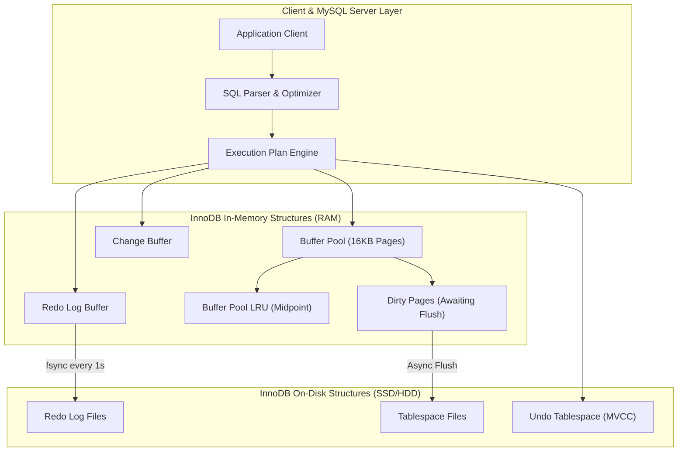
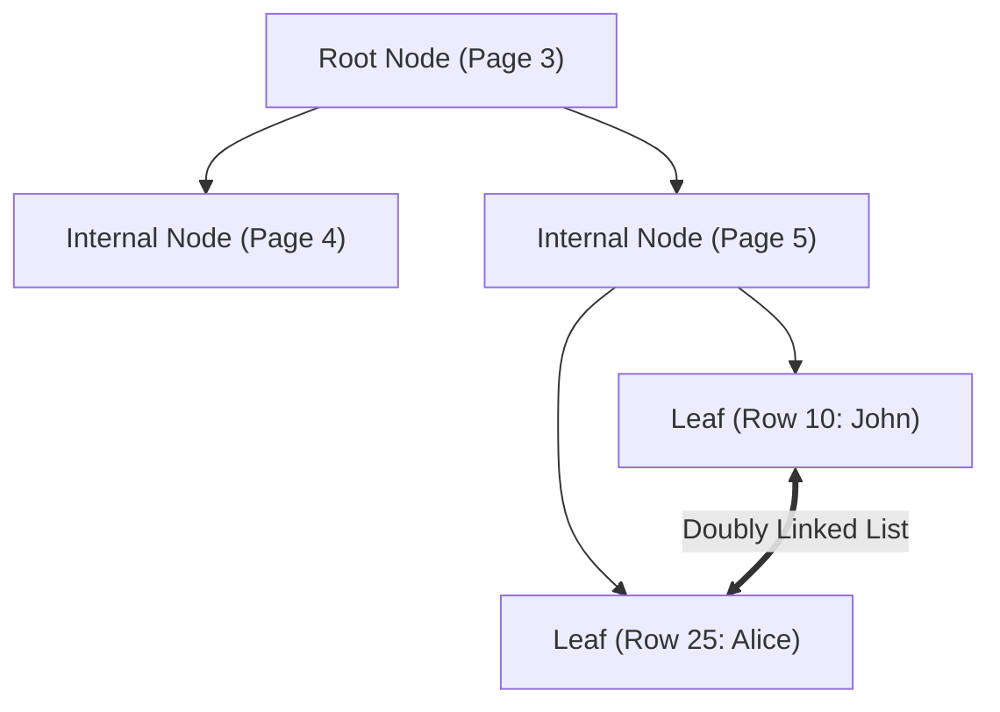

# Deep Dive: MySQL InnoDB Storage Engine Internals, B+Trees & MVCC

> **Module:** Database Deep Dives (Topic 2.1)
> **Target:** Master MySQL InnoDB Memory Architecture, B+Tree Physical Disk Structures, Buffer Pool LRU Algorithms, Locking Mechanics & MVCC Concurrency.

---

## 🏛️ 1. Complete InnoDB Storage Engine Architecture

### Analogy First: The Office Workspace
Think of InnoDB like a busy office:
*   **Buffer Pool (RAM) = Your Desk:** It's super fast to read and write documents here, but space is limited. 
*   **Tablespace Files (SSD) = The Filing Cabinet:** Massive storage, but it takes time to get up and fetch a folder.
*   **Redo Log = Your Notepad:** Before putting a final document away, you quickly jot down changes so you don't forget if the power goes out.

### Step-by-Step Flow: How a Query Works
1.  **Parse & Plan:** The application sends a query, and MySQL plans the best route.
2.  **Check the Desk (Buffer Pool):** InnoDB checks if the required 16KB data page is already in RAM. 
3.  **Fetch from Cabinet (Disk):** If not, it fetches the page from the `.ibd` tablespace file into RAM.
4.  **Jot it Down (Redo Log):** Modifications are written sequentially to the redo log for safety.



---

## 🔬 2. Low-Level Memory Mechanics: The Buffer Pool

### Analogy First: The VIP Club Line
The LRU (Least Recently Used) cache is like a VIP club. If a massive tour group (full-table scan) comes in, they shouldn't immediately kick out your regular VIPs (hot data). 

### Step-by-Step Flow: Midpoint LRU
1.  **Enter at the Midpoint:** New data enters the "Old Sub-list" (the waiting line).
2.  **Wait and See:** Data stays there unless accessed again after a short delay (e.g., 1 second).
3.  **Promote to VIP:** If accessed again, it moves to the "New Sub-list" (hot data). 

---

## 🌲 3. Physical B+Tree Index Structures

### Analogy First: The Book Index
*   **Clustered Index = The Book Pages:** The data is sorted physically by chapter (Primary Key). 
*   **Secondary Index = The Glossary:** It tells you the exact page number (Primary Key) where a topic lives.



### Annotated Python Code: Simulating Index Lookups
```python
# Simulating a secondary index lookup overhead
database = {
    # Clustered Index (Primary Key -> Full Row)
    1: {"id": 1, "user_id": 42, "status": "COMPLETED"},
    2: {"id": 2, "user_id": 99, "status": "PENDING"}
}

# Secondary Index (Indexed Column -> Primary Key)
idx_user_id = {42: [1], 99: [2]}

def find_user_orders(target_user_id: int):
    # Step 1: Traverse the secondary index B+Tree
    primary_keys = idx_user_id.get(target_user_id, [])
    
    results = []
    # Step 2: For each PK, perform a "Bookmark Lookup" on the clustered index
    for pk in primary_keys:
        full_row = database[pk]  # This is the extra traversal cost!
        results.append(full_row)
        
    return results

print(find_user_orders(42))
```

---

## 🔒 4. Multi-Version Concurrency Control (MVCC)

### Analogy First: The Google Doc Version History
MVCC is like collaborating on a Google Doc. While you are typing a new paragraph (Write), your friend can still read the previous saved version (Read) without blocking you.

---

## ⚔️ 5. Interview Tips: 3-Point Elevator Pitches

**Q: What is a Gap Lock and how does it prevent Phantom Reads?**
1.  **The Concept:** Gap locks secure the "spaces" between existing rows in an index.
2.  **The Trigger:** Used in `REPEATABLE READ` isolation when doing range queries (e.g., `BETWEEN 20 AND 30`).
3.  **The Benefit:** It prevents other transactions from inserting new rows into that gap, completely avoiding "phantom reads".

**Q: High Mutex contention in InnoDB Status. How to fix?**
1.  **The Symptom:** 100% CPU usage with threads fighting over a single Buffer Pool lock.
2.  **The Fix:** Increase `innodb_buffer_pool_instances` in the configuration.
3.  **The Result:** Shards the buffer pool into smaller pieces, allowing parallel memory access without stepping on each other's toes.
