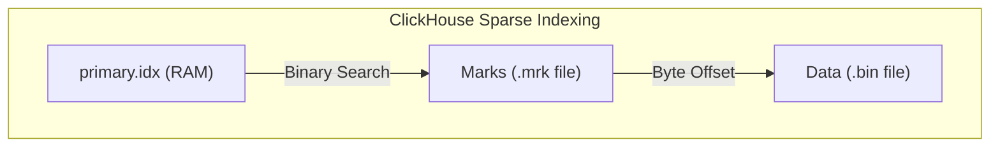

# ClickHouse Columnar Storage & MergeTree Mechanics

> **Module:** Database Deep Dives (Topic 2.2)  
> **Source Mapping:** `backend-roadmap.md` (Level 29: #580–#585)

---

## 💡 1. Conceptual Blueprint & First Principles

### Analogy First: The Receipt Box vs. The Spreadsheet
*   **Row-Oriented (PostgreSQL) = A Box of Receipts:** Great if you need to pull out a single receipt and see all details (date, items, total). Bad if you just want to sum up all the totals across 10,000 receipts.
*   **Columnar (ClickHouse) = A Spreadsheet:** Data is stored column by column. If you want the sum of all totals, you just highlight the "Total" column and sum it up instantly, ignoring the other data.

### Step-by-Step Flow: Vectorized Execution
1.  **Fetch Column:** The CPU loads a contiguous block of data (e.g., an array of integers) from RAM.
2.  **SIMD Magic:** Using SIMD (Single Instruction, Multiple Data), the CPU processes chunks of data in parallel.
3.  **Decompress & Compute:** Massive compression reduces disk reads, and the fast CPU handles decompression and sums it in one clock cycle.

---

## 🔬 2. Under-the-Hood: MergeTree Engine & Sparse Indexing

### Analogy First: The Dictionary Guide Words
A sparse index is like the guide words at the top of a dictionary page. It doesn't index every single word; it just tells you "this chunk of data starts at 'Aardvark' and ends at 'Apple'". 



### Annotated Python Code: Sparse Indexing Logic
```python
# Simulating ClickHouse Sparse Indexing
data_file_blocks = {
    # Offset: Data (Block of 8192 rows, highly compressed)
    0: {"date": "2026-08-01", "rows": [...]},
    1024: {"date": "2026-08-15", "rows": [...]},
}

# The Sparse Index kept in RAM
sparse_index = [
    {"value": "2026-08-01", "mark_offset": 0},
    {"value": "2026-08-15", "mark_offset": 1024},
]

def sparse_search(target_date: str):
    # Step 1: Binary search the tiny RAM index
    for entry in sparse_index:
        if entry["value"] == target_date:
            # Step 2: Get exact byte offset and read ONLY that block from disk
            offset = entry["mark_offset"]
            return data_file_blocks[offset]
    return None

print(sparse_search("2026-08-15"))
```

---

## ⚔️ 3. Interview Tips: 3-Point Elevator Pitches

**Q: Why should you NEVER use UUID as the first column in a ClickHouse ORDER BY key?**
1.  **The Mechanism:** ClickHouse physically sorts data on disk by the `ORDER BY` key to optimize range scans.
2.  **The Problem:** UUIDs are random. Sorting by randomness destroys sequential writes, bloats compression, and makes the sparse index useless.
3.  **The Solution:** Always order by low-cardinality or time-based monotonic columns first (like `tenant_id` or `date`).

**Q: How do you handle real-time Updates/Deletes if ClickHouse is immutable?**
1.  **The Engine:** Use specialized engines like `ReplacingMergeTree` or `CollapsingMergeTree`.
2.  **The Write:** Instead of updating, you insert a *new* row with a higher timestamp or a cancellation flag.
3.  **The Read:** Background threads will eventually deduplicate them, or you can use `SELECT ... FINAL` to deduplicate on the fly at query time.
