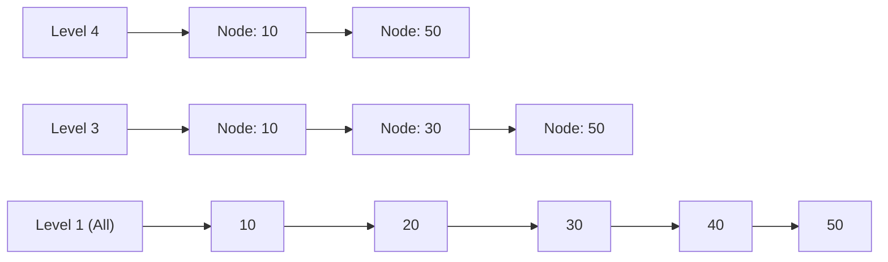

# Redis Internals, Data Structures & Distributed Locks

> **Module:** Database Deep Dives (Topic 2.3)  
> **Source Mapping:** `backend-roadmap.md` (Level 13: #304–#321) & `roadmap.md` (Tier 1: #174–#188)

---

## 💡 1. Conceptual Blueprint & First Principles

Redis is not just a key-value cache; it is a **single-threaded, in-memory data structure server**. 
- **Single-Threaded Model:** Because memory operations are fast, Redis bypasses lock contention, context switching, and race conditions by processing commands sequentially via an event loop (epoll/kqueue).
- **Data Structures:** C-level abstractions (like SDS, SkipLists) allow Redis to guarantee predictable $O(1)$ or $O(\log N)$ performance.
- **Distributed Consensus (Redlock):** Redis extends its atomic guarantees to distributed locking across microservices.

## 🔬 2. Under-the-Hood Mechanics

### Sorted Sets (`ZSET`) and SkipLists

A Sorted Set achieves $O(\log N)$ inserts/lookups by combining a Hash Table (for $O(1)$ score lookups by member) and a **SkipList** (for range queries).


*A SkipList uses randomized probabilistic layers to skip over elements, offering binary-search-like speed without the rigid rebalancing overhead of a Red-Black Tree.*

## 💻 3. Production Code & Benchmarks

### Safe Distributed Locking with Lua

In distributed systems,Worker A might acquire a lock, experience a long GC pause, and its lock expires. Worker B acquires the lock. Worker A wakes up and mistakenly deletes Worker B's lock. 
**Solution:** Atomically verify ownership using a UUID and Lua script.

```bash
# 1. Acquire Lock (NX = Not Exists, PX = 30000ms expiration)
SET resource_lock "uuid_worker_A" NX PX 30000
```

```lua
-- 2. Release Lock (Executed Atomically in Redis)
if redis.call("get", KEYS[1]) == ARGV[1] then
    return redis.call("del", KEYS[1])
else
    return 0
end
```
**Benchmark:** Redis easily executes 100,000+ Lua scripts per second. Because Lua scripts are atomic and block the single thread, they *must* be extremely fast and avoid long loops.

## ⚔️ 4. Staff / Senior Interview Scenarios

**Scenario 1:** *Redis is single-threaded. How does it handle saving massive datasets to disk (RDB snapshots) without blocking incoming requests?*
- **Staff Answer:** Redis uses the `fork()` system call. The OS creates a child process with a point-in-time snapshot of memory using **Copy-on-Write (CoW)**. The child process writes the RDB file to disk asynchronously. If the main thread modifies memory during this time, the OS copies the modified pages, ensuring the child sees an isolated, immutable state.

**Scenario 2:** *You are using Redis for a distributed lock. The Redis master node crashes after granting the lock but before replicating to the replica. What happens?*
- **Staff Answer:** The replica is promoted to master, but it doesn't have the lock. Another client can now acquire the same lock, violating mutual exclusion. This is why standard Redis locking is unsafe for strict consistency. For strict safety across partitions/crashes, you must use the **Redlock algorithm** (requiring consensus across $N/2 + 1$ independent Redis nodes) or switch to a CP system like ZooKeeper or etcd.
