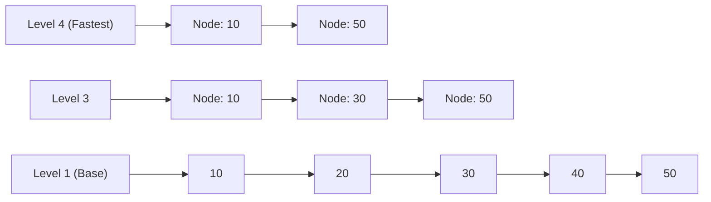

# Redis Internals, Data Structures & Distributed Locks

> **Module:** Database Deep Dives (Topic 2.3)  
> **Source Mapping:** `backend-roadmap.md` (Level 13: #304–#321)

---

## 💡 1. Conceptual Blueprint & First Principles (OS/Kernel)

Redis is a **single-threaded, in-memory data structure server**.
- **Single-Threaded Epoll:** Redis uses an event loop built on OS multiplexing (`epoll` on Linux, `kqueue` on Mac). Because RAM access is sub-microsecond, CPU is rarely the bottleneck. By staying single-threaded, Redis completely bypasses lock contention (mutexes), context switching overhead, and race conditions. 
- **Memory Allocation:** Redis uses `jemalloc` to prevent memory fragmentation during rapid string allocations.

## 🔬 2. Under-the-Hood: ZSET and SkipLists

A Sorted Set (`ZSET`) guarantees $O(\log N)$ inserts and range queries. It combines a Hash Table (for $O(1)$ member lookups) and a **SkipList** (for sorting by score).


*Probabilistic balancing: Instead of expensive Red-Black tree rotations, a SkipList flips a "coin" (randomness) upon insertion to decide how many layers the node occupies.*

---

## 🏢 3. Real-World Production Example (Twitter / GitHub)

**Twitter (X) Home Timelines:** Twitter uses Redis `ZSET`s to cache home timelines. The `member` is the Tweet ID, and the `score` is the Unix Timestamp.
- **Eviction Limit:** To prevent OOM (Out of Memory), timelines are capped at 800 tweets using `ZREMRANGEBYRANK timeline_key 0 -801` executed asynchronously via pipelining.

## 💻 4. Production Code & Benchmarks

### Safe Distributed Locking with Lua (Python Example)
If a worker crashes mid-task, standard locks might deadlock. If a worker pauses (GC pause) and its lock expires, it might wake up and delete someone else's lock. **Solution:** Atomically verify ownership via Lua.

```python
import redis
import uuid

r = redis.Redis()

# Generate unique worker ID
worker_id = str(uuid.uuid4())

# 1. Acquire Lock (NX = Not Exists, PX = 30000ms expiration)
acquired = r.set("resource_lock", worker_id, nx=True, px=30000)

if acquired:
    try:
        # Perform critical section work...
        pass
    finally:
        # 2. Safe Release via Atomic Lua Script
        lua_script = """
        if redis.call("get", KEYS[1]) == ARGV[1] then
            return redis.call("del", KEYS[1])
        else
            return 0
        end
        """
        r.eval(lua_script, 1, "resource_lock", worker_id)
```

### Exact CLI Benchmark Command (`redis-benchmark`)
```bash
# Test SET and GET with 100 concurrent clients, pipeline of 16
redis-benchmark -t set,get -c 100 -P 16 -n 1000000 -q
```
**Annotated Output:**
```text
SET: 1102535.75 requests per second, p50=1.127 msec
GET: 1205312.38 requests per second, p50=1.011 msec
# Notice throughput exceeds 1M ops/sec by utilizing Pipelining (-P 16).
# Pipelining batches network TCP packets, reducing syscall overhead.
```

---

## ⚔️ 5. Staff / Senior Interview Scenarios

**Q: Redis is single-threaded. How does it handle saving massive datasets to disk (RDB) without blocking incoming requests?**
**Staff Answer:** Redis utilizes the OS `fork()` system call. `fork()` creates a child process. The OS uses **Copy-on-Write (CoW)** memory mapping. The child process sees a frozen point-in-time snapshot of memory and writes it to disk. If the main thread modifies a key during this time, the OS copies only that specific 4KB memory page for the main thread, leaving the child's snapshot intact.

**Q: Explain the controversy between Martin Kleppmann and Antirez regarding Redlock.**
**Staff Answer:** The Redlock algorithm attempts to provide strict distributed locking across 5 Redis nodes. Kleppmann (author of DDIA) argued Redlock is fundamentally unsafe because it relies on wall-clock time. If a worker acquires a lock, but experiences a 10-second JVM garbage collection pause, the lock expires in Redis. Another worker acquires it. The first worker wakes up, thinking it still has the lock, and corrupts the data. Kleppmann argues you need monotonic "fencing tokens" (e.g., ZooKeeper zxid) injected into the database to reject stale writes. Antirez argued Redlock is practically safe for most microservice use cases.
