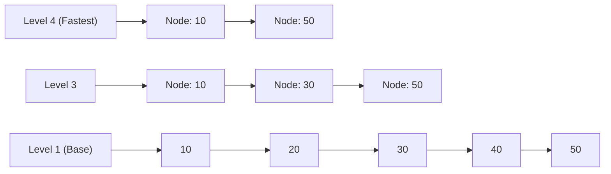

# Redis Internals, Data Structures & Distributed Locks

> **Module:** Database Deep Dives (Topic 2.3)  
> **Source Mapping:** `backend-roadmap.md` (Level 13: #304–#321)

---

## 💡 1. Conceptual Blueprint & First Principles

### Analogy First: The Super-Fast Waiter
Think of Redis as a single, incredibly fast waiter at a restaurant. 
*   Instead of hiring many slow waiters who bump into each other (multi-threading with locks), you have one waiter taking orders at lightning speed (epoll event loop). 
*   Because everything is in RAM, the waiter never has to walk to the kitchen (disk); all the food is right there on the counter.

### Step-by-Step Flow: Event Loop
1.  **Wait for Events:** The OS (`epoll` or `kqueue`) monitors all active connections.
2.  **Queue the Ready:** When a client sends a command, the connection is marked "ready".
3.  **Execute Sequentially:** The single Redis thread executes the commands one by one, bypassing race conditions completely.

---

## 🔬 2. Under-the-Hood: ZSET and SkipLists

### Analogy First: The Express Subway Train
A SkipList is like a subway system. 
*   **Local Train (Level 1):** Stops at every single station (Node 10, 20, 30, 40).
*   **Express Train (Level 3):** Skips multiple stations (Node 10 directly to Node 50).
To find a station fast, you take the express train as far as possible, then hop on the local train for the last few stops.



---

## 💻 3. Production Code & Benchmarks

### Annotated Python Code: Safe Distributed Locks
```python
import redis
import uuid
import time
from typing import Any

# Step 1: Connect to the super-fast waiter
r: redis.Redis[Any] = redis.Redis(host='localhost', port=6379, db=0)

# Step 2: Give this worker a unique name tag
worker_id: str = str(uuid.uuid4())

def acquire_and_release_lock():
    # Step 3: Try to grab the lock (NX = only if it doesn't exist, PX = expire in 30s)
    acquired: bool | None = r.set("resource_lock", worker_id, nx=True, px=30000)

    if acquired:
        try:
            print("Lock acquired! Doing critical work...")
            time.sleep(1) # Simulating work
        finally:
            # Step 4: Safely release using Lua. 
            # ONLY delete the lock if our worker_id still owns it.
            lua_script: str = """
            if redis.call("get", KEYS[1]) == ARGV[1] then
                return redis.call("del", KEYS[1])
            else
                return 0
            end
            """
            r.eval(lua_script, 1, "resource_lock", worker_id)
            print("Lock safely released!")

acquire_and_release_lock()
```

---

## ⚔️ 4. Interview Tips: 3-Point Elevator Pitches

**Q: How does Redis save massive datasets to disk without blocking the single thread?**
1.  **The Fork:** Redis uses the OS `fork()` system call to create a child process.
2.  **The Snapshot:** The child process gets a frozen point-in-time view of memory and writes it to disk (RDB file).
3.  **Copy-on-Write (CoW):** If the main thread changes a value during this time, the OS duplicates only that tiny memory page, ensuring the child's snapshot is unharmed and the main thread never blocks.

**Q: What is the controversy around the Redlock distributed locking algorithm?**
1.  **The Vulnerability:** Martin Kleppmann noted that Redlock relies on wall-clock time. If a worker pauses (e.g., Garbage Collection), its lock can expire and be taken by someone else.
2.  **The Disaster:** When the original worker wakes up, two workers hold the lock, leading to data corruption.
3.  **The Solution:** Kleppmann argues you need monotonic "fencing tokens" (like an incrementing ID) validated by the database to ensure absolute safety.
