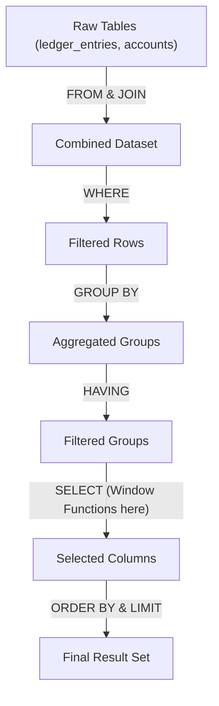

# 05. SQL Mastery: JOINs, CTEs, Window Functions, and Subqueries

## 1. Real-World Analogy: The Financial Spreadsheet

Think of your database as a massive collection of interlinked spreadsheets for a financial firm:
- **JOINs**: Like using `VLOOKUP` to merge the "Customers" tab with the "Orders" tab so you can see who bought what.
- **GROUP BY**: Like creating a Pivot Table to summarize total payments by day or by region.
- **Window Functions**: Like adding a formula in an adjacent column to calculate a running total or a moving average, without collapsing the original rows.
- **CTEs (Common Table Expressions)**: Like a temporary "scratchpad" tab where you do intermediate calculations before feeding them into your final report.

## 2. Step-by-Step Flow: SQL Evaluation Order



## 3. JOINs Deep Dive

### Types of JOINs
- **INNER JOIN**: Returns only rows with a match in both tables.
- **LEFT JOIN**: Returns all rows from the left table, and matched rows from the right (or NULL if no match).
- **RIGHT JOIN**: Returns all rows from the right table.
- **FULL OUTER JOIN**: Returns all rows when there is a match in either left or right table.
- **CROSS JOIN**: Returns the Cartesian product (every row combined with every row).

### JOINs vs Subqueries vs EXISTS
- **JOIN**: Best for retrieving columns from multiple tables.
- **IN**: Good for checking against a small, static list.
- **EXISTS**: Optimized for checking existence in large datasets because it short-circuits (stops searching) once a match is found.

## 4. Annotated Python & SQL Examples

```python
import sqlite3
from typing import Any

# Use Python 3.11+ type hints
def execute_sql_demo() -> list[tuple[Any, ...]]:
    """Demonstrates advanced SQL features using SQLite in Python 3.11+"""
    
    # 1. Establish connection to in-memory database
    conn = sqlite3.connect(":memory:")
    cursor = conn.cursor()
    
    # 2. Setup financial tables
    cursor.executescript("""
        CREATE TABLE accounts (id INTEGER PRIMARY KEY, name TEXT);
        CREATE TABLE ledger_entries (
            id INTEGER PRIMARY KEY,
            account_id INTEGER,
            amount DECIMAL(10,2),
            entry_date DATE
        );
        INSERT INTO accounts VALUES (1, 'Alice'), (2, 'Bob'), (3, 'Charlie');
        INSERT INTO ledger_entries VALUES 
            (1, 1, 100.00, '2023-01-01'), (2, 1, 50.00, '2023-01-02'),
            (3, 2, 200.00, '2023-01-01'), (4, 1, -20.00, '2023-01-03');
    """)
    
    # 3. GROUP BY and HAVING
    # Summarizing data by category, filtering the summary
    cursor.execute("""
        SELECT a.name, SUM(l.amount) as total_balance, COUNT(l.id) as tx_count
        FROM accounts a
        LEFT JOIN ledger_entries l ON a.id = l.account_id
        GROUP BY a.id, a.name
        HAVING total_balance > 0
    """)
    
    # 4. CTEs (Common Table Expressions)
    # Using WITH to structure complex queries clearly
    cursor.execute("""
        WITH DailyTotals AS (
            SELECT entry_date, SUM(amount) as daily_sum
            FROM ledger_entries
            GROUP BY entry_date
        )
        SELECT entry_date, daily_sum
        FROM DailyTotals
        WHERE daily_sum > 50
        ORDER BY entry_date;
    """)

    # 5. Window Functions
    # Calculating running totals and ranking
    cursor.execute("""
        SELECT 
            account_id,
            entry_date,
            amount,
            -- Running total partitioned by account, ordered by date
            SUM(amount) OVER (PARTITION BY account_id ORDER BY entry_date) as running_balance,
            -- Ranking transactions by amount within each account
            RANK() OVER (PARTITION BY account_id ORDER BY amount DESC) as rank,
            -- Look at the previous transaction amount
            LAG(amount) OVER (PARTITION BY account_id ORDER BY entry_date) as prev_amount
        FROM ledger_entries
        ORDER BY account_id, entry_date;
    """)
    
    results = cursor.fetchall()
    conn.close()
    return results
```

## 5. Pagination: Offset vs Cursor

When paginating large financial datasets (e.g., thousands of ledger entries):

### OFFSET/LIMIT (Slow)
```sql
-- Scans and discards the first 10,000 rows. Slow on large tables!
SELECT * FROM ledger_entries ORDER BY entry_date DESC LIMIT 100 OFFSET 10000;
```

### Cursor-Based / Keyset Pagination (Fast)
```sql
-- Uses an index to jump directly to the last seen record. Extremely fast!
SELECT * FROM ledger_entries 
WHERE (entry_date, id) < ('2023-01-02', 2) 
ORDER BY entry_date DESC, id DESC 
LIMIT 100;
```

## 6. Interview Questions & Elevator Pitches

**Q: What is the difference between WHERE and HAVING?**
1. **Scope**: `WHERE` filters individual rows *before* aggregation occurs.
2. **Aggregation**: `HAVING` filters groups *after* aggregation (e.g., `SUM()`, `COUNT()`) is applied.
3. **Usage**: Use `WHERE` to filter raw data (e.g., status = 'active'), and `HAVING` to filter aggregated metrics (e.g., total_sales > 1000).

**Q: Why use a CTE over a Subquery?**
1. **Readability**: CTEs (`WITH` clause) read top-to-bottom, making complex logic easier to follow than deeply nested subqueries.
2. **Reusability**: You can reference a CTE multiple times within the same main query; a subquery must be rewritten each time.
3. **Recursion**: CTEs support `RECURSIVE` queries, which are essential for hierarchical data like org charts or category trees.

**Q: Explain how Window Functions differ from GROUP BY.**
1. **Granularity**: `GROUP BY` collapses multiple rows into a single summary row, losing the individual row details.
2. **Preservation**: Window functions calculate aggregates while preserving all the original rows in the output.
3. **Analytics**: Window functions are ideal for running totals (`SUM() OVER`), rankings (`RANK()`), and comparing adjacent rows (`LAG()`/`LEAD()`).
