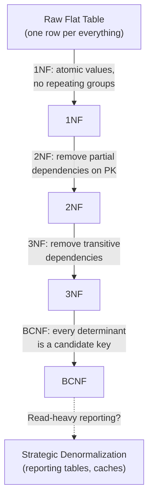

# 06. Database Normalization & Strategic Denormalization

## 1. Real-World Analogy: The Filing Cabinet vs The Dashboard

Imagine running the back office of an e-commerce payments company (think Electronic First):

- **Unnormalized data**: One giant spreadsheet row per transaction that also crams in the customer's full name, address, the product catalog description, the partner's API key, and the dispute status. Fast to *write* once, but a nightmare to *update* — change a customer's city and you must hunt down 10,000 rows.
- **Normalized data**: Separate, linked folders — `customers`, `orders`, `order_items`, `payments`, `disputes`. Each fact lives in exactly one place. Update the city once, it propagates everywhere via the link.
- **Denormalized data**: A purpose-built "dashboard" table that pre-joins the hot columns (customer name + last 5 orders + total spent) so reports render instantly without 6 joins.

**The core trade-off**: Normalization optimizes for *write consistency* (no contradictions); denormalization optimizes for *read speed* (fewer joins). A senior backend engineer knows when to stop normalizing and start duplicating — deliberately.

## 2. Step-by-Step Flow: The Normal Forms

Normalization is a ladder. Each step removes a specific *anomaly* (insert / update / delete). You climb until the data is clean, then stop.



### Functional Dependency (the foundation)
A column `B` is **functionally dependent** on `A` if knowing `A` tells you `B` uniquely: `A → B`.
- Example: `customer_id → customer_name, customer_city`. The name depends on the ID, not on the order.
- **Partial dependency**: a non-key column depends on *part* of a composite key.
- **Transitive dependency**: `A → B → C` (e.g., `order_id → customer_id → customer_city`).

## 3. Walkthrough: Normalizing a Payments Flat Table

Start with a messy flat `orders` table (an order can have many items, one customer):

| order_id | customer_name | customer_city | items (CSV) | partner_name | partner_fee_pct |
|----------|---------------|---------------|-------------|--------------|-----------------|
| 1001 | Fazley | Chittagong | "Laravel Book, Sticker" | Ezpin | 3.5 |
| 1001 | Fazley | Chittagong | "Mug" | Ezpin | 3.5 |
| 1002 | Ayesha | Dhaka | "Course" | Gamivo | 2.0 |

**Problems**: `customer_name` repeats per row (update anomaly), `items` is a multi-valued CSV (can't query one item), `partner_fee_pct` is duplicated (delete anomaly if the order is removed).

### 1NF — Atomic values, no repeating groups
Split the CSV into rows; every cell holds one value.

```sql
CREATE TABLE order_items_1nf (
    order_id      INT,
    customer_name TEXT,
    customer_city TEXT,
    item_name     TEXT,          -- one item per row, not CSV
    partner_name  TEXT,
    partner_fee_pct DECIMAL(4,2)
);
```

### 2NF — Remove partial dependencies
If the PK were `(order_id, item_name)`, `customer_name` depends only on `order_id` (part of the key) → violation. Split customers and orders out.

```sql
CREATE TABLE customers (
    customer_id   INT PRIMARY KEY,
    name          TEXT,
    city          TEXT
);

CREATE TABLE orders (
    order_id      INT PRIMARY KEY,
    customer_id   INT REFERENCES customers(customer_id),
    partner_id    INT REFERENCES partners(partner_id)
);

CREATE TABLE order_items (
    order_id      INT REFERENCES orders(order_id),
    item_name     TEXT,
    PRIMARY KEY (order_id, item_name)
);
```

### 3NF — Remove transitive dependencies
`partner_fee_pct` depends on `partner_name`, not on the order. Move partner data to its own table (already done above with `partners`). Now every non-key column depends *only* on the key.

```sql
CREATE TABLE partners (
    partner_id    INT PRIMARY KEY,
    name          TEXT,
    fee_pct       DECIMAL(4,2)    -- depends on partner, not order
);
```

### BCNF — Every determinant is a candidate key
Rare in practice, but matters when you have overlapping candidate keys (e.g., a `course_enrollments` table where both `(student, course)` and `(student, slot)` are unique but `course → slot`). Split so no non-key attribute determines another. For most Laravel apps, reaching solid **3NF** is the goal; BCNF is the edge case interviewers probe.

## 4. Annotated Laravel & SQL Examples

### Migrations that enforce normalization
```php
// database/migrations/xxxx_create_orders_table.php
Schema::create('orders', function (Blueprint $table) {
    $table->id();                              // PK
    $table->foreignId('customer_id')           // FK → customers (2NF/3NF)
          ->constrained()->cascadeOnDelete();
    $table->foreignId('partner_id')
          ->constrained();
    $table->decimal('amount', 12, 2);
    $table->timestamps();
});

// Eloquent: relationships replace manual joins, keep tables normalized
class Order extends Model {
    public function customer()  { return $this->belongsTo(Customer::class); }
    public function items()     { return $this->hasMany(OrderItem::class); }
    public function partner()   { return $this->belongsTo(Partner::class); }
}
```

### JSON columns vs relations (a normalization grey zone)
Modern MySQL 8 / Laravel lets you store semi-structured data in `JSON` columns. Use it for *non-queryable metadata* (webhook payloads, feature flags) — but **not** for data you filter or report on. That stays normalized.

```php
Schema::create('payment_webhooks', function (Blueprint $table) {
    $table->id();
    $table->foreignId('order_id')->constrained();
    $table->json('raw_payload');     // store once, query rarely → OK as JSON
    $table->string('event_type');    // indexed, filterable → normalized column
    $table->timestamps();
});
```

### When to denormalize — a reporting/materialized view
Fraud and finance dashboards at scale hate 6-table joins. Create a denormalized `customer_stats` table refreshed by a nightly job or triggered on payment:

```sql
-- Denormalized, read-optimized (intentional duplication)
CREATE TABLE customer_stats (
    customer_id   INT PRIMARY KEY,
    name          TEXT,                 -- copied from customers (safe, changes rarely)
    total_orders  INT,
    total_spent   DECIMAL(14,2),
    last_order_at TIMESTAMP,
    open_disputes INT                   -- pre-aggregated from disputes table
);
```
Keep it consistent with triggers, an event listener (Laravel `PaymentSettled` → update stats), or a ClickHouse materialized view for OLAP.

## 5. Normalization vs Denormalization: The Decision Matrix

| Scenario | Choose | Why |
|----------|--------|-----|
| OLTP core (orders, payments, wallets) | **Normalize to 3NF** | Write consistency, no contradictory balances |
| ClickHouse / analytics OLAP | **Denormalize** | Columnar engine loves wide, flat tables; joins are expensive |
| Fraud rules engine lookups | **Denormalize hot columns** | Sub-10ms decisioning can't afford 5 joins |
| Reporting dashboards | **Materialized view / stats table** | Pre-aggregated, refreshed async |
| Config / metadata blobs | **JSON column** | Rarely queried, schema-flexible |

## 6. Interview Questions & Elevator Pitches

**Q: What is normalization and why do it?**
1. **Definition**: Organizing columns/tables to minimize redundancy and avoid insert/update/delete anomalies.
2. **Goal**: Each fact stored once → updates are single-point, no contradictory data (critical for money).
3. **Limit**: Over-normalizing hurts read performance (many joins); stop at 3NF for OLTP.

**Q: When would you deliberately denormalize?**
1. **Read bottleneck**: Dashboards/reports doing 6+ joins on every request.
2. **OLAP**: ClickHouse / columnar stores expect flat, wide tables — normalization there is an anti-pattern.
3. **Latency SLA**: Fraud scoring or real-time feeds needing sub-10ms lookups; duplicate the few hot columns.

**Q: 2NF vs 3NF in one line?**
1. **2NF**: No partial dependency — non-key columns must depend on the *whole* key (matters with composite keys).
2. **3NF**: No transitive dependency — non-key columns depend only on the key, not on another non-key column.

**Q: How do you handle JSON vs normalized columns in Laravel?**
1. **Normalized column**: Anything you filter, sort, or report on → real column + index.
2. **JSON column**: Immutable payloads (webhook raw, settings) you read whole → `json` cast, query rarely.
3. **Rule of thumb**: If a `WHERE` or `GROUP BY` touches it, it's not JSON material.
