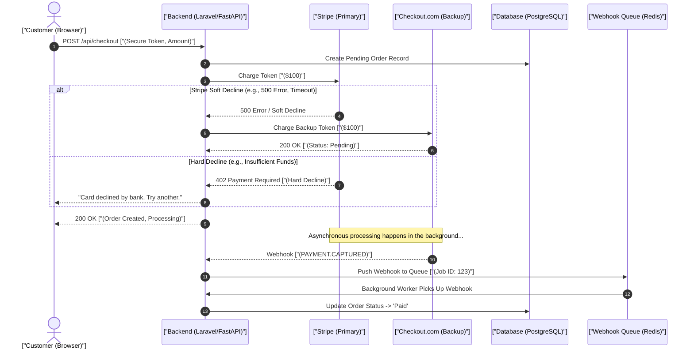

# Staff/Senior Domain Architecture Interview Blueprint

> **Module:** Interview Practice (Topic 6.2)  
> **Target:** Real-World Production & High-Volume Financial System Design

---

## 🎯 Production System Scenarios Covered

This guide covers real-world architectural design patterns derived from high-volume production environments:
- **Configurable Fraud Engines:** IP, Card, Velocity, BIN/ASN validation & Risk scoring under 50ms.
- **Payment Gateway Integrations:** Checkout.com, Stripe, Multi-Gateway Failovers & Webhook Synchronization.
- **OLAP Analytics Engines:** ClickHouse analytics, synchronization patterns, and high-performance querying.
- **Infrastructure & Production Environments:** Docker, Traefik, application layer optimization, and edge protection.

---

## 🛂 1. Analogy: The Border Checkpoint & Passport Control

Understanding payment architectures can be daunting. Let's ground it in a real-world analogy: an international airport Border Checkpoint.

* **Fraud Engine (Passport Scanner):** Before a passenger (the transaction) enters the country (your merchant account), their passport is scanned. The scanner checks interpol databases (BIN/ASN blacklists) and evaluates if they've visited high-risk countries recently (Velocity/IP scoring). This must happen in milliseconds; otherwise, the entire line stops.
* **Payment Gateway Router (Customs Agent Routing):** If one passport control line (Stripe) is broken or declining too many people unnecessarily, the director routes passengers to a backup line (Checkout.com, then Braintree) to keep the flow moving without causing a massive bottleneck.
* **Webhooks (Baggage Claim Notifications):** After the passenger passes through, their checked baggage might arrive later. A text message (webhook) is sent to the passenger saying "Your bag has cleared customs" (`PAYMENT.CAPTURED`). Sometimes the bag arrives before the passenger passes customs, so the text message needs to be held in a queue (Deferred Webhook Pattern).
* **Analytics Engine (Airport Operations Center):** The airport doesn't ask every passport control agent for their daily stats one by one (MySQL row-based). Instead, they look at a giant digital dashboard that logs every single scan as a simple tick mark (ClickHouse column-based), instantly calculating total passengers processed per hour with vector mathematics.

---

## 💳 2. Payment Gateway Routing & Failovers

High-volume merchants cannot rely on a single payment processor. If Stripe goes down or aggressively declines cards, revenue halts entirely. We implement a multi-gateway routing system to ensure high availability and maximize conversion rates.

### Detailed Flow of a Multi-Gateway Processor

1. **Tokenization:** The frontend tokenizes the card directly with a primary gateway or an independent PCI-compliant vault. This keeps your servers out of PCI-DSS scope.
2. **Primary Gateway Attempt:** The backend attempts the charge on the primary gateway (e.g., Stripe) using the secure token.
3. **Evaluating Declines (Soft vs. Hard):**
   * **Hard Decline:** The customer's bank returns "Stolen Card", "Lost Card", or "Insufficient Funds". Retrying on another gateway will also fail and can incur processing penalties. We halt the operation and inform the user.
   * **Soft Decline:** The gateway itself errors out (HTTP 500), times out, or the acquiring bank has a temporary network issue ("Processor Declined", "Do Not Honor").
4. **Failover Execution:** If a soft decline occurs, our system catches the exception, logs the failure, and routes the charge to the backup gateway (e.g., Checkout.com, then Braintree).
5. **Webhook Asynchronous Fulfillment:** The gateway processes the payment and fires an async webhook. The backend verifies the cryptographic signature, enforces idempotency, and fulfills the order.

### Mermaid Diagram: Checkout Flow to Webhook



---

## 💻 3. Annotated Code: Multi-Gateway Failover Router

Below is a highly annotated implementation of a resilient multi-gateway payment router written in PHP 8.2+. It demonstrates the try/catch logic required to handle failovers smoothly without exposing complexity to the core application controllers.

```php
<?php

declare(strict_types=1);

namespace App\Services\Payment;

use Exception;
use Illuminate\Support\Facades\Log;

/**
 * Interface ensuring all Gateway implementations share the same contract.
 * Polymorphism allows the router to process Stripe or Checkout identically.
 */
interface PaymentGatewayInterface
{
    /**
     * @param string $token The vaulted card token.
     * @param int $amountCents The charge amount in cents to avoid floating point errors.
     * @param string $currency The 3-letter currency code (e.g., 'USD').
     * @return array Standardized response containing transaction ID and status.
     */
    public function charge(string $token, int $amountCents, string $currency): array;
    
    /**
     * @return string The human-readable name of the gateway (e.g., 'stripe').
     */
    public function getName(): string;
}

/**
 * Custom Exception for Soft Declines (network errors, gateway timeouts).
 * Tells the router: "It's safe to retry on another gateway."
 */
class SoftDeclineException extends Exception {}

/**
 * Custom Exception for Hard Declines (stolen card, insufficient funds).
 * Tells the router: "Stop! Do not retry this anywhere."
 */
class HardDeclineException extends Exception {}

/**
 * The core Payment Router that handles failover cascades.
 */
class PaymentRouter
{
    /**
     * Constructor Injection of the available gateways.
     * 
     * @param PaymentGatewayInterface[] $gateways Ordered array: [Stripe, Checkout, Braintree]
     */
    public function __construct(
        private readonly array $gateways
    ) {}

    /**
     * Executes a charge with automatic failover logic.
     * 
     * @throws HardDeclineException When bank explicitly rejects the card.
     * @throws Exception When all gateways fail (soft declines).
     */
    public function executeCharge(string $token, int $amountCents, string $currency): array
    {
        $lastException = null;

        // Iterate through the prioritized list of gateways
        foreach ($this->gateways as $gateway) {
            try {
                // Attempt to process the charge on the current iteration's gateway
                Log::info(sprintf('Attempting charge with gateway: %s', $gateway->getName()));
                
                // Execute the charge API call
                $response = $gateway->charge($token, $amountCents, $currency);
                
                // If we reach this line, the charge succeeded without throwing an exception! 
                Log::info(sprintf('Charge successful with %s', $gateway->getName()));
                
                // Return immediately, bypassing remaining backup gateways in the array
                return [
                    'status' => 'success',
                    'gateway_used' => $gateway->getName(),
                    'transaction_id' => $response['transaction_id']
                ];
                
            } catch (HardDeclineException $e) {
                // 🛑 Hard Decline: The user has no money, card is stolen, or blocked.
                // We MUST halt the failover pipeline immediately to avoid penalties and looping.
                Log::warning('Hard decline encountered. Halting failover.', [
                    'gateway' => $gateway->getName(),
                    'reason' => $e->getMessage()
                ]);
                
                // Bubble the exception up to the controller to inform the user
                throw $e;
                
            } catch (SoftDeclineException $e) {
                // ⚠️ Soft Decline: The gateway is having issues, or bank rejected the processor.
                // We store the exception and loop to the NEXT gateway in the array.
                Log::warning('Soft decline encountered. Failing over...', [
                    'failed_gateway' => $gateway->getName(),
                    'reason' => $e->getMessage()
                ]);
                $lastException = $e;
                continue; // Move to the next gateway
                
            } catch (Exception $e) {
                // ❌ Unknown Error: System crash, syntax error in gateway package, etc.
                // Treat as a soft decline and attempt failover to preserve the sale.
                Log::error('Unknown payment error.', ['exception' => $e->getMessage()]);
                $lastException = $e;
                continue; // Move to the next gateway
            }
        }

        // If the foreach loop finishes without returning, EVERY gateway failed.
        // This is a critical infrastructure issue.
        Log::critical('All payment gateways failed to process the transaction.');
        throw new Exception('Payment processing unavailable at this time.', 0, $lastException);
    }
}
```

---

## 📊 4. ClickHouse Real-Time Synchronization Deep-Dive

ClickHouse is an extremely fast Column-Oriented database (OLAP), optimized for reading massive amounts of data in parallel. However, it fundamentally differs from MySQL/PostgreSQL (OLTP). Traditional `UPDATE` and `DELETE` commands are highly inefficient in ClickHouse due to its immutable data part structure. Instead, we use specialized `MergeTree` engines to handle data mutations coming from our primary database via Change Data Capture (CDC).

### `ReplacingMergeTree` (Handling Updates)

* **Mechanic:** ClickHouse tables append rows instantly on disk. To simulate an `UPDATE`, you insert a completely new row with the exact same primary key, but a higher version number (like an `updated_at` timestamp or an incrementing `version` integer column).
* **The Background Magic:** ClickHouse periodically runs asynchronous "Merge" operations. When it finds two rows with the same primary key, it silently discards the older row and keeps only the row with the highest version number.
* **Query Time Considerations:** Because background merges happen randomly, querying `SELECT * FROM table` might return duplicate old rows. You must use `SELECT * FROM table FINAL` to force ClickHouse to resolve the versions during the query, ensuring accurate data at the cost of a slight performance hit.

### `CollapsingMergeTree` (Handling Deletes)

* **Mechanic:** This engine uses a special "Sign Column" (often named `sign` which is an `Int8`).
* **Insertion:** When you `INSERT` a record initially, you set `sign = 1`.
* **Deletion:** To `DELETE` that record, you don't run a SQL `DELETE` statement. Instead, you insert an identical copy of the row, but with `sign = -1`.
* **The Background Magic:** During a background Merge, ClickHouse locates the `1` and `-1` pair. It sees they perfectly cancel each other out, and physically deletes both rows from the disk entirely.
* **Instant Aggregation:** Even before the physical merge happens, queries can handle the data correctly simply by multiplying by the sign: `SUM(amount * sign)`. The deleted rows inherently subtract themselves from the total instantly!

---

## 🎤 5. Additional Interview Questions (Q9-Q12)

### Q9: How do you handle customer refunds and reverse ledger entries safely?
> **Elevator Pitch (3 points):**
> 1. **Append-Only Ledgers:** I treat financial tables as an immutable double-entry ledger. A refund is recorded as a new appended row with a negative amount, never as a destructive `UPDATE` to the original transaction.
> 2. **Idempotency Keys:** I generate a unique `refund_id` (UUID) and pass it in the gateway header. If the network drops and the system retries, the gateway recognizes the ID and ensures the user isn't refunded twice.
> 3. **State Machine Drive:** Refunds move through strict states (`PENDING` ➔ `PROCESSING` ➔ `SETTLED`), strictly driven by async webhooks to guarantee the UI reflects the true state of the money.

### Q10: How do you handle chargeback/dispute webhooks and suspend user accounts?
> **Elevator Pitch (3 points):**
> 1. **Deferred Webhook Ingestion:** I capture the `DISPUTE.CREATED` webhook, store it in a delayed queue to ensure the transaction row already exists, and immediately return `200 OK` to the provider to prevent retry storms.
> 2. **Automated Risk Mitigation:** A background worker picks up the job, automatically flags the user's account status as `SUSPENDED` to prevent further abuse, and deducts the disputed amount plus gateway fees from their internal ledger.
> 3. **Evidence API Sync:** The system triggers an API call compiling basic evidence (IP logs, delivery receipts, terms of service acceptance) and submits it back to the gateway's Dispute API to attempt an automated resolution win.

### Q11: How do you scale analytical dashboards when merchants request 30-day stats on millions of transactions?
> **Elevator Pitch (3 points):**
> 1. **Offload to OLAP:** Querying wide date ranges on PostgreSQL causes massive disk I/O bottlenecks. I stream the data into ClickHouse via Kafka/Debezium (CDC) for column-oriented vector processing speed.
> 2. **Materialized Views:** For common queries (like "Daily Revenue by Source"), I utilize ClickHouse Materialized Views as aggregating triggers, pre-calculating the sums at ingestion time instead of read time.
> 3. **Redis Caching Layer:** I place a Redis cache with a 5-minute TTL in front of the dashboard API endpoint. Millions of reads hit RAM instantly, sparing the OLAP database entirely for repeated dashboard loads.

### Q12: How do you configure Traefik/Nginx rate limiting to protect payment APIs from brute-force botnets?
> **Elevator Pitch (3 points):**
> 1. **Multi-Tiered Limits:** I configure a very tight limit on the specific `/api/checkout` endpoint (e.g., 5 requests/min per IP) to stop automated card-testing attacks, while leaving generic read API limits looser.
> 2. **Distributed Redis Limiter:** Inside the application layer, I implement a distributed sliding-window rate limiter, tracking attempts by both IP address and User Account ID, as botnets frequently cycle IPs to evade basic limits.
> 3. **Edge Protection (WAF):** I push protection to the edge using Cloudflare WAF, utilizing custom rules to block known Tor exit nodes, anomalous ASNs, and enforcing CAPTCHA challenges before requests even reach our Traefik proxies.
