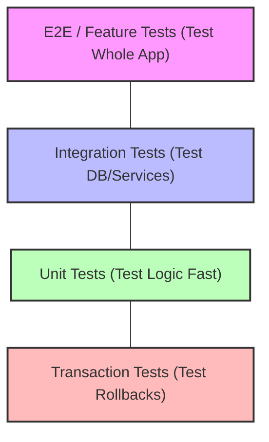

# Testing Financial Systems: Bulletproofing Your Backend

## 1. The Real-World Analogy: Factory Quality Control
Imagine a factory that builds high-performance cars. 
- **Unit Tests**: Inspecting a single screw or spark plug to ensure it meets exact specifications.
- **Integration Tests**: Assembling the engine and transmission, then checking if they turn together smoothly.
- **Feature/E2E Tests**: A test driver taking the fully assembled car onto a track to see how it handles corners and braking.
- **Database / Transaction Tests**: The crash test dummy. Proving that if the system crashes, safety mechanisms (rollbacks) activate perfectly.

In financial systems, you can't afford a single missing screw. We rely heavily on rigid testing to prevent catastrophic money loss.

## 2. The Test Pyramid Workflow



## 3. Test Types in Laravel

When dealing with finances, Database testing is crucial. Laravel provides `RefreshDatabase` to ensure a clean slate.

```php
<?php

namespace Tests\Feature;

use Illuminate\Foundation\Testing\RefreshDatabase;
use Tests\TestCase;
use App\Models\User;

class PaymentTest extends TestCase
{
    // RefreshDatabase resets the database after each test to prevent data leaks
    use RefreshDatabase;

    public function test_payment_creates_transaction(): void
    {
        // 1. Arrange: Setup user and initial state with $10.00
        $user = User::factory()->create(['balance' => 1000]); 
        
        // 2. Act: Perform the payment action of $5.00
        $response = $this->actingAs($user)->postJson('/api/pay', [
            'amount' => 500 
        ]);

        // 3. Assert: Check the response and database state
        $response->assertStatus(200);
        $this->assertDatabaseHas('transactions', [
            'user_id' => $user->id,
            'amount' => 500,
            'status' => 'completed'
        ]);
    }
}
```

## 4. Testing Financial Edge Cases

Financial systems must handle failures gracefully. Here are critical edge cases:

### A. Currency Rounding (The Floating Point Trap)
Always use integers (cents) for money. Never floats!

```php
    public function test_currency_rounding_is_exact(): void
    {
        // Bad: 0.1 + 0.2 = 0.30000000000000004
        // Good: 10 + 20 = 30 cents
        $cartTotal = 1005; // $10.05
        $taxRate = 0.075; // 7.5%
        
        // Calculate tax and cast to int to drop decimals safely
        $tax = (int) round($cartTotal * $taxRate);
        
        // Assert exactly 75 cents tax
        $this->assertEquals(75, $tax); 
    }
```

### B. Concurrent Update / Race Condition
Two requests try to spend the same balance at the exact same millisecond.

```php
    public function test_prevents_race_conditions_on_balance(): void
    {
        // Create user with 100 cents
        $user = User::factory()->create(['balance' => 100]);
        
        // In Laravel, we test the lock mechanism directly using a transaction
        \DB::transaction(function () use ($user) {
            // Lock the row for update (SELECT ... FOR UPDATE)
            $lockedUser = User::where('id', $user->id)->lockForUpdate()->first();
            
            // Deduct balance securely
            $lockedUser->balance -= 100;
            $lockedUser->save();
        });
        
        // Assert balance didn't go below zero
        $this->assertEquals(0, $user->fresh()->balance);
    }
```

### C. Failed Transaction Rollback
If step 2 fails, step 1 must be undone.

```php
    public function test_rolls_back_on_failure(): void
    {
        // Start with 500 cents
        $user = User::factory()->create(['balance' => 500]);
        
        try {
            \DB::transaction(function () use ($user) {
                // Step 1: Deduct balance
                $user->decrement('balance', 500);
                
                // Step 2: Simulate an error before order completes
                throw new \Exception("External API Down");
            });
        } catch (\Exception $e) {
            // Catch the expected exception so the test doesn't fail
        }
        
        // Assert the balance was restored because the transaction rolled back
        $this->assertEquals(500, $user->fresh()->balance);
    }
```

### D. Duplicate Webhook Handling
Payment gateways often retry webhooks. Your system must be idempotent.

```php
    public function test_ignores_duplicate_webhooks(): void
    {
        // Mock a standard webhook payload
        $payload = ['event' => 'payment.success', 'id' => 'evt_123'];
        
        // First webhook call: should process successfully
        $this->postJson('/api/webhooks/stripe', $payload)->assertStatus(200);
        
        // Second webhook call with same ID: should return 200 but not duplicate logic
        $this->postJson('/api/webhooks/stripe', $payload)->assertStatus(200);
        
        // Assert only ONE transaction was created in the database
        $this->assertDatabaseCount('transactions', 1);
    }
```

### E. Timeout & Retry Logic
Testing if the system correctly retries a flaky external service.

```php
    public function test_retries_on_timeout(): void
    {
        // Fake the HTTP facade to fail twice, then succeed
        \Illuminate\Support\Facades\Http::fakeSequence()
            ->pushStatus(504) // First try times out
            ->pushStatus(504) // Second try times out
            ->pushStatus(200); // Third try succeeds
            
        // Call the service that is configured to retry 3 times
        $response = (new PaymentService())->charge(100);
        
        // Assert the final result was a success
        $this->assertTrue($response);
    }
```

### F. Mid-Month Plan Change Proration
Testing complex logic like upgrading a plan halfway through the month.

```php
    public function test_calculates_proration_correctly(): void
    {
        // User on a $30/month plan (100 cents/day)
        // Upgrades to a $60/month plan (200 cents/day) on day 15
        $daysRemaining = 15;
        
        // Unused time on old plan = $15 credit
        $credit = $daysRemaining * 100;
        
        // Cost of new plan for remaining days = $30
        $newCost = $daysRemaining * 200;
        
        // Net amount owed today = $15
        $amountToCharge = $newCost - $credit;
        
        // Assert exact math
        $this->assertEquals(1500, $amountToCharge);
    }
```

## 5. Test Design Patterns

### Mocking External Services
Don't hit real Stripe/PayPal APIs in tests. Use Laravel's HTTP Fake.

```php
    public function test_stripe_payment_success(): void
    {
        // Fake all outbound HTTP requests to Stripe
        \Illuminate\Support\Facades\Http::fake([
            'api.stripe.com/*' => \Illuminate\Support\Facades\Http::response(['status' => 'succeeded'], 200)
        ]);
        
        // Perform local action that triggers the external API
        $response = $this->postJson('/api/checkout', ['amount' => 1000]);
        
        // Assert the HTTP client actually made a request to Stripe
        \Illuminate\Support\Facades\Http::assertSent(function ($request) {
            return str_contains($request->url(), 'api.stripe.com');
        });
    }
```

### Mock vs Stub vs Fake
- **Stub**: Hardcoded dummy answer ("Always return true").
- **Mock**: Verifies behavior ("Assert this method was called 3 times").
- **Fake**: Working implementation, but simplified (like Laravel's in-memory `Queue::fake()`).

### Happy Path vs Failure Path
- **Happy Path**: Testing when everything goes right (valid card, enough funds).
- **Failure Path**: Testing boundary conditions (card declined, negative amount, network timeout). Financial systems need more failure path tests than happy path tests.

### What NOT to Mock
- **The Database**: Use a real test database (SQLite or Postgres). Mocking the DB hides query errors.
- **Your own business logic**: Test the actual code, don't mock the class you are trying to test.

## 6. Interview Tips & Elevator Pitches

**Q1: How do you prevent users from spending money they don't have if they send two requests at the exact same time?**
- "I use pessimistic locking in the database with `SELECT ... FOR UPDATE`."
- "This locks the user's balance row during the transaction."
- "The second request waits until the first finishes, preventing race conditions."

**Q2: How do you handle external API failures during a complex financial operation?**
- "I wrap the entire local operation in a database transaction."
- "If the external API fails or times out, an exception is thrown."
- "The transaction automatically rolls back, ensuring no partial data (like a deducted balance without an order) is saved."

**Q3: Why shouldn't you use floating-point numbers for currency?**
- "Floating-point math in computers is imprecise due to base-2 binary conversion."
- "This leads to rounding errors like `0.1 + 0.2 = 0.30000000000000004`."
- "Instead, I store all financial values as integers representing the smallest unit, like cents."

**Q4: How do you test third-party webhooks without exposing your dev environment?**
- "In automated tests, I use HTTP Fakes to simulate the incoming payload."
- "For manual testing, I use tools like Stripe CLI or ngrok to tunnel requests."
- "Most importantly, I write tests to ensure idempotency so duplicate webhooks don't create double charges."
