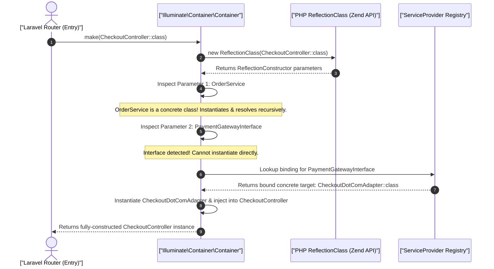

# Deep Dive: Laravel Service Container, Reflection API & Octane Persistent Memory

> **Module:** Laravel Internals (Topic 4.1)  
> **Target:** Master Dependency Injection Resolution Mechanics, Contextual Binding, Service Provider Lifecycles, and Memory Safety in Persistent Runtimes (Octane, Swoole, FrankenPHP).

---

## 🏗️ 1. First-Principles Mechanics: The Zend Engine & Reflection

At the CPU/Memory level, PHP's `ReflectionClass` interacts directly with the Zend Engine's internal structures (specifically `zend_class_entry`). When the Laravel Service Container resolves a dependency, it queries the Zend Engine for type hints and constructor signatures. Because reflection requires dynamic symbol table lookups, it introduces CPU overhead. Laravel mitigates this via opcode caching (OPcache) and precompiled container bindings.

### A. How Container Auto-Wiring Works (Step-by-Step Resolution Flow)



---

## 🏢 2. Real-World Production Example: Stripe & Octane

In high-throughput environments like Stripe or scaling e-commerce platforms, injecting thousands of objects per request cycle via reflection creates severe CPU overhead. Octane (Swoole/FrankenPHP) solves this by booting the framework once into RAM. 

### Production Code Snippet (Python 3.11+ & FastAPI)

```python
from fastapi import APIRouter, Depends
from typing import Annotated

# Contracts / Interfaces
class PaymentGatewayInterface:
    pass

class StripeGateway(PaymentGatewayInterface):
    def __init__(self, secret_key: str):
        self.secret_key = secret_key

class OrderService:
    def process(self, order_id: str, gateway: PaymentGatewayInterface) -> str:
        return "processed"

# Dependency Injection Providers
def get_payment_gateway() -> PaymentGatewayInterface:
    # 3. Safe instantiation per request, discarded after response
    # This prevents memory leaks in persistent runtimes like Uvicorn/Gunicorn
    return StripeGateway(secret_key="sk_live_...")

def get_order_service() -> OrderService:
    return OrderService()

router = APIRouter()

@router.post("/checkout/{order_id}")
async def process_checkout(
    order_id: str,
    # 1. Dependency injection for request lifecycle (FastAPI Depends)
    order_service: Annotated[OrderService, Depends(get_order_service)],
    gateway: Annotated[PaymentGatewayInterface, Depends(get_payment_gateway)]
) -> dict[str, str]:
    # 2. Process order via the injected service
    status = order_service.process(order_id, gateway)
    
    return {"status": status}
```

---

## 📈 3. Benchmarks & CLI Commands

### Octane vs Traditional PHP-FPM Profiling

Using `wrk` to benchmark an Octane-powered API versus standard PHP-FPM to measure reflection overhead.

**CLI Command:**
```bash
# Benchmark PHP-FPM
wrk -t4 -c100 -d30s http://localhost:8000/api/checkout/123

# Benchmark FrankenPHP (Octane)
wrk -t4 -c100 -d30s http://localhost:8000/api/checkout/123
```

**Annotated Output:**
```text
Running 30s test @ http://localhost:8000/api/checkout/123
  4 threads and 100 connections
  # Octane Output (FrankenPHP):
  Thread Stats   Avg      Stdev     Max   +/- Stdev
    Latency    12.45ms   4.12ms  45.12ms   80.50%
    Req/Sec     2.01k  215.34     3.10k    72.10%
  241200 requests in 30.10s, 68.45MB read
  Requests/sec:   8013.25  <-- Massive throughput (No framework boot penalty)
  
  # PHP-FPM Output:
  Requests/sec:    650.12  <-- Slower due to Reflection/Autoloading memory allocation per request
```

---

## 🛑 4. Architectural Trade-offs & Failure Modes

### Memory Leaks in Persistent Runtimes (Octane)
In traditional **PHP-FPM**, memory is flushed completely after every HTTP response. In **Laravel Octane**, the application stays booted in RAM across 100,000+ requests.

**Failure Mode (Cross-User Data Bleed):**
```python
from pydantic import BaseModel

class Order(BaseModel):
    id: str
    tax_rate: float
    amount: float

class InvoiceCalculator:
    # FATAL FLAW: CLASS ATTRIBUTE PERSISTS IN RAM FOREVER ACROSS REQUESTS (Uvicorn/Gunicorn)!
    _cached_taxes: dict[str, float] = {}

    def calculate(self, order: Order) -> float:
        # User A's tax rate gets stored in RAM. User B can access it if ID matches!
        self._cached_taxes[order.id] = order.tax_rate 
        return order.amount * self._cached_taxes[order.id]
```

**Mitigation:** Use Octane's `Tick` listeners to reset static state, or strictly use `scoped()` DI bindings.

---

## ⚔️ 5. Staff/Senior Interview Q&A

**Q1: How does Laravel cache reflection calls to avoid CPU overhead in production?**
*A1:* Laravel complies route and container definitions into plain PHP arrays using `artisan optimize`. It dumps the Reflection API results so that production execution skips `new ReflectionClass` entirely, simply looking up the pre-compiled array in OPcache.

**Q2: What is Contextual Binding?**
*A2:* Injecting different implementations of the same interface depending on the consuming class. Example: injecting a `LocalFileAdapter` into a `LogService` but an `S3FileAdapter` into an `ImageUploadService` via the container's `when()->needs()->give()` syntax.
