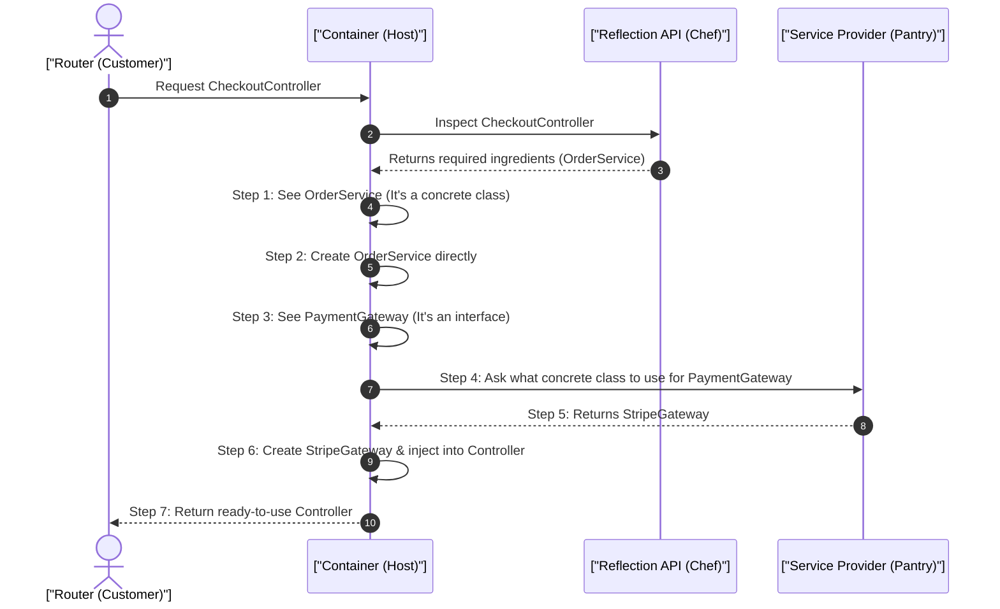

# 1. Analogy First: The Restaurant Host and the Master Chef

Imagine a high-end restaurant:
- **Service Container (The Host):** Knows who ordered what and brings the final dish to the table.
- **Reflection API (The Master Chef):** Reads a new, complex recipe (a Class), inspects every single ingredient required (Dependencies), and figures out how to put them together.

In traditional PHP, the restaurant shuts down, fires the chef, and turns off the ovens after *every single customer* (HTTP Request).
In **Laravel Octane (or persistent runtimes)**, the restaurant stays open 24/7. The chef is already hired, and the kitchen is hot and ready, making serving the next customer lightning fast!

## 2. Step-by-Step Flow: How Auto-Wiring Works

Here is the sequence of events when Laravel creates an object for you:



## 3. Annotated Python Code: Persistent Memory

Here is how Dependency Injection looks in a persistent Python runtime (FastAPI), acting similar to Octane. We have to be careful with memory!

```python
from fastapi import APIRouter, Depends
from typing import Annotated

# 1. Define an Interface (Contract) for payment gateways
class PaymentGatewayInterface:
    pass

# 2. Define the concrete implementation
class StripeGateway(PaymentGatewayInterface):
    def __init__(self, secret_key: str):
        # 3. Store the key for later use
        self.secret_key = secret_key

class OrderService:
    def process(self, order_id: str, gateway: PaymentGatewayInterface) -> str:
        # 4. Process the order using the injected gateway
        return "processed"

# 5. Dependency Provider: creates a fresh instance per request
def get_payment_gateway() -> PaymentGatewayInterface:
    # 6. We do this per-request to avoid sharing state between users (Memory Safety!)
    return StripeGateway(secret_key="sk_live_...")

def get_order_service() -> OrderService:
    # 7. Provide the OrderService
    return OrderService()

router = APIRouter()

@router.post("/checkout/{order_id}")
async def process_checkout(
    order_id: str,
    # 8. Inject dependencies via FastAPI's DI system
    order_service: Annotated[OrderService, Depends(get_order_service)],
    gateway: Annotated[PaymentGatewayInterface, Depends(get_payment_gateway)]
) -> dict[str, str]:
    # 9. Execute business logic with fully wired dependencies
    status = order_service.process(order_id, gateway)
    
    # 10. Return response. Objects are cleaned up after this by Garbage Collection.
    return {"status": status}
```

## 4. Architectural Trade-offs & Failure Modes

**The Persistent RAM Trap (Memory Leaks):**
Since Octane keeps your app loaded in RAM, static or class-level variables stay there forever. 
- *Bad:* Storing user data in a static variable. User A's data will bleed into User B's request!
- *Good:* Always use request-scoped variables or let the DI container spawn fresh objects per request.

## 5. Interview Tips: 3-Point Elevator Pitches

**Q: How does Laravel avoid the CPU cost of Reflection in production?**
1. **Compilation:** Laravel compiles route and container definitions into plain, flat arrays.
2. **Caching:** It dumps this compiled file (`artisan optimize`) to disk.
3. **Execution:** In production, it reads the cached array from OPcache, skipping the heavy Reflection API entirely.

**Q: What is Contextual Binding?**
1. **Definition:** Giving different implementations of the same interface based on who is asking.
2. **Example:** Injecting a `LocalFileAdapter` for a `LogService`, but an `S3FileAdapter` for an `ImageUploadService`.
3. **Impact:** Highly flexible, reusable code without changing the core business logic.
