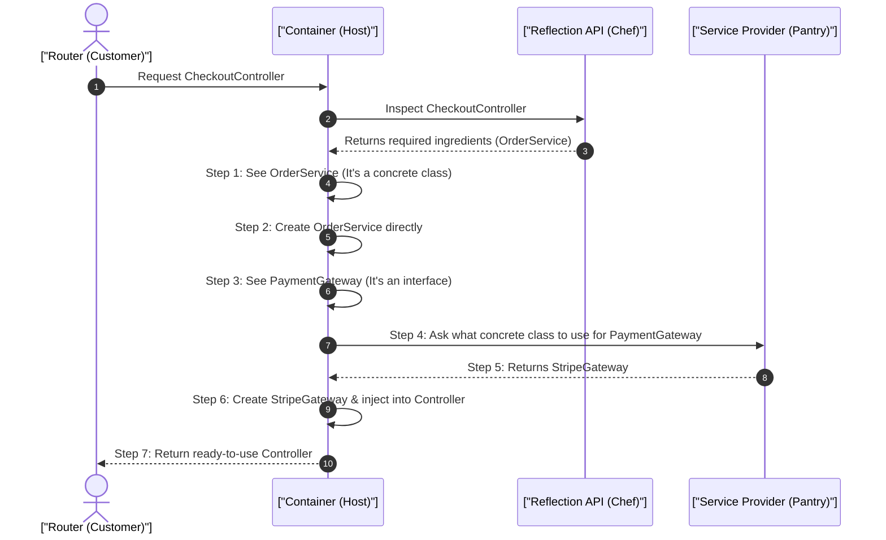

# 1. Analogy First: The Restaurant Host and the Master Chef

Imagine a high-end restaurant:
- **Service Container (The Host):** Knows who ordered what and brings the final dish to the table.
- **Reflection API (The Master Chef):** Reads a new, complex recipe (a Class), inspects every single ingredient required (Dependencies), and figures out how to put them together.

In traditional PHP, the restaurant shuts down, fires the chef, and turns off the ovens after *every single customer* (HTTP Request).
In **Laravel Octane (or persistent runtimes)**, the restaurant stays open 24/7. The chef is already hired, and the kitchen is hot and ready, making serving the next customer lightning fast!

## 2. Step-by-Step Flow: How Auto-Wiring Works

Here is the sequence of events when Laravel creates an object for you:



## 3. Annotated Laravel Code: Auto-Wiring & Octane Safety

Here is how Dependency Injection and auto-wiring work in Laravel. In persistent runtimes like Laravel Octane, we use scoped bindings to stay memory-safe!

```php
<?php

namespace App\Services;

use App\Contracts\PaymentGatewayInterface;
use App\Models\Order;
use Illuminate\Http\JsonResponse;
use Illuminate\Support\ServiceProvider;

// 1. Define an Interface (Contract) for payment gateways
interface PaymentGatewayInterface
{
    public function charge(int $amount): string;
}

// 2. Define the concrete implementation
class StripeGateway implements PaymentGatewayInterface
{
    // 3. Store the API secret key via constructor promotion
    public function __construct(
        private readonly string $secretKey
    ) {}

    public function charge(int $amount): string
    {
        // Return transaction confirmation
        return "charged_{$amount}_via_stripe";
    }
}

// 4. Service that depends on the interface contract
class OrderService
{
    public function __construct(
        private readonly PaymentGatewayInterface $gateway
    ) {}

    public function process(string $orderId, int $amount): string
    {
        // 5. Delegate payment processing to the injected gateway
        return $this->gateway->charge($amount);
    }
}

// 6. Controller: Laravel auto-wires OrderService into the constructor via Reflection
class CheckoutController
{
    public function __construct(
        private readonly OrderService $orderService
    ) {}

    public function processCheckout(string $orderId): JsonResponse
    {
        // 7. Execute business logic with fully resolved dependencies
        $status = $this->orderService->process($orderId, 4999);

        // 8. Return response (cleaned up per request cycle)
        return response()->json(['status' => $status]);
    }
}

// 9. Service Provider: Register bindings into the Laravel Service Container
class AppServiceProvider extends ServiceProvider
{
    public function register(): void
    {
        // 10. Bind interface to concrete implementation.
        // For Laravel Octane: use scoped() instead of singleton() to reset state between requests!
        $this->app->scoped(PaymentGatewayInterface::class, function ($app) {
            return new StripeGateway(config('services.stripe.secret'));
        });
    }
}
```

## 4. Architectural Trade-offs & Failure Modes

**The Persistent RAM Trap (Memory Leaks):**
Since Octane keeps your app loaded in RAM, static or class-level variables stay there forever. 
- *Bad:* Storing user data in a static variable. User A's data will bleed into User B's request!
- *Good:* Always use request-scoped variables or let the DI container spawn fresh objects per request.

## 5. Interview Tips: 3-Point Elevator Pitches

**Q: How does Laravel avoid the CPU cost of Reflection in production?**
1. **Compilation:** Laravel compiles route and container definitions into plain, flat arrays.
2. **Caching:** It dumps this compiled file (`artisan optimize`) to disk.
3. **Execution:** In production, it reads the cached array from OPcache, skipping the heavy Reflection API entirely.

**Q: What is Contextual Binding?**
1. **Definition:** Giving different implementations of the same interface based on who is asking.
2. **Example:** Injecting a `LocalFileAdapter` for a `LogService`, but an `S3FileAdapter` for an `ImageUploadService`.
3. **Impact:** Highly flexible, reusable code without changing the core business logic.
