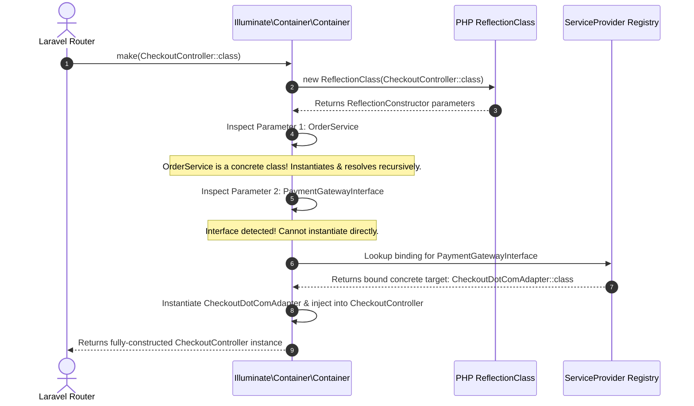

# Deep Dive: Laravel Service Container, Reflection API & Octane Persistent Memory

> **Module:** Laravel Internals (Topic 4.1)  
> **Target:** Master Dependency Injection Resolution Mechanics, Contextual Binding, Service Provider Lifecycles, and Memory Safety in Persistent Runtimes (Octane, Swoole, FrankenPHP).

---

## 🏗️ 1. Service Container Resolution Under the Hood

The **Service Container (`Illuminate\Container\Container`)** is the heart of Laravel. It acts as an advanced **Inversion of Control (IoC)** container that resolves class dependencies automatically using **PHP's Reflection API**.

### A. How Container Auto-Wiring Works (Step-by-Step Resolution Flow)

When a HTTP request invokes a Controller action:

```php
namespace App\Http\Controllers;

use App\Contracts\PaymentGatewayInterface;
use App\Services\OrderService;

class CheckoutController extends Controller
{
    public function __construct(
        protected OrderService $orderService,
        protected PaymentGatewayInterface $gateway
    ) {}
}
```



---

## 💻 2. Under the Hood: Pure PHP Implementation of a Container

To understand how Laravel does this without magic, here is a pure PHP reproduction of Laravel's container resolution using `ReflectionClass`:

```php
namespace App\Core;

use ReflectionClass;
use Exception;

class Container 
{
    protected array $bindings = [];
    protected array $instances = [];

    // Register a binding (Interface ➔ Concrete)
    public function bind(string $abstract, $concrete = null, bool $shared = false): void 
    {
        if ($concrete === null) {
            $concrete = $abstract;
        }
        $this->bindings[$abstract] = compact('concrete', 'shared');
    }

    // Resolve class instance automatically
    public function make(string $abstract) 
    {
        // 1. Return existing Singleton instance if shared
        if (isset($this->instances[$abstract])) {
            return $this->instances[$abstract];
        }

        $concrete = $this->bindings[$abstract]['concrete'] ?? $abstract;

        // 2. Use ReflectionClass to inspect parameters
        $reflector = new ReflectionClass($concrete);

        if (!$reflector->isInstantiable()) {
            throw new Exception("Class {$concrete} is not instantiable.");
        }

        $constructor = $reflector->getConstructor();
        if ($constructor === null) {
            return new $concrete;
        }

        // 3. Recursively resolve constructor dependencies
        $dependencies = [];
        foreach ($constructor->getParameters() as $parameter) {
            $type = $parameter->getType();
            if (!$type || $type->isBuiltin()) {
                throw new Exception("Cannot resolve primitive parameter {$parameter->getName()}");
            }

            $dependencies[] = $this->make($type->getName());
        }

        $object = $reflector->newInstanceArgs($dependencies);

        // Save as singleton if binding was marked shared
        if (isset($this->bindings[$abstract]) && $this->bindings[$abstract]['shared']) {
            $this->instances[$abstract] = $object;
        }

        return $object;
    }
}
```

---

## ⚡ 3. Container Binding Scopes: `bind()`, `singleton()`, and `scoped()`

| Container Scope | Behavior Per Request | Persistent Runtime (Octane/Swoole) Behavior | Best Use Case |
| :--- | :--- | :--- | :--- |
| **`bind()`** | Creates a **NEW instance** every time `make()` is called. | Creates a **NEW instance** every time. | Short-lived transient objects, payload DTOs. |
| **`singleton()`** | Creates **1 instance** per request lifecycle. | Persists **1 instance across THOUSANDS of requests**! | Stateless services, database connection pools. |
| **`scoped()`** | Creates **1 instance** per request. | **Wipes instance at end of HTTP request**! | Request-bound state, active authenticated user context. |

```php
// AppServiceProvider.php
public function register(): void
{
    // 1. Standard transient binding
    $this->app->bind(PaymentGatewayInterface::class, StripeGateway::class);

    // 2. Application-wide Singleton (Be careful in Octane!)
    $this->app->singleton(HttpClientService::class, fn () => new HttpClientService());

    // 3. Octane-Safe Scoped Binding (Refreshes per request)
    $this->app->scoped(UserContext::class, fn () => new UserContext());
}
```

---

## 🛑 4. Persistent Memory Pitfalls in Laravel Octane (FrankenPHP & Swoole)

In traditional **PHP-FPM**, memory is flushed completely after every HTTP response. In **Laravel Octane**, the application stays booted in RAM across 100,000+ requests.

### 🔴 Case Study 1: Static Array Memory Leak & Cross-User Data Bleed

```php
// DANGEROUS CODE IN OCTANE:
class InvoiceCalculator 
{
    // STATIC PROPERTY PERSISTS IN RAM FOREVER ACROSS REQUESTS!
    protected static array $cachedTaxes = [];

    public function calculate(Order $order): float 
    {
        // User A's tax rate gets stored in RAM
        self::$cachedTaxes[$order->id] = $order->tax_rate; 
        
        return $order->amount * self::$cachedTaxes[$order->id];
    }
}
```
- **Consequence:** `self::$cachedTaxes` grows infinitely, leading to **Out Of Memory (OOM) crashes**. If modified carelessly, User B can access User A's cached calculation!

### 🟢 Solution: Octane Request Listeners & Clean Reset Patterns

```php
// Octane-Safe Code: Use Scoped Services or Octane Reset Listeners
use Laravel\Octane\Events\RequestReceived;

class EventServiceProvider extends ServiceProvider 
{
    public function boot(): void 
    {
        // Reset static caches or singletons before next request arrives
        Octane::tick('task-name', function () {
            // Periodic cleanup...
        });
    }
}
```
