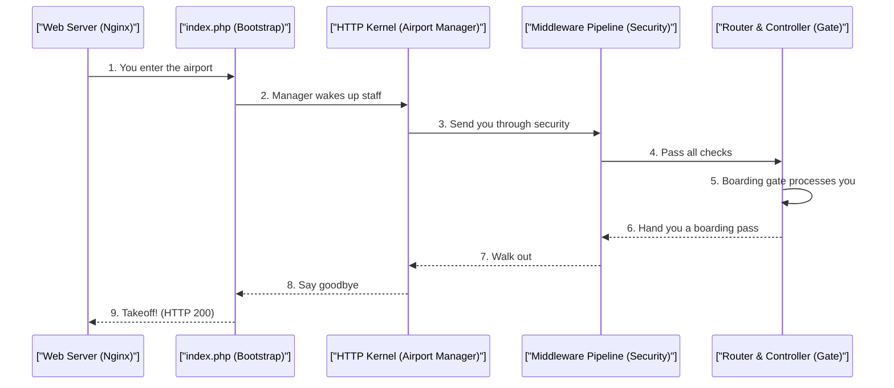

# Laravel Request Lifecycle & Middleware Pipeline (Beginner Guide)

> **Module:** Laravel Internals (Topic 4.2)

---

## ✈️ 1. The Airport Security Analogy (Conceptual Blueprint)

Imagine traveling through an airport. 

1. **The Terminal Entrance (`public/index.php`):** You walk into the airport. Everyone enters through this single door. This is where the airport (Laravel) gets ready to process you.
2. **The Security Checkpoints (Middleware Pipeline):** Before you can reach your gate (the core application logic), you must pass through multiple security checkpoints. 
   - **Ticket check:** Do you have a ticket? (Authentication)
   - **Metal detector:** Are you carrying anything dangerous? (Input validation)
   - If you fail any check, you get kicked out early! If you pass, you proceed to the next step.
3. **The Boarding Gate (Controller):** You finally reach your destination, where the actual work happens.
4. **The Departure (Response):** You get your flight! On your way out, some checkpoints might do a final check (like grabbing a duty-free bag).

---

## 🔬 2. Step-by-Step: Under-the-Hood Mechanics

Here is how the "airport security" works in code.

### Sequence Diagram: The Request "Onion"



---

## 💻 3. Step-by-Step Code Example

Let's look at how this pipeline is built using simple Python code!

```python
from typing import Callable, Any

# Step 1: Define what our "Gate" (Controller) does.
def controller_action(request: str) -> str:
    # This is the core application logic.
    return f"Processed {request} at the gate!"

# Step 2: Create our Pipeline (Security Checkpoints).
def build_pipeline(middlewares: list[type], core_action: Callable) -> Callable:
    # We start with the destination.
    pipeline = core_action
    
    # We wrap the destination with layers (middlewares) from the inside out.
    for middleware_class in reversed(middlewares):
        middleware_instance = middleware_class()
        
        # We define a function that runs the middleware, then passes you to the next step.
        def wrap(request: Any, next_call: Callable = pipeline, m=middleware_instance) -> Any:
            # Check the request, then hand it off to the next layer!
            return m.handle(request, next_call)
            
        pipeline = wrap
        
    return pipeline
```

---

## ⚔️ 4. The 3-Point Interview Pitch

Here are 3 common questions you might get asked in an interview!

1. **Question:** "What is the purpose of a Middleware in Laravel?"
   - **Answer:** Middleware acts as a filtering layer for HTTP requests entering your application. Like airport security, it checks incoming traffic (e.g., for authentication or logging) before it hits your core controller logic, and can also modify the response on the way out.
2. **Question:** "What happens if a middleware stops the request early?"
   - **Answer:** It short-circuits the pipeline! Instead of calling the `next` layer, the middleware directly returns an error response (like a 403 Forbidden). The inner controller is never reached.
3. **Question:** "What is a 'Terminating' middleware?"
   - **Answer:** It's a middleware that runs a `terminate()` method *after* the response has already been sent to the user's browser. It is perfect for background tasks like logging data without making the user wait.
