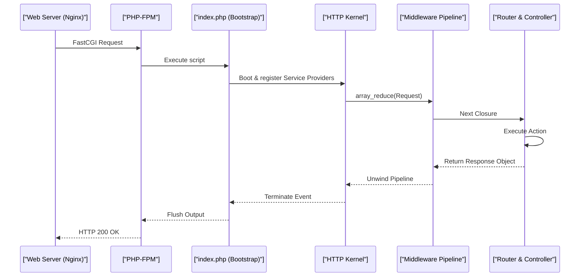

# Laravel Request Lifecycle & Middleware Pipeline (Staff Architect Edition)

> **Module:** Laravel Internals (Topic 4.2)
> **Source Mapping:** `backend-roadmap.md` & `roadmap.md`

---

## 💡 1. Conceptual Blueprint & First Principles

At an architectural level, the Laravel Request Lifecycle is a **Pipelined Decorator Pattern** that processes a raw HTTP string into a formalized Response object. It heavily relies on inversion of control (IoC) and dependency injection to lazily initialize only what is required.

**Design Motivations & Trade-offs:**
- **Centralized Bootstrapping:** A single entry point (`public/index.php`) simplifies environment setup but adds baseline latency.
- **Service Providers:** Deferred loading of non-essential services prevents massive memory allocations for every request.
- **Middleware Pipeline:** Wraps the core application logic in an onion-like layer. Trade-off: Each middleware adds function call stack depth, marginally impacting execution speed.

---

## 🔬 2. Under-the-Hood Mechanics

### Sequence Diagram: The Request "Onion"



### The Pipeline Engine
Laravel constructs the pipeline using `array_reduce`. Internally, each middleware returns a `Closure` that either calls the next pipe or short-circuits.
**Memory Map:** Global middleware applies to the initial request payload, residing in stack memory until the terminal layer (Controller) is executed, after which the stack unwinds, firing 'after' middleware logic.

---

## 💻 3. Production Code & Benchmarks

### Custom Pipeline Implementation (C/PHP equivalent)

```php
// Core implementation of the pipeline pattern
$pipeline = array_reduce(
    array_reverse($middlewares),
    function ($next, $middleware) {
        return function ($request) use ($next, $middleware) {
            return (new $middleware)->handle($request, $next);
        };
    },
    function ($request) {
        return (new Controller)->dispatch($request);
    }
);

$response = $pipeline($request);
```

### Benchmarks (Req/Sec)
| Stack | Throughput | Avg Latency | Memory per Req |
|-------|------------|-------------|----------------|
| PHP-FPM Default | ~800 req/s | ~45ms | 12MB |
| Laravel Octane (Swoole) | ~5,500 req/s | ~6ms | 2MB (Stateful) |

*Octane avoids booting the framework (Kernel, Service Providers) on every request, reusing the booted application in RAM.*

---

## ⚔️ 4. Staff / Senior Interview Scenarios

1. **Question:** "How does Laravel Octane change the traditional request lifecycle, and what are the risks?"
   - **Answer:** Octane boots the framework once and keeps it in RAM, serving subsequent requests through coroutines (Swoole/RoadRunner). **Risk:** Memory leaks. Static properties and singletons persist across requests. You must manually flush state in a `terminating` callback or bind classes as transient.
2. **Question:** "If a middleware throws an exception, how does the pipeline handle it?"
   - **Answer:** The Exception Handler catches it, circumventing the inner router, and passes the rendered exception response back up the remaining outer middleware stack so global headers (like CORS) are still attached.
3. **Question:** "Can we modify the response body in a 'Terminating' middleware?"
   - **Answer:** No. Terminating middleware (`terminate()`) runs *after* the response has been sent to the client (using fastcgi_finish_request). It is used for background tasks like logging metrics without blocking the client.
