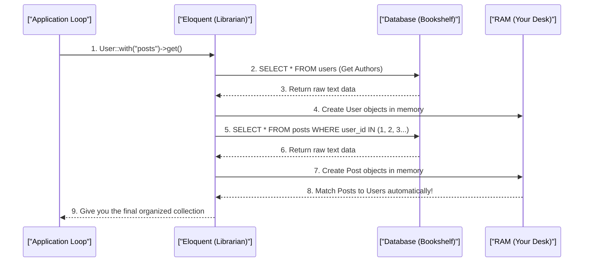

# Eloquent ORM & The N+1 Problem (Beginner Guide)

> **Module:** Laravel Internals (Topic 4.3)

---

## 📚 1. The Library Analogy (Conceptual Blueprint)

Imagine you are doing research in a huge library.

**The N+1 Problem:**
1. **The Initial Request:** You ask the librarian for a list of 10 authors. (1 query to the database).
2. **The Inefficient Loop (N):** For *each* author on your list, you walk up to the librarian and ask: "Can you go find this author's books?" You do this 10 separate times! (10 additional queries).
3. **The Result:** You made 11 total trips (1 + 10) to the librarian. This is the **N+1 Problem**. It's exhausting and slow!

**The Eager Loading Solution:**
1. **The Smart Request:** You ask the librarian: "Give me the list of 10 authors, AND please grab all of their books at the same time."
2. **The Result:** The librarian makes just 2 trips: one for the authors, and one for all the books. Much faster!

---

## 🔬 2. Step-by-Step: Under-the-Hood Mechanics

How does Laravel (Eloquent) actually solve this problem in memory?

### Sequence Diagram: The Hydration Pipeline



---

## 💻 3. Step-by-Step Code Example (Laravel / PHP 8.2+)

Here is how you detect and fix the N+1 problem in Laravel!

```php
<?php
// === Step 1: Define the Relationship in your Model ===

class User extends Model
{
    // Tell Eloquent that a User "has many" Posts.
    public function posts(): HasMany
    {
        return $this->hasMany(Post::class);
    }
}

// === Step 2: The BAD Way (N+1 Problem) ===

// 1 query: SELECT * FROM users
$users = User::all();

foreach ($users as $user) {
    // N queries: SELECT * FROM posts WHERE user_id = ?
    // Each loop iteration hits the database AGAIN! 💀
    echo $user->posts->count();
}
// Total: 1 + N queries (if 100 users = 101 queries!)

// === Step 3: The GOOD Way (Eager Loading) ===

// Query 1: SELECT * FROM users
// Query 2: SELECT * FROM posts WHERE user_id IN (1, 2, 3, ...)
$users = User::with('posts')->get();

foreach ($users as $user) {
    // No extra queries! Posts are already loaded in memory. ⚡
    echo $user->posts->count();
}
// Total: Always just 2 queries, no matter how many users!

// === Step 4: Auto-Detection (Crash on N+1 in Development) ===

// In AppServiceProvider::boot()
use Illuminate\Database\Eloquent\Model;

class AppServiceProvider extends ServiceProvider
{
    public function boot(): void
    {
        // This tells Laravel: "If anyone causes an N+1 problem,
        // throw an exception!" Only enabled in development.
        Model::preventLazyLoading(! app()->isProduction());
    }
}
?>
```

---

## ⚔️ 4. The 3-Point Interview Pitch

Here are 3 common questions you might get asked in an interview!

1. **Question:** "What is the N+1 problem in an ORM?"
   - **Answer:** It happens when you load a list of items (1 query), and then loop through them to load a relationship for each item (N queries). It causes a massive performance drop because you are hitting the database over and over again.
2. **Question:** "How do you fix the N+1 problem in Laravel?"
   - **Answer:** You use **Eager Loading** with the `with()` method. Instead of loading relationships inside a loop, `with()` grabs all the necessary related data upfront using just one extra query (e.g., `WHERE IN(...)`).
3. **Question:** "What is 'Hydration' in Eloquent?"
   - **Answer:** Hydration is the process of taking raw, plain text data from the database (arrays) and converting it into rich, fully-featured PHP Objects (Models) in memory. It is computationally expensive, which is why fetching thousands of rows at once can cause memory crashes!
