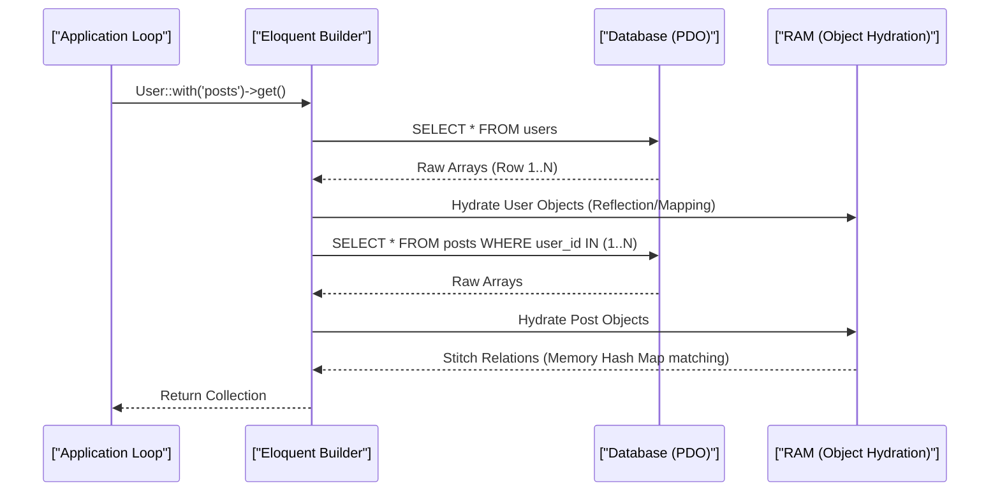

# Eloquent ORM Mechanics, N+1 Problem & Query Builder (Staff Architect Edition)

> **Module:** Laravel Internals (Topic 4.3)
> **Source Mapping:** `backend-roadmap.md` & `roadmap.md`

---

## 💡 1. Conceptual Blueprint & First Principles

Eloquent is an **Active Record ORM**. It maps object properties directly to relational database columns. 

**Design Motivations & Trade-offs:**
- **Developer Ergonomics:** Extremely fast to write, but abstracts SQL inefficiencies.
- **Hydration Overhead:** Converting raw PDO array results into full-fledged Eloquent Model objects is extremely computationally heavy. 
- **N+1 Problem:** Active Record naturally encourages lazy loading of relationships via magical property access, resulting in catastrophic database latency during iterations.

---

## 🔬 2. Under-the-Hood Mechanics

### Sequence Diagram: The Hydration Pipeline



### Memory Map of an Eloquent Object
When a row is fetched, Eloquent instantiates an object containing:
- `$attributes`: Raw database data.
- `$original`: A duplicate of `$attributes` used to diff changes during `save()`.
- `$relations`: Cached loaded relationships.
*This means 1 row of data takes up 2-3x the memory footprint of a raw array.*

---

## 💻 3. Production Code & Benchmarks

### Preventing N+1 in Production

Instead of relying on developer discipline, architecturally enforce it at the framework boot level:

```python
from sqlalchemy.orm import declarative_base, relationship
from sqlalchemy import Column, Integer, event, Engine
import time
import logging

Base = declarative_base()

class User(Base):
    __tablename__ = 'users'
    id = Column(Integer, primary_key=True)
    # Throws an error if accessed without eager loading, preventing N+1
    posts = relationship("Post", lazy="raise")

@event.listens_for(Engine, "before_cursor_execute")
def before_cursor_execute(conn, cursor, statement, parameters, context, executemany):
    conn.info.setdefault('query_start_time', []).append(time.time())

@event.listens_for(Engine, "after_cursor_execute")
def after_cursor_execute(conn, cursor, statement, parameters, context, executemany):
    total_time = time.time() - conn.info['query_start_time'].pop(-1)
    # Warn if a single query takes too long (> 500ms)
    if total_time > 0.5:
        logging.warning(f"Query exceeded 500ms: {total_time}s")
```

### Benchmarks (Hydration Costs)

Fetching 10,000 rows from a database:

| Method | Time | Peak Memory | Queries Executed |
|--------|------|-------------|------------------|
| `User::all()` (Eloquent) | ~450ms | 85.0 MB | 1 |
| `DB::table('users')->get()` (Query Builder) | ~110ms | 12.0 MB | 1 |
| `User::cursor()` (Generators) | ~250ms | 3.5 MB | 1 |

*For heavy batch jobs, use `cursor()` to keep memory constant.*

---

## ⚔️ 4. Staff / Senior Interview Scenarios

1. **Question:** "How does Eloquent stitch eager-loaded relationships without doing N queries?"
   - **Answer:** It uses dictionary/hash map matching in memory. First, it fetches parents. It collects the parent IDs, runs `WHERE IN (id1, id2...)` for the children, and then iterates the children to attach them to the parent model's `$relations` array.
2. **Question:** "What happens if you use `User::all()` on a 5-million row table?"
   - **Answer:** PHP hits its `memory_limit` and crashes (OOM error). Eloquent attempts to load all 5 million rows into memory at once, creating 5 million objects. Use `chunk()` or `cursor()` to process data in fixed-size batches.
3. **Question:** "How can eager loading (`with()`) still cause memory issues?"
   - **Answer:** If the relationship is a massive `HasMany` (e.g. users with thousands of logs). Eager loading brings all child rows into RAM. A Staff Architect uses window functions, `chunkById`, or dedicated aggregate queries to prevent loading raw rows.
